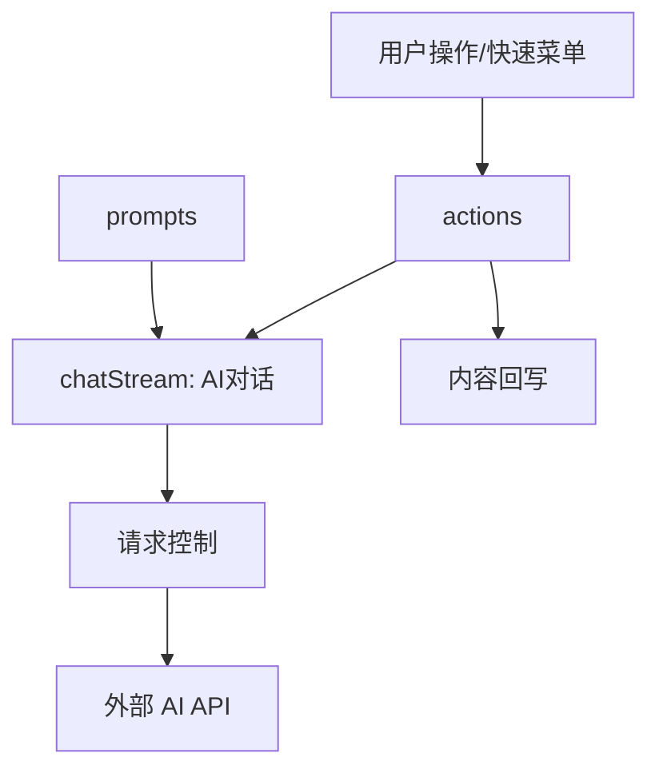

# 思源笔记 AI 模块说明

`app/src/ai` 目录负责思源笔记中 AI 相关功能的实现，包括流式聊天对话、AI 预设动作处理、自定义请求控制器以及 Prompt 模板管理。

## 目录结构与功能说明

### 1. 核心交互与流处理
- **[chatStream.ts](file:///d:/dev/siyuan-note/app/src/ai/chatStream.ts)**
  AI 聊天对话的核心逻辑。负责创建聊天对话框、初始化 Vue 组件状态，并处理用户输入的流式请求与响应渲染。
- **[chatStream.state.ts](file:///d:/dev/siyuan-note/app/src/ai/chatStream.state.ts)**
  管理聊天会话的状态，包括对话历史、取消状态、暂停/恢复逻辑等。

### 2. 动作与菜单
- **[actions.ts](file:///d:/dev/siyuan-note/app/src/ai/actions.ts)**
  AI 快捷动作的主入口。管理编辑器右键或快捷菜单中 AI 项的生成、点击处理及响应后的内容填充（`fillContent`）。
- **[actions.fillContent.ts](file:///d:/dev/siyuan-note/app/src/ai/actions.fillContent.ts)**
  定义了 AI 生成内容如何回写到 Protyle 编辑器中（例如：替换当前内容、在下方插入新块）。

### 3. 请求控制层
- **[requestController.impl.ts](file:///d:/dev/siyuan-note/app/src/ai/requestController.impl.ts)**
  封装了 AI 网络请求的生命周期管理。屏蔽了具体的网络库细节，提供开始、暂停、恢复及中断请求的标准接口。
- **[createAIRequestHandler.ts](file:///d:/dev/siyuan-note/app/src/ai/createAIRequestHandler.ts)**
  根据配置创建对应的处理器，支持 OpenAI-like 等多种 AI 服务。

### 4. 辅助模块
- **[prompts/](file:///d:/dev/siyuan-note/app/src/ai/prompts/)**
  内置的 Prompt 模板库，包含润色、翻译、总结等多种预设指令。
- **[persona/](file:///d:/dev/siyuan-note/app/src/ai/persona/)**
  AI 人格定义相关配置，用于定制 AI 的回复风格。
- **[parser/](file:///d:/dev/siyuan-note/app/src/ai/parser/)**
  负责解析 AI 返回的内容（如处理流式数据中的 JSON 部分或特定的标记格式）。

---

## 模块协作关系

## 注意事项
- 流式请求依赖于 `universalStreamRequest` 工具，修改网络逻辑时需注意信号处理（AbortSignal）。
- UI 层使用 Vue 驱动，状态更新需确保在 Vue 的响应式系统内进行。
- 所有的 AI 配置（API Key, Base URL 等）通过 `types.ts` 中的 `AIConfig` 定义并从思源配置中心获取。
