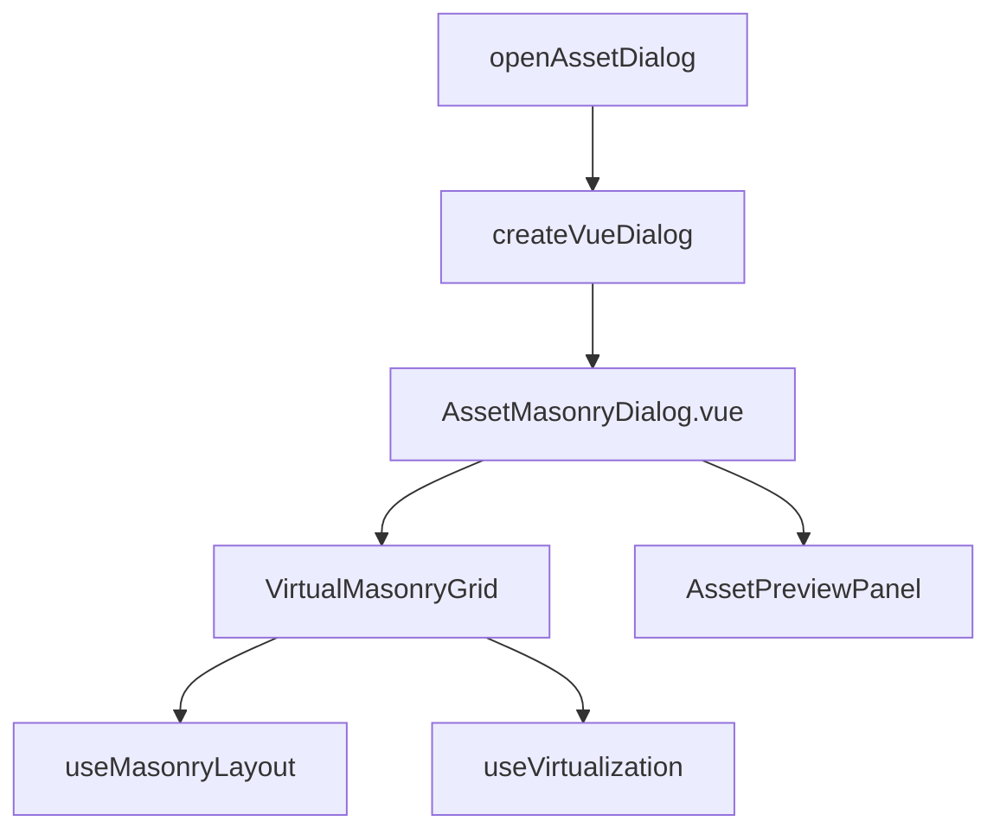

# 素材预览瀑布流布局实现计划

将素材预览对话框从列表布局改为瀑布流布局，提升素材浏览体验。

## 设计方案

### 架构概述

### 组件职责

| 组件 | 职责 |
|------|------|
| AssetMasonryDialog.vue | 整合瀑布流网格和预览面板，处理搜索过滤逻辑 |
| VirtualMasonryGrid | 复用 toread/瀑布流 的核心组件 |
| AssetPreviewPanel | 右侧预览区，显示选中素材的详情 |

---

## Proposed Changes

### Asset 模块

#### [NEW] [AssetMasonryDialog.vue](file:///d:/dev/siyuan-note/app/src/asset/components/AssetMasonryDialog.vue)

素材瀑布流选择器主组件：
- 左侧：搜索栏 + 过滤按钮 + VirtualMasonryGrid
- 右侧：预览面板（桌面端）
- 使用 `fetchPost` 获取素材列表
- 点击素材触发选择事件

#### [NEW] [AssetCard.vue](file:///d:/dev/siyuan-note/app/src/asset/components/AssetCard.vue)

瀑布流中的单个素材卡片：
- 显示素材缩略图 (使用 /api/s-forge/thumbnail)
- 始终显示文件名（图片下方）
- 点击选中

---

#### [MODIFY] [assetDialog.ts](file:///d:/dev/siyuan-note/app/src/asset/assetDialog.ts)

修改 `openAssetDialog` 函数：
- 使用 `createVueDialog` 替代原生 Dialog
- 挂载 `AssetMasonryDialog.vue` 组件
- 传入 callback 作为 props

---

### 复用策略

已将 `toread/瀑布流` 核心代码复制并适配到 `app/src/components/masonry` 目录。
- 删除了外部依赖 `rbush` (使用内部实现或假定环境已有)
- 适配了 Vue 组件样式 (SCSS)

---

## User Review Required

> [!NOTE]
> 瀑布流模块已集成到 `app/src/components/masonry`，无需额外配置。

---

## Verification Plan

### Manual Verification

1. **打开素材对话框**
   - 在编辑器中输入 `/` 触发斜杠菜单
   - 选择"插入素材"或按快捷键
   - 确认对话框显示为瀑布流布局

2. **验证瀑布流布局**
   - 对话框加载后，素材应以多列瀑布流形式展示
   - 不同尺寸的图片应自动适配高度
   - 滚动时应顺滑无卡顿（虚拟滚动生效）

3. **验证搜索过滤**
   - 输入搜索关键词，瀑布流应更新
   - 点击 Type 过滤按钮，选择特定格式

4. **验证选择插入**
   - 点击任意素材卡片
   - 对话框关闭，素材应插入到当前编辑器位置
