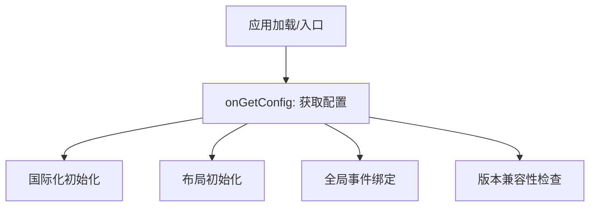

# 思源笔记 Boot (引导启动) 模块

`app/src/boot` 目录承载了思源笔记应用程序的启动生命周期、全局环境初始化以及配置加载逻辑。

## 目录结构与功能说明

### 1. 初始化核心
- **[onGetConfig.ts](file:///d:/dev/siyuan-note/app/src/boot/onGetConfig.ts)**
  启动流程的核心入口。当应用从内核（Kernel）获取到基础配置后触发。它负责初始化系统级变量、挂载 i18n 多语言包、注册核心快捷键、并拉起编辑器及 UI 布局。

### 2. 环境兼容与更新
- **[compatibleVersion.ts](file:///d:/dev/siyuan-note/app/src/boot/compatibleVersion.ts)**
  处理不同版本之间的数据/配置兼容性检查，确保升级后数据结构的正确衔接。
- **[openChangelog.ts](file:///d:/dev/siyuan-note/app/src/boot/openChangelog.ts)**
  负责在软件更新后自动或手动弹出更新日志界面。

### 3. 全局事件总线
- **[globalEvent/](file:///d:/dev/siyuan-note/app/src/boot/globalEvent/)**
  管理应用全局层面的交互事件。
  - 监听窗口缩放、网络状态变化、主题切换等系统级指令并分发给各模块。

---

## 模块协作关系

## 注意事项
- `onGetConfig.ts` 是极其重要的“同步点”，大部分模块的初始化有序依赖此处。修改时需格外小心启动顺序，避免死锁或未初始化访问。
- 启动性能优化重点在于减少本目录下的阻塞式同步操作。
