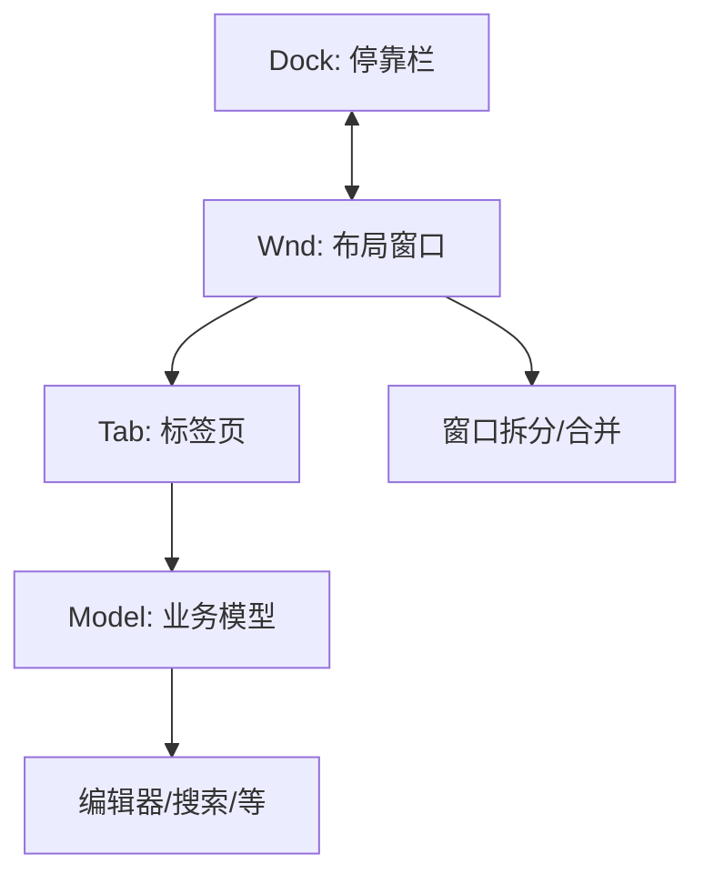

# 思源笔记 Layout (布局管理) 模块

`app/src/layout` 目录负责思源笔记整个 IDE 风格界面的窗口布局、标签页管理以及停靠面板（Dock）系统的核心实现。

## 目录结构与功能说明

### 1. 布局模型
- **[Wnd.ts](file:///d:/dev/siyuan-note/app/src/layout/Wnd.ts)**
  窗口（Window）基类。定义了可以水平或垂直拆分的布局单元，它是所有视图容器的父级。
- **[Tab.ts](file:///d:/dev/siyuan-note/app/src/layout/Tab.ts)**
  标签页类。承载具体的业务模型（Model），处理标签的切换、关闭、拖拽排序及固定逻辑。
- **[Model.ts](file:///d:/dev/siyuan-note/app/src/layout/Model.ts)**
  业务模型基类。所有的编辑器、搜索页、资产管理器等业务逻辑都需要继承此类以挂载到标签页中。

### 2. 停靠系统
- **[dock/](file:///d:/dev/siyuan-note/app/src/layout/dock/)**
  负责实现界面四周的停靠栏。
  - 管理侧边栏（如文档树、大纲、反链）的可见性、尺寸调整及其与主编辑区的交互。

### 3. 工具与状态
- **[util.ts](file:///d:/dev/siyuan-note/app/src/layout/util.ts)**
  包含布局序列化（保存到数据库/本地存储）与反序列化（重新拉起界面）的核心逻辑。
- **[status.ts](file:///d:/dev/siyuan-note/app/src/layout/status.ts)**
  管理底部的状态栏及其插件挂载逻辑。
- **[topBar.ts](file:///d:/dev/siyuan-note/app/src/layout/topBar.ts)**
  控制应用顶部的状态区域（如面包屑、同步状态、页签搜索等）。

---

## 模块协作关系

## 注意事项
- 修改布局逻辑时，务必注意 `Wnd.ts` 中的拆分比例计算，这直接影响到多窗口模式下的视觉效果。
- 业务页面（如新插件页面）应继承 `Model` 并通过注册机制挂载到 `Tab` 中。
