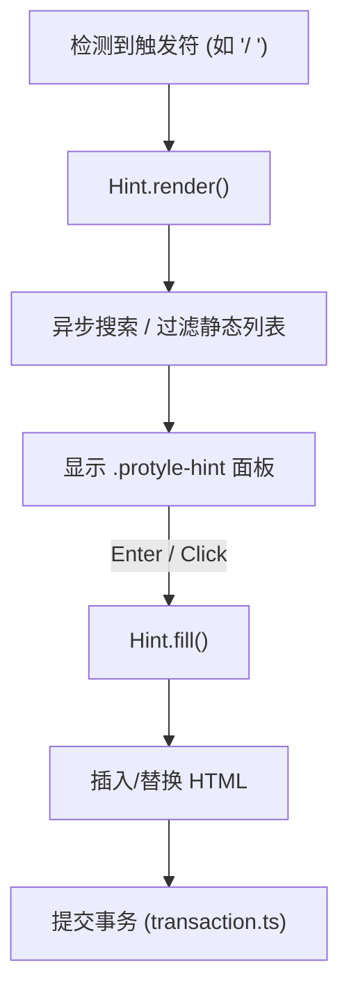

# Protyle Hint 补全提示模块说明

`app/src/protyle/hint` 目录实现了 Protyle 编辑器的实时补全系统，包括 Emoji 补全、块引用联想、斜杠命令（Inline Commands）以及各种扩展补全功能。

## 核心组件与机制

### 1. 联想引擎 (Hint Class)
- **[index.ts](file:///d:/dev/siyuan-note/app/src/protyle/hint/index.ts)**
  - **触发监听**: `render` 方法根据当前输入行的字符（如 `/`、`((`、`#`、`:`）自动识别并激活联想面板。
  - **位置计算**: 自动追踪光标位置（Range），确保联想面板始终浮动在输入字符的正下方或正上方。
  - **内容填充**: `fill` 方法处理用户选中联想项后的动作，包括替换文本、插入 HTML、甚至发起异步请求创建新文档并自动建立引用。

### 2. 扩展命令 (Slashing & Extensions)
- **[extend.ts](file:///d:/dev/siyuan-note/app/src/protyle/hint/extend.ts)**
  - **斜杠命令池**: `hintSlash` 定义了所有内置命令（如插入标题、列表、代码块、数学公式等）的搜索关键词、样式及原始 Markdown 代码。
  - **插件接入**: 支持插件通过 `protyleSlash` 接口注册自定义命令，实现与编辑器原生命令的无缝集成。
  - **渲染工具**: 提供 `genHintItemHTML` 等工具函数，统一样式展现搜索到的块内容（如显示块图标、别名、命名及路径）。

### 3. 特定类型补全
- **[extend.hintRef.ts](file:///d:/dev/siyuan-note/app/src/protyle/hint/extend.hintRef.ts)**: 处理 `((` 触发的块引用搜索。
- **[extend.template.ts](file:///d:/dev/siyuan-note/app/src/protyle/hint/extend.template.ts)**: 快捷插入模板。
- **[extend.widget.ts](file:///d:/dev/siyuan-note/app/src/protyle/hint/extend.widget.ts)**: 快捷插入挂件。

---

## 触发逻辑概览

| 触发字符 | 联想类型 | 数据来源 | 处理逻辑 |
| :--- | :--- | :--- | :--- |
| `/` 或 `、` | 斜杠命令 | 内置 + 插件 | 列表选择/插入 |
| `((` | 块引用 | `/api/search/searchRefBlock` | 插入 block-ref SPAN |
| `{{` | 嵌入块 | `/api/search/searchRefBlock` | 插入 SQL 嵌入公式 |
| `:` | Emoji | 内置 Emoji 库 | 插入 Unicode/图片 |
| `#` | 标签 | `/api/search/searchTag` | 插入 tag SPAN |

---

## 工作流

> [!IMPORTANT]
> **异步加载提示**
> 对于由于网络延迟可能导致返回较慢的搜索（如块引用），建议调用 `genLoading(protyle)` 显示加载动画，防止用户在等待期间误操作。
