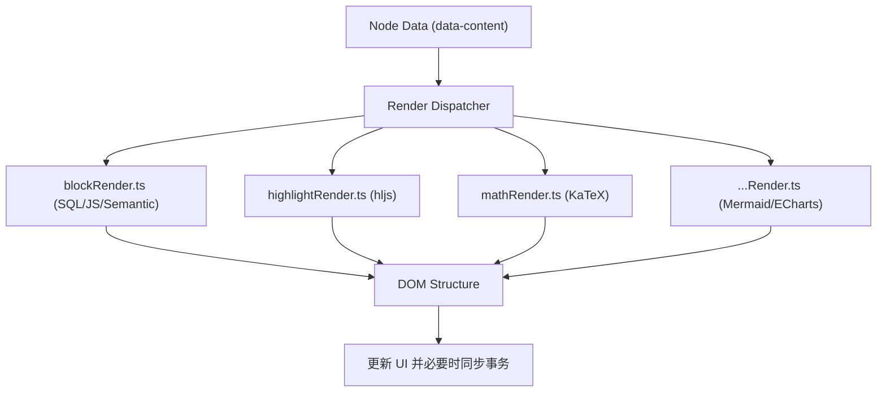

# Protyle Render 渲染模块说明

`app/src/protyle/render` 目录负责将 Markdown 数据或特定的节点属性转化为富文本 DOM 展现，涵盖了从简单的 HTML 渲染到复杂的嵌入块、数学公式、流程图及代码高亮等动态功能。

## 核心渲染器

### 1. 块搜索与嵌入渲染 (Block & Embed Render)
- **[blockRender.ts](file:///d:/dev/siyuan-note/app/src/protyle/render/blockRender.ts)**
  - **动态搜索**: 处理 `data-type="NodeBlockQueryEmbed"` 的节点。
  - **多模式支持**: 
    - `//!js`: 支持嵌入 JavaScript 脚本进行逻辑控制的块搜索。
    - `k:/s:/r:`: 支持关键词、语法及正则表达式搜索。
    - `n:`: 支持基于大模型的语义搜索。
    - `SQL`: 默认支持标准 SQL 语句查询数据库中的块。
  - **嵌套处理**: 自动递归渲染嵌套在嵌入块内部的其他搜索块（封顶深度为 4 层）。

### 2. 代码高亮渲染 (Highlight Render)
- **[highlightRender.ts](file:///d:/dev/siyuan-note/app/src/protyle/render/highlightRender.ts)**
  - **集成 Highlight.js**: 动态加载必要的 JS/CSS 资源，支持数百种编程语言的高亮。
  - **行号支持**: `lineNumberRender` 通过模拟计算 DOM 高度，精确实现多行代码的行号对齐。
  - **交互增强**: 为代码块自动添加复制、更多操作等按钮。

### 3. 数学公式渲染 (Math Render)
- **[mathRender.ts](file:///d:/dev/siyuan-note/app/src/protyle/render/mathRender.ts)**
  - **KaTeX 驱动**: 将 `$[math]$` 或 `$$ [math] $$` 渲染为美观的数学公式。
  - **光标优化**: 针对数学公式块前后的光标移动困难问题，自动填充 ZWSP 或 `\n` 进行占位修复。
  - **错误处理**: 当公式语法错误时，实时展示红色错误提示信息。

### 4. 图表与流程图渲染
- **Mermaid**: `mermaidRender.ts` 处理流程图、序列图等。
- **ECharts**: `chartRender.ts` 处理高级数据图表。
- **Graphviz/PlantUML/Mindmap**: 各自对应的渲染器处理特定的绘图语言转换。

## 核心流程

> [!NOTE]
> **资源按需加载**
> 本模块大量使用 `addScript` 动态加载库（如 KaTeX, Mermaid），以减小初始加载体积。修改相关逻辑时，请确保配置了正确的 CDN 路径。

> [!WARNING]
> **递归限制**
> 嵌入块渲染（`blockRender`）有硬编码的 4 层深度限制（`calculateEmbedDepth`），目的是防止由于环形引用导致的浏览器死循环或堆栈溢出。
