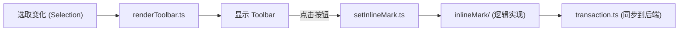

# Protyle Toolbar 工具栏模块说明

`app/src/protyle/toolbar` 目录负责 Protyle 编辑器的动态工具栏（即选中文字后弹出的浮动菜单）及其相关功能。该模块支持插件扩展、动态定位以及复杂的内联标记（Inline Mark）操作。

## 核心架构与功能

### 1. 工具栏容器 (Toolbar Class)
- **[index.ts](file:///d:/dev/siyuan-note/app/src/protyle/toolbar/index.ts)**
  - **组件实例化**: 管理 `.protyle-toolbar`（主工具栏）和 `.protyle-util`（下拉面板/二级菜单）两个核心 DOM 元素。
  - **插件扩展**: 在 `constructor` 和 `update` 方法中，自动遍历并挂载插件定义的工具栏项。
  - **子面板管理**: 统一调度 `showRender`、`showCodeLanguage`、`showTpl` 等方法，控制二级交互界面的显示。

### 2. 渲染与定位 (Rendering & Positioning)
- **[renderToolbar.ts](file:///d:/dev/siyuan-note/app/src/protyle/toolbar/renderToolbar.ts)**
  - **动态显隐**: 判断当前选取（Range）是否包含有效文字，自动决定工具栏的显示或隐藏。
  - **智能定位**: `setPosition` 根据选取在屏幕上的位置，自动计算工具栏应显示在选取的上方还是下方，并处理边缘溢出情况。
  - **状态更新**: 根据当前的文字属性（如是否加粗、是否是代码行内元素），自动激活对应的工具栏按钮背景。

### 3. 内联标记逻辑 (Inline Marking)
- **[setInlineMark.ts](file:///d:/dev/siyuan-note/app/src/protyle/toolbar/setInlineMark.ts)**
  这是处理格式化（加粗、斜体、超链接、块引用等）的最核心逻辑入口。
  - **逻辑流**: 包含构建上下文 -> 准备内容 -> 移除/添加标记 -> 元素合并 -> 事务同步。
  - **模块化**: 具体的 DOM 操作被拆分到了 **[inlineMark/](file:///d:/dev/siyuan-note/app/src/protyle/toolbar/inlineMark)** 子目录中，包括：
    - `添加内联标记.ts`: 创建新的 SPAN 标签并应用属性。
    - `移除内联标记.ts`: 剥离 SPAN 标签或从中移除特定属性。
    - `合并相邻同类型元素.ts`: 优化 DOM 结构，防止产生冗余的相邻相同格式标签。

### 4. 特定面板功能
- **[Font.ts](file:///d:/dev/siyuan-note/app/src/protyle/toolbar/Font.ts)**: 处理字体颜色、背景色及字体大小的设置。
- **[Link.ts](file:///d:/dev/siyuan-note/app/src/protyle/toolbar/Link.ts)**: 超链接编辑面板。
- **[showContent.ts](file:///d:/dev/siyuan-note/app/src/protyle/toolbar/showContent.ts)**: 针对块内容的特殊操作菜单。

---

## 模块交互逻辑

> [!TIP]
> **关于 ZWSP (零宽空格)**
> 工具栏逻辑大量使用了 `Constants.ZWSP` 来维持光标在空标签（如空的行内代码块）中的位置。在修改相关逻辑时，务必保留 `整理零宽空格.ts` 的调用，以确保存储的 Markdown 数据干净。
