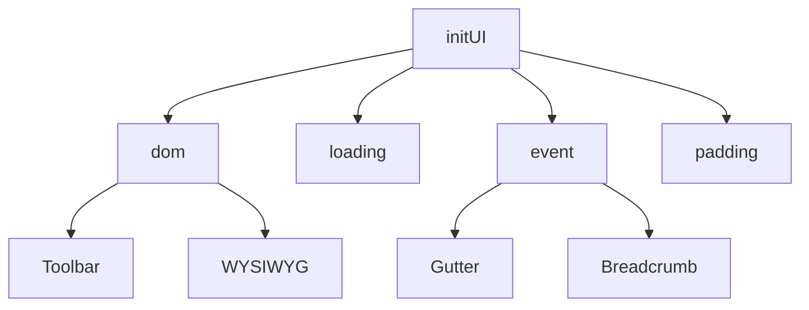

# Protyle UI 核心模块说明

`app/src/protyle/ui` 目录负责 [Protyle](https://github.com/siyuan-note/siyuan) 编辑器核心 UI 的初始化、布局计算及基础事件绑定。

## 目录结构与功能说明

### 1. 核心初始化
- **[initUI.ts](file:///d:/dev/siyuan-note/app/src/protyle/ui/initUI.ts)**
  编辑器的 UI 初始化主入口。它协调 DOM 创建、加载状态显示、编辑模式设置以及基础事件（缩放、点击、悬停）的绑定流程。

- **[dom.ts](file:///d:/dev/siyuan-note/app/src/protyle/ui/dom.ts)**
  专注于构建编辑器的 DOM 树。包括初始化 `protyle-content` 容器、挂载背景/标题区域、WYSIWYG 核心、预览层、以及工具栏（Toolbar）等子组件。

### 2. 事件处理
- **[event.ts](file:///d:/dev/siyuan-note/app/src/protyle/ui/event.ts)**
  集成了编辑器的交互交互逻辑。
  - **缩放**: `Ctrl/Cmd + 滚轮` 动态调整字体大小。
  - **底部点击**: 在文档末尾空白处点击时，智能判断并自动创建新块。
  - **悬停高亮**: 管理属性区域（Attr）、块标记（Gutter）及面包屑的高亮分发逻辑。

### 3. 布局与装饰
- **[padding.ts](file:///d:/dev/siyuan-note/app/src/protyle/ui/padding.ts)**
  动态计算编辑器的边距（内边距）。它会根据窗口宽度、是否全宽模式、以及打字机模式等选项，实时调整 `wysiwyg` 层的内边距。
- **[loading.ts](file:///d:/dev/siyuan-note/app/src/protyle/ui/loading.ts)**
  提供统一的加载动画（SVG）插入与移除接口，确保编辑器在数据加载时有良好的视觉反馈。

### 4. 辅助工具
- **[hideElements.ts](file:///d:/dev/siyuan-note/app/src/protyle/ui/hideElements.ts)**
  界面清理工具类。用于在特定场景（如全屏、弹窗触发）下隐藏工具栏、侧边栏、提示框或高亮状态，保持工作区清爽。

---

## 模块协作关系

## 注意事项
- 本目录下的逻辑主要涉及 **原生 DOM 操作**，修改时需注意各组件及其容器的父子挂载顺序。
- 布局计算依赖于 `Constants.SIZE_EDITOR_WIDTH` 等全局常量，调整样式时建议优先查看 `padding.ts`。
