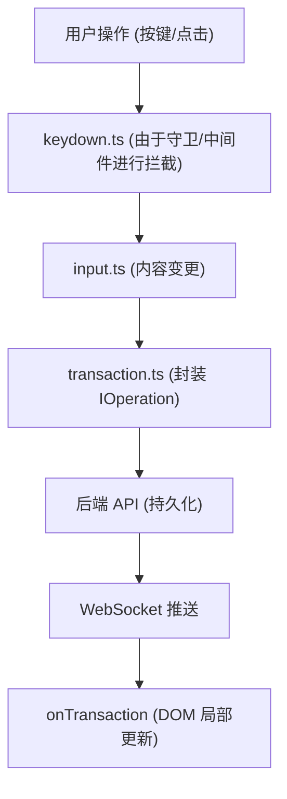

# Protyle WYSIWYG 编辑器核心模块说明

`app/src/protyle/wysiwyg` 目录是 Protyle 编辑器最核心的逻辑所在地。它负责所见即所得（WYSIWYG）界面的渲染、用户交互监听以及与后端的数据同步（事务）。

## 核心架构设计

该模块采用了高度解耦的设计模式，将复杂的编辑器逻辑拆分为初始化、事务处理、按键分发和特定块操作四大块。

### 1. 核心容器 (WYSIWYG Class)
- **[index.ts](file:///d:/dev/siyuan-note/app/src/protyle/wysiwyg/index.ts)**
  - **初始化**: `WYSIWYG` 类是编辑器的主要入口。它负责创建 `.protyle-wysiwyg` 基准 DOM 元素，并根据配置设置 `contenteditable` 属性。
  - **事件总线**: 统一绑定并分发 `copy`、`mousedown`、`drop` 等底层浏览器事件。
  - **状态同步**: 包含 `renderCustom` 等方法，用于根据文档属性（IAL）动态更新编辑器外观（如设置全宽模式）。

### 2. 事务与同步系统 (Transaction System)
- **[transaction.ts](file:///d:/dev/siyuan-note/app/src/protyle/wysiwyg/transaction.ts)**
  - **原子操作**: 定义了 `insert`、`delete`、`update`、`move` 等原子化的操作指令（`IOperation`）。
  - **远程同步**: 通过 `promiseTransaction` 将本地的操作缓冲并累积发送到后端 API (`/api/transactions`)，确保多设备间、及前端与后端数据库的一致性。
  - **状态重播**: `onTransaction` 函数负责响应来自 WebSocket 或撤销重做系统的推送，将远程变更精确地“重播”到当前 DOM 树中。

### 3. 高级按键逻辑 (Keydown Middleware)
- **[keydown.ts](file:///d:/dev/siyuan-note/app/src/protyle/wysiwyg/keydown.ts)**
  - **中间件模式**: 按键处理不再是一个巨大的 `switch` 语句，而是由一系列高内聚的中间件（Middleware）和守卫（Guard）组成。
  - **拦截机制**: 
    - **Guards**: `protyleDisabledGuard`、`avPanelGuard` 等，用于预先判断是否应该中止后续处理。
    - **Middlewares**: `enterKeyMiddleware`、`tabKeyMiddleware` 等，每个中间件只负责一种类型的按键组合或功能。
  - **异步控制**: 使用 `AbortController` 实现按键链式处理的提前终止，避免输入法冲突和逻辑竞争。

### 4. 专项处理逻辑
该目录下还包含大量针对特定块类型或交互的专门处理文件：
- **[input.ts](file:///d:/dev/siyuan-note/app/src/protyle/wysiwyg/input.ts)**: 处理基础的字符输入、拼音输入（IME）以及实时解析逻辑。
- **[list.ts](file:///d:/dev/siyuan-note/app/src/protyle/wysiwyg/list.ts)** & **[turnIntoList.ts](file:///d:/dev/siyuan-note/app/src/protyle/wysiwyg/turnIntoList.ts)**: 复杂的列表缩进、类型转换逻辑。
- **[move.ts](file:///d:/dev/siyuan-note/app/src/protyle/wysiwyg/move.ts)**: 块的拖拽与物理位置移动。
- **[remove.ts](file:///d:/dev/siyuan-note/app/src/protyle/wysiwyg/remove.ts)** & **[removeEmbed.ts](file:///d:/dev/siyuan-note/app/src/protyle/wysiwyg/removeEmbed.ts)**: 安全地删除内容并妥善处理引用/嵌入关系。

---

## 工作流说明

> [!NOTE]
> 当你修改该目录下的任何逻辑时，请务必注意**事务的一致性**。任何对 DOM 的直接修改如果没有对应的 `IOperation` 发送给后端，或者没有考虑到 `undo/redo` 的互逆操作，都可能导致数据不同步。
