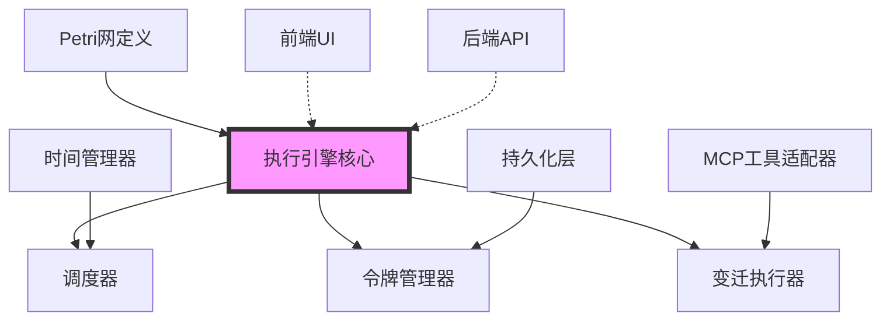
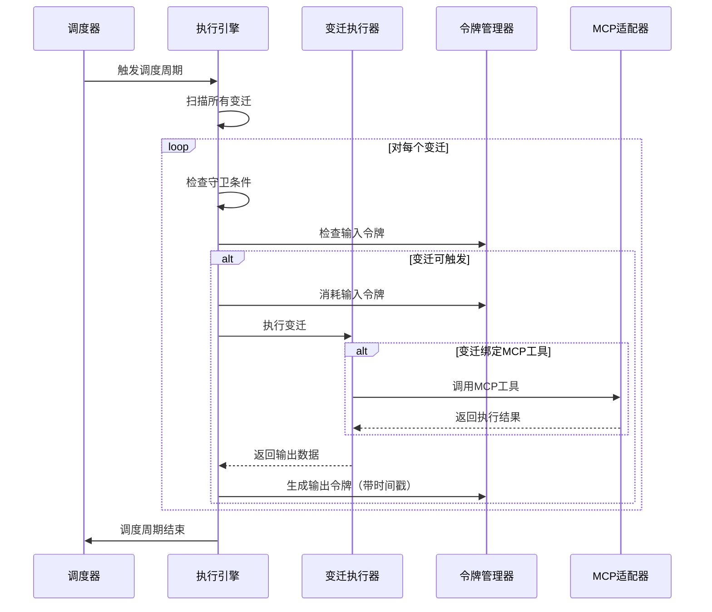

# Petri网执行引擎设计文档

## 一、项目背景

### 1.1 目标
构建一个严格基于时间-色彩Petri网（Timed Colored Petri Net, TCPN）的执行引擎，用于在思源笔记中实现灵活的工作流编排和任务调度。

### 1.2 核心原则
1. **完成严格基于时间-色彩Petri网的执行引擎** - 所有执行逻辑必须符合Petri网的数学模型
2. **变迁声明结构严格兼容MCP工具** - 确保能够直接引入MCP（Model Context Protocol）工具作为变迁
3. **绝对禁止绕过Petri网的数学结构直接进行函数执行** - 保证系统的可验证性和可预测性
4. **需要仔细考虑实现语言选择** - 在前端TypeScript与后端Go之间做出合理的架构决策
5. **如果使用Go语言实现，需要考虑动态节点定义机制** - 保证系统的灵活性和扩展性

---

## 二、Petri网核心概念

### 2.1 基础Petri网（P/T网）
- **库所（Place）**: 表示系统状态，可以容纳令牌（Token）
- **变迁（Transition）**: 表示状态转换的动作或事件
- **弧（Arc）**: 连接库所和变迁，定义令牌的流动
- **令牌（Token）**: 表示资源或状态的抽象

### 2.2 色彩Petri网（CPN）
- **色彩集（Color Set）**: 为令牌赋予类型和数据
- **守卫（Guard）**: 变迁触发的条件表达式
- **弧表达式（Arc Expression）**: 定义令牌的消耗和生成规则

### 2.3 时间Petri网（TPN）
- **时间戳（Timestamp）**: 令牌的可用时间
- **延迟（Delay）**: 变迁触发后令牌生成的延迟
- **时间约束**: 变迁触发的时间窗口

### 2.4 时间-色彩Petri网（TCPN）
结合CPN和TPN的特性，令牌既有类型数据，又有时间属性，变迁既有守卫条件，又有时间约束。

---

## 三、架构设计

### 3.1 核心组件



### 3.2 数据结构设计

#### 3.2.1 库所（Place）
```typescript
interface Place {
  id: string;              // 库所唯一标识
  name: string;            // 库所名称
  colorSet: ColorSetDef;   // 色彩集定义
  tokens: Token[];         // 当前令牌列表
  capacity?: number;       // 容量限制（可选）
}
```

#### 3.2.2 令牌（Token）
```typescript
interface Token {
  id: string;              // 令牌唯一标识
  color: ColorValue;       // 令牌的色彩值（携带的数据）
  timestamp: number;       // 令牌的时间戳（何时可用）
  metadata?: any;          // 元数据（用于调试、追踪等）
}
```

#### 3.2.3 变迁（Transition）
```typescript
interface Transition {
  id: string;              // 变迁唯一标识
  name: string;            // 变迁名称
  guard?: GuardExpression; // 守卫条件
  arcs: Arc[];             // 关联的弧
  delay?: number;          // 触发延迟（ms）
  timeWindow?: {           // 时间窗口
    earliest: number;      // 最早触发时间
    latest: number;        // 最晚触发时间
  };
  mcpTool?: MCPToolRef;    // MCP工具引用
}
```

#### 3.2.4 弧（Arc）
```typescript
interface Arc {
  id: string;
  source: string;          // 源节点ID（Place或Transition）
  target: string;          // 目标节点ID
  expression: ArcExpression; // 弧表达式（定义令牌的变换规则）
  weight?: number;         // 权重（简单情况下的令牌数量）
}
```

#### 3.2.5 色彩集定义
```typescript
type ColorSetDef = 
  | { type: 'primitive', primitive: 'number' | 'string' | 'boolean' }
  | { type: 'enum', values: string[] }
  | { type: 'record', fields: Record<string, ColorSetDef> }
  | { type: 'list', element: ColorSetDef }
  | { type: 'union', variants: ColorSetDef[] };
```

### 3.3 执行引擎核心流程



---

## 四、实现语言选择分析

### 4.1 方案一：前端TypeScript实现

#### 优势
- ✅ 与思源前端深度集成，UI交互流畅
- ✅ 开发迭代快，调试方便
- ✅ 可直接利用浏览器的定时器（setTimeout/setInterval）
- ✅ 与前端状态管理（Vuex/Pinia）无缝对接
- ✅ 类型安全（TypeScript）

#### 劣势
- ❌ 无法在后台持续运行（浏览器关闭即停止）
- ❌ 性能受限于浏览器单线程模型
- ❌ 无法直接访问系统资源（文件系统、网络等）
- ❌ 跨标签页/窗口的状态同步复杂

#### 适用场景
- 轻量级工作流（用户交互驱动）
- 短时任务编排
- 实时UI反馈需求高的场景

---

### 4.2 方案二：后端Go语言实现

#### 优势
- ✅ 可持续后台运行，不依赖前端页面
- ✅ 高性能并发处理（Goroutine）
- ✅ 可直接访问系统资源和API
- ✅ 更好的稳定性和可靠性
- ✅ 易于实现持久化和状态恢复

#### 劣势
- ❌ 需要设计前后端通信协议
- ❌ 动态节点定义需要额外设计（见4.3节）
- ❌ 调试相对复杂
- ❌ 开发周期可能更长

#### 适用场景
- 长时运行的工作流（定时任务、监控等）
- 复杂的业务逻辑编排
- 需要系统级资源访问的场景

---

### 4.3 Go语言动态节点定义方案

如果选择Go实现，需要解决"如何动态定义节点"的问题。

#### 方案A：基于Lua脚本引擎
```go
import "github.com/yuin/gopher-lua"

type TransitionExecutor struct {
    luaState *lua.LState
}

func (te *TransitionExecutor) Execute(input TokenBinding) (output TokenBinding, err error) {
    // 1. 将输入令牌注入Lua环境
    // 2. 执行Lua脚本定义的变迁逻辑
    // 3. 提取输出令牌
    return
}
```

**优势**: 轻量、高性能、易于沙箱化  
**劣势**: 需要学习Lua语法

---

#### 方案B：基于JavaScript引擎（Goja）
```go
import "github.com/dop251/goja"

type TransitionExecutor struct {
    jsRuntime *goja.Runtime
}

func (te *TransitionExecutor) Execute(input TokenBinding) (output TokenBinding, err error) {
    // 执行JavaScript定义的变迁逻辑
    return
}
```

**优势**: 与前端语言一致，开发者友好  
**劣势**: 性能略低于Lua

---

#### 方案C：基于Zod Schema + JSON配置
```go
type TransitionDefinition struct {
    ID       string                 `json:"id"`
    Name     string                 `json:"name"`
    Guard    *GuardExpression       `json:"guard,omitempty"`
    MCPTool  *MCPToolReference      `json:"mcpTool,omitempty"`
    Transform map[string]interface{} `json:"transform"` // JSON-Schema定义的数据转换
}
```

**优势**: 完全声明式，易于序列化和持久化  
**劣势**: 表达能力受限，复杂逻辑难以实现

---

#### 方案D：基于WebAssembly（WASM）
```go
import "github.com/wasmerio/wasmer-go/wasmer"

type WASMTransition struct {
    instance *wasmer.Instance
}

func (wt *WASMTransition) Execute(input []byte) (output []byte, err error) {
    // 调用WASM模块的导出函数
    return
}
```

**优势**: 高性能、多语言支持（可用Rust/AssemblyScript编写）  
**劣势**: 复杂度高，开发门槛高

---

#### **推荐方案**：方案B（Goja） + 方案C（JSON配置）混合
- 简单的数据转换用JSON Schema配置
- 复杂的业务逻辑用JavaScript脚本
- 统一通过Zod进行类型校验

---

### 4.4 架构决策建议

#### 阶段一：原型验证（前端实现）
- 使用TypeScript在前端快速实现核心引擎
- 验证Petri网模型的可行性
- 完成MCP工具集成

#### 阶段二：生产级实现（后端实现）
- 将核心引擎迁移至Go后端
- 采用Goja + JSON配置的动态节点定义方案
- 前端仅保留UI和监控功能

---

## 五、MCP工具集成方案

### 5.1 MCP工具结构
根据MCP协议，工具定义如下：
```typescript
interface MCPTool {
  name: string;
  description: string;
  inputSchema: JSONSchema;  // 输入参数的JSON Schema
  handler: (params: any) => Promise<any>;
}
```

### 5.2 映射到Petri网变迁

#### 策略一：一对一映射
每个MCP工具直接对应一个Petri网变迁。

```typescript
function mcpToolToTransition(mcpTool: MCPTool): Transition {
  return {
    id: `mcp_${mcpTool.name}`,
    name: mcpTool.name,
    guard: zodSchemaToGuard(mcpTool.inputSchema), // 将JSONSchema转为守卫条件
    mcpTool: {
      name: mcpTool.name,
      handler: mcpTool.handler
    },
    arcs: generateDefaultArcs(mcpTool.inputSchema) // 根据schema自动生成输入/输出弧
  };
}
```

#### 策略二：工具调用作为变迁的副作用
变迁本身不与MCP工具绑定，而是在变迁执行过程中动态调用。

```typescript
interface Transition {
  // ...
  sideEffects?: {
    mcpToolCall?: {
      name: string;
      paramMapping: (tokens: Token[]) => any; // 从令牌映射到工具参数
    }
  }
}
```

#### **推荐**：策略一
优势：结构清晰，符合Petri网的数学模型；劣势少。

### 5.3 具体实现步骤

1. **定义MCP工具注册表**
```typescript
class MCPToolRegistry {
  private tools: Map<string, MCPTool> = new Map();
  
  register(tool: MCPTool) {
    this.tools.set(tool.name, tool);
  }
  
  get(name: string): MCPTool | undefined {
    return this.tools.get(name);
  }
}
```

2. **创建适配器层**
```typescript
class MCPTransitionAdapter {
  constructor(
    private registry: MCPToolRegistry,
    private engine: PetriNetEngine
  ) {}
  
  async importTool(toolName: string): Promise<Transition> {
    const tool = this.registry.get(toolName);
    if (!tool) throw new Error(`Tool ${toolName} not found`);
    
    return mcpToolToTransition(tool);
  }
  
  async executeMCPTransition(
    transition: Transition, 
    inputTokens: Token[]
  ): Promise<Token[]> {
    // 1. 提取输入参数
    const params = this.extractParams(inputTokens, transition.mcpTool!);
    
    // 2. 调用MCP工具
    const result = await transition.mcpTool!.handler(params);
    
    // 3. 生成输出令牌
    return this.generateOutputTokens(result, transition);
  }
}
```

3. **Schema转换**
```typescript
function zodSchemaToGuard(schema: JSONSchema): GuardExpression {
  // 将JSON Schema转换为Petri网的守卫表达式
  // 例如：{ type: 'number', minimum: 0 } => token.color.value >= 0
}
```

---

## 六、关键技术挑战

### 6.1 时间管理
- **挑战**：如何高效处理大量带时间戳的令牌？
- **方案**：使用优先队列（Min-Heap）管理令牌的激活时间

```typescript
class TokenScheduler {
  private heap: MinHeap<Token> = new MinHeap((a, b) => a.timestamp - b.timestamp);
  
  schedule(token: Token) {
    this.heap.push(token);
  }
  
  getReadyTokens(currentTime: number): Token[] {
    const ready: Token[] = [];
    while (this.heap.peek()?.timestamp <= currentTime) {
      ready.push(this.heap.pop()!);
    }
    return ready;
  }
}
```

### 6.2 并发控制
- **挑战**：多个变迁同时触发，如何避免资源竞争？
- **方案**：
  - 前端：使用事务性更新（基于Immer或类似库）
  - 后端：使用Go的channel和mutex

### 6.3 状态持久化
- **挑战**：如何保存和恢复Petri网的执行状态？
- **方案**：
```typescript
interface PetriNetSnapshot {
  version: string;
  timestamp: number;
  places: Place[];
  transitions: Transition[];
  executionHistory: ExecutionEvent[]; // 用于回溯分析
}

class PersistenceManager {
  async saveSnapshot(net: PetriNet): Promise<void> {
    const snapshot = net.toSnapshot();
    await db.put('petrinet_state', snapshot);
  }
  
  async loadSnapshot(): Promise<PetriNet> {
    const snapshot = await db.get('petrinet_state');
    return PetriNet.fromSnapshot(snapshot);
  }
}
```

---

## 七、开发路线图

### Phase 1: 核心引擎（2周）
- [ ] 实现基础Petri网数据结构
- [ ] 实现令牌管理器
- [ ] 实现变迁触发逻辑
- [ ] 单元测试覆盖率达到80%

### Phase 2: 时间与色彩扩展（1周）
- [ ] 添加时间戳支持
- [ ] 实现色彩集定义和验证
- [ ] 实现守卫表达式求值器

### Phase 3: MCP工具集成（1周）
- [ ] 设计MCP适配器接口
- [ ] 实现Schema转换
- [ ] 测试与现有MCP工具的集成

### Phase 4: 持久化与UI（1周）
- [ ] 实现状态持久化
- [ ] 构建可视化编辑器
- [ ] 添加执行监控面板

### Phase 5: 后端迁移（可选，2周）
- [ ] Go语言重写核心引擎
- [ ] 实现Goja脚本执行器
- [ ] 前后端API对接

---

## 八、验证与测试

### 8.1 单元测试示例
```typescript
describe('PetriNetEngine', () => {
  it('应该正确触发简单变迁', () => {
    const net = new PetriNet();
    const p1 = net.addPlace({ id: 'p1', colorSet: { type: 'primitive', primitive: 'number' }});
    const p2 = net.addPlace({ id: 'p2', colorSet: { type: 'primitive', primitive: 'number' }});
    const t1 = net.addTransition({ id: 't1', name: 'increment' });
    
    net.addArc({ source: 'p1', target: 't1', expression: 'x' });
    net.addArc({ source: 't1', target: 'p2', expression: 'x + 1' });
    
    net.addToken('p1', { color: 5, timestamp: 0 });
    
    net.step();
    
    expect(net.getPlace('p2').tokens).toHaveLength(1);
    expect(net.getPlace('p2').tokens[0].color).toBe(6);
  });
});
```

### 8.2 集成测试
- 测试复杂工作流的端到端执行
- 测试MCP工具调用的正确性
- 测试状态恢复的一致性

---

## 九、参考资料

1. **Petri网理论**
   - Kurt Jensen, "Coloured Petri Nets: Basic Concepts, Analysis Methods and Practical Use"
   - [CPN Tools](https://cpntools.org/)

2. **MCP协议**
   - [Model Context Protocol Specification](https://modelcontextprotocol.io/)

3. **相关实现**
   - [petri-net.js](https://github.com/DrTtnk/petri-net)
   - [Go Petri Net](https://github.com/pFlow-dev/pflow-xyz)

---

## 十、待决策事项

> [!IMPORTANT]
> 以下问题需要在实现前明确：

1. **实现语言最终选择**：TypeScript还是Go？建议先用TS原型，再迁移Go
2. **动态节点定义方案**：如果选Go，是用Goja、Lua还是JSON配置？
3. **MCP工具集成深度**：是否支持工具的动态注册和卸载？
4. **可视化编辑器的优先级**：是否在Phase 1就实现？
5. **是否需要支持分布式Petri网**：多个思源笔记实例之间的协同？

---

## 十一、附录

### 附录A：术语表
- **TCPN**: Timed Colored Petri Net，时间-色彩Petri网
- **MCP**: Model Context Protocol，模型上下文协议
- **CPN**: Colored Petri Net，色彩Petri网
- **令牌绑定（Token Binding）**: 变迁输入令牌到变量的映射关系

### 附录B：示例工作流定义
```json
{
  "id": "example_workflow",
  "name": "文档处理工作流",
  "places": [
    { "id": "待处理", "colorSet": { "type": "record", "fields": { "docId": "string" } } },
    { "id": "已提取", "colorSet": { "type": "record", "fields": { "docId": "string", "content": "string" } } },
    { "id": "已分析", "colorSet": { "type": "record", "fields": { "docId": "string", "summary": "string" } } }
  ],
  "transitions": [
    {
      "id": "提取内容",
      "mcpTool": { "name": "extract_text" }
    },
    {
      "id": "生成摘要",
      "mcpTool": { "name": "summarize" },
      "delay": 1000
    }
  ],
  "arcs": [
    { "source": "待处理", "target": "提取内容" },
    { "source": "提取内容", "target": "已提取" },
    { "source": "已提取", "target": "生成摘要" },
    { "source": "生成摘要", "target": "已分析" }
  ]
}
```