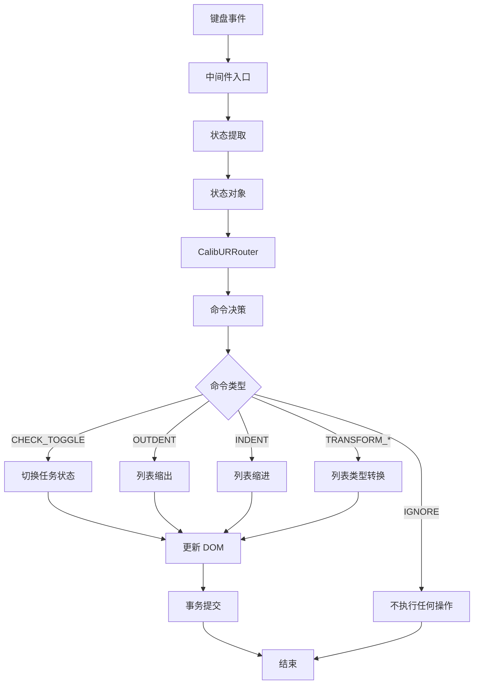
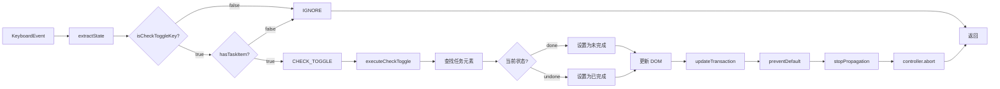
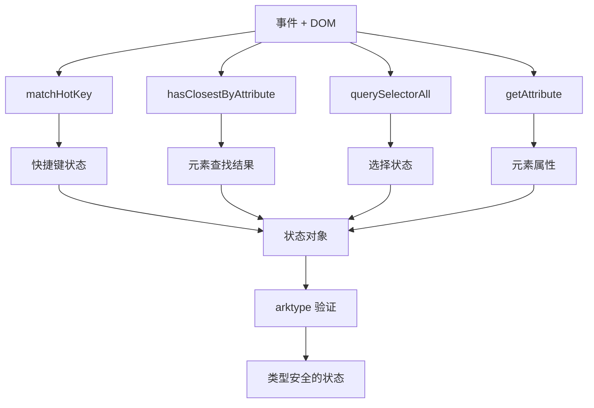

# listRouter 详细架构设计

## 文档信息

- **创建日期**: 2026-01-25
- **目标**: 将 keydown.list.ts 重构为使用 CalibURRouter 模式
- **参考实现**: keydown.altEnter.ts
- **迁移范围**: 4 个中间件函数

---

## 1. 执行摘要

### 1.1 背景

当前 [`keydown.list.ts`](app/src/protyle/wysiwyg/keydown.list.ts:1) 包含 4 个列表相关的键盘事件处理中间件，采用传统的命令式编程风格。为了提高代码的可维护性、可测试性和可扩展性，需要将其重构为使用 CalibURRouter 模式。

### 1.2 目标

1. **提高代码质量**: 通过状态驱动的路由模式，使代码逻辑更清晰
2. **增强可测试性**: 状态提取和命令执行分离，便于单元测试
3. **改善可维护性**: 声明式路由定义，易于理解和修改
4. **保持行为一致**: 确保重构后功能完全等价

### 1.3 迁移优先级

按复杂度从低到高排序：

1. **Phase 1 (试点)**: `listCheckToggleMiddleware` - 任务列表切换
2. **Phase 2**: `listOutdentMiddleware` - 列表缩出
3. **Phase 3**: `listIndentMiddleware` - 列表缩进  
4. **Phase 4**: `listTransformMiddleware` - 列表类型转换

---

## 2. 文件结构设计

### 2.1 目录结构方案

采用**目录结构**方案，便于模块化管理和渐进式迁移：

```
app/src/protyle/wysiwyg/
├── keydown.list.ts                    # 保留原文件（渐进式迁移期间）
└── keydown.list/                      # 新的模块化目录
    ├── index.ts                       # 主入口，导出 listRouter 和中间件
    ├── types.ts                       # 类型定义和 arktype schemas
    ├── commands.ts                    # 命令常量定义
    ├── state.ts                       # 状态提取函数
    ├── executors.ts                   # 命令执行器
    ├── router.ts                      # 路由定义
    └── middlewares/                   # 各个中间件实现
        ├── checkToggle.ts             # 任务列表切换
        ├── outdent.ts                 # 列表缩出
        ├── indent.ts                  # 列表缩进
        └── transform.ts               # 列表类型转换
```

### 2.2 文件职责说明

#### 2.2.1 [`index.ts`](app/src/protyle/wysiwyg/keydown.list/index.ts)

**职责**: 模块主入口，统一导出

```typescript
// 导出路由器
export { listRouter } from "./router";

// 导出中间件（用于渐进式迁移）
export { listCheckToggleMiddleware } from "./middlewares/checkToggle";
export { listOutdentMiddleware } from "./middlewares/outdent";
export { listIndentMiddleware } from "./middlewares/indent";
export { listTransformMiddleware } from "./middlewares/transform";

// 导出类型（供外部使用）
export type { ListState, ListCommand } from "./types";
```

#### 2.2.2 [`types.ts`](app/src/protyle/wysiwyg/keydown.list/types.ts)

**职责**: 集中管理所有类型定义和 arktype schemas

- 定义状态空间类型
- 定义命令类型
- 定义辅助类型

#### 2.2.3 [`commands.ts`](app/src/protyle/wysiwyg/keydown.list/commands.ts)

**职责**: 定义所有命令常量

```typescript
// 命令常量，使用 as const 确保类型安全
export const LIST_COMMANDS = {
    CHECK_TOGGLE: "CHECK_TOGGLE",
    OUTDENT: "OUTDENT",
    INDENT: "INDENT",
    TRANSFORM_TO_UL: "TRANSFORM_TO_UL",
    TRANSFORM_TO_OL: "TRANSFORM_TO_OL",
    TRANSFORM_TO_TL: "TRANSFORM_TO_TL",
    TRANSFORM_TO_QUOTE: "TRANSFORM_TO_QUOTE",
    IGNORE: "IGNORE"
} as const;

export type ListCommand = typeof LIST_COMMANDS[keyof typeof LIST_COMMANDS];
```

#### 2.2.4 [`state.ts`](app/src/protyle/wysiwyg/keydown.list/state.ts)

**职责**: 状态提取函数，从事件和 DOM 中提取决策所需的状态

- 提取快捷键匹配状态
- 提取 DOM 元素状态
- 提取选择状态

#### 2.2.5 [`executors.ts`](app/src/protyle/wysiwyg/keydown.list/executors.ts)

**职责**: 命令执行器，根据命令执行具体操作

- 复用现有业务逻辑函数
- 处理事件和控制器
- 统一错误处理

#### 2.2.6 [`router.ts`](app/src/protyle/wysiwyg/keydown.list/router.ts)

**职责**: 路由定义，使用 CalibURRouter 构建决策树

- 定义状态空间
- 定义路由规则
- 构建路由器实例

#### 2.2.7 [`middlewares/`](app/src/protyle/wysiwyg/keydown.list/middlewares/) 目录

**职责**: 各个中间件的具体实现

每个中间件文件包含：
- 中间件函数
- 状态提取逻辑
- 命令执行逻辑

---

## 3. 渐进式迁移策略

### 3.1 迁移阶段

#### 阶段 0: 准备阶段
- 创建目录结构
- 设置基础文件和类型定义
- 编写测试框架

#### 阶段 1: 试点迁移（listCheckToggleMiddleware）
- 实现完整的 CalibURRouter 模式
- 验证架构设计的可行性
- 建立迁移模板

#### 阶段 2-4: 逐步迁移其他中间件
- 按优先级顺序迁移
- 每个中间件独立测试
- 保持向后兼容

#### 阶段 5: 清理阶段
- 移除旧代码
- 更新导入引用
- 完善文档

### 3.2 新旧代码共存方案

在迁移期间，新旧代码需要共存：

```typescript
// 在主键盘事件处理器中
import { 
    listCheckToggleMiddleware as newListCheckToggleMiddleware 
} from "./keydown.list";
import { 
    listOutdentMiddleware as oldListOutdentMiddleware,
    listIndentMiddleware as oldListIndentMiddleware,
    listTransformMiddleware as oldListTransformMiddleware
} from "./keydown.list.ts";

// 使用特性开关控制
const useNewListRouter = true; // 可配置

if (useNewListRouter) {
    await newListCheckToggleMiddleware(event, protyle, nodeElement, range, controller);
} else {
    await oldListCheckToggleMiddleware(event, protyle, nodeElement, range, controller);
}
```

## 4. 状态空间设计

### 4.1 设计原则

状态空间设计遵循以下原则：

1. **最小化**: 只包含路由决策所需的状态
2. **正交性**: 状态字段之间相互独立，避免冗余
3. **可测试性**: 状态易于构造和验证
4. **类型安全**: 使用 arktype 进行运行时类型验证

### 4.2 通用状态类型

所有中间件共享的基础状态：

```typescript
import { type } from "arktype";

// 基础状态 schema
export const BaseListStateSchema = type({
    // 快捷键匹配状态
    isCheckToggleKey: "boolean",
    isOutdentKey: "boolean",
    isIndentKey: "boolean",
    isListKey: "boolean",
    isOListKey: "boolean",
    isCheckKey: "boolean",
    isQuoteKey: "boolean",
    
    // DOM 元素状态
    hasTaskItem: "boolean",
    hasSelectElements: "boolean",
    isInListItem: "boolean",
    isInCodeBlock: "boolean",
    
    // 选择状态
    selectCount: "number",
    isContinuousSelection: "boolean"
});

export type BaseListState = typeof BaseListStateSchema.infer;
```

### 4.3 Phase 1: listCheckToggleMiddleware 状态设计

这是最简单的中间件，作为试点实现：

```typescript
// 任务列表切换状态 schema
export const CheckToggleStateSchema = type({
    isCheckToggleKey: "boolean",
    hasTaskItem: "boolean"
});

export type CheckToggleState = typeof CheckToggleStateSchema.infer;
```

**状态字段说明**:

- `isCheckToggleKey`: 是否按下任务列表切换快捷键
- `hasTaskItem`: 光标是否在任务列表项中

**状态空间分析**:

| isCheckToggleKey | hasTaskItem | 命令 | 说明 |
|-----------------|-------------|------|------|
| false | * | IGNORE | 未按快捷键，忽略 |
| true | false | IGNORE | 按了快捷键但不在任务列表中 |
| true | true | CHECK_TOGGLE | 切换任务状态 |
### 4.4 Phase 2: listOutdentMiddleware 状态设计

```typescript
// 列表缩出状态 schema
export const OutdentStateSchema = type({
    isOutdentKey: "boolean",
    hasSelectElements: "boolean",
    isContinuousSelection: "boolean",
    isFirstSelectInList: "boolean",
    isInListItem: "boolean",
    isInCodeBlock: "boolean"
});

export type OutdentState = typeof OutdentStateSchema.infer;
```

**状态字段说明**:

- `isOutdentKey`: 是否按下列表缩出快捷键
- `hasSelectElements`: 是否有多选元素
- `isContinuousSelection`: 多选元素是否连续
- `isFirstSelectInList`: 第一个选中元素是否在列表中
- `isInListItem`: 当前元素是否在列表项中
- `isInCodeBlock`: 当前元素是否在代码块中

### 4.5 Phase 3: listIndentMiddleware 状态设计

```typescript
// 列表缩进状态 schema
export const IndentStateSchema = type({
    isIndentKey: "boolean",
    hasSelectElements: "boolean",
    isContinuousSelection: "boolean",
    isFirstSelectInList: "boolean",
    isInListItem: "boolean",
    isInCodeBlock: "boolean",
    hasPreviousSibling: "boolean"
});

export type IndentState = typeof IndentStateSchema.infer;
```

**状态字段说明**:

- `isIndentKey`: 是否按下列表缩进快捷键
- `hasSelectElements`: 是否有多选元素
- `isContinuousSelection`: 多选元素是否连续
- `isFirstSelectInList`: 第一个选中元素是否在列表中
- `isInListItem`: 当前元素是否在列表项中
- `isInCodeBlock`: 当前元素是否在代码块中
- `hasPreviousSibling`: 是否有前一个兄弟元素（缩进需要）

### 4.6 Phase 4: listTransformMiddleware 状态设计

这是最复杂的中间件，需要处理多种列表类型转换：

```typescript
// 列表转换状态 schema
export const TransformStateSchema = type({
    isListKey: "boolean",
    isOListKey: "boolean",
    isCheckKey: "boolean",
    isQuoteKey: "boolean",
    selectCount: "number",
    isContinuousSelection: "boolean",
    hasListItem: "boolean",
    currentType: "'NodeParagraph' | 'NodeList' | 'NodeHeading' | 'other'",
    currentSubtype: "'u' | 'o' | 't' | null"
});

export type TransformState = typeof TransformStateSchema.infer;
```

**状态字段说明**:

- `isListKey`: 是否按下无序列表快捷键
- `isOListKey`: 是否按下有序列表快捷键
- `isCheckKey`: 是否按下任务列表快捷键
- `isQuoteKey`: 是否按下引用快捷键
- `selectCount`: 选中元素数量
- `isContinuousSelection`: 选中元素是否连续
- `hasListItem`: 选中元素中是否包含列表项
- `currentType`: 当前块类型
- `currentSubtype`: 当前列表子类型（如果是列表）
## 5. 路由结构设计

### 5.1 路由设计原则

1. **单一职责**: 每个路由只处理一种场景
2. **清晰的决策树**: 路由规则按优先级排列
3. **可扩展性**: 易于添加新的路由规则
4. **性能优化**: 快速路径优先（如 IGNORE 场景）

### 5.2 Phase 1: listCheckToggleMiddleware 路由设计（试点）

这是最简单的路由，作为试点实现：

```typescript
import { calibur } from "calibur-router";
import { type } from "arktype";
import { LIST_COMMANDS } from "./commands";

// 定义状态空间
const checkToggleStateSchema = type({
    isCheckToggleKey: "boolean",
    hasTaskItem: "boolean"
});

// 构建路由器
export const checkToggleRouter = calibur
    .universe(checkToggleStateSchema)
    // 规则 1: 未按快捷键，忽略
    .split(
        type({ isCheckToggleKey: "false" }),
        () => LIST_COMMANDS.IGNORE
    )
    // 规则 2: 按了快捷键但不在任务列表中，忽略
    .split(
        type({ isCheckToggleKey: "true", hasTaskItem: "false" }),
        () => LIST_COMMANDS.IGNORE
    )
    // 规则 3: 按了快捷键且在任务列表中，切换状态
    .remain(() => LIST_COMMANDS.CHECK_TOGGLE)
    .build();
```

**路由决策树**:

```
状态输入
    │
    ├─ isCheckToggleKey = false ──> IGNORE
    │
    ├─ isCheckToggleKey = true
    │   │
    │   ├─ hasTaskItem = false ──> IGNORE
    │   │
    │   └─ hasTaskItem = true ──> CHECK_TOGGLE
```
### 5.3 Phase 2-4: 其他中间件路由设计草案

#### 5.3.1 listOutdentMiddleware 路由草案

```typescript
export const outdentRouter = calibur
    .universe(outdentStateSchema)
    // 快速路径：未按快捷键
    .split(
        type({ isOutdentKey: "false" }),
        () => LIST_COMMANDS.IGNORE
    )
    // 在代码块中，忽略
    .split(
        type({ isOutdentKey: "true", isInCodeBlock: "true" }),
        () => LIST_COMMANDS.IGNORE
    )
    // 有多选且连续且在列表中
    .split(
        type({
            isOutdentKey: "true",
            hasSelectElements: "true",
            isContinuousSelection: "true",
            isFirstSelectInList: "true"
        }),
        () => LIST_COMMANDS.OUTDENT
    )
    // 单个元素在列表项中
    .split(
        type({
            isOutdentKey: "true",
            hasSelectElements: "false",
            isInListItem: "true"
        }),
        () => LIST_COMMANDS.OUTDENT
    )
    .remain(() => LIST_COMMANDS.IGNORE)
    .build();
```

#### 5.3.2 listIndentMiddleware 路由草案

```typescript
export const indentRouter = calibur
    .universe(indentStateSchema)
    // 快速路径：未按快捷键
    .split(
        type({ isIndentKey: "false" }),
        () => LIST_COMMANDS.IGNORE
    )
    // 在代码块中，忽略
    .split(
        type({ isIndentKey: "true", isInCodeBlock: "true" }),
        () => LIST_COMMANDS.IGNORE
    )
    // 没有前一个兄弟元素，无法缩进
    .split(
        type({ isIndentKey: "true", hasPreviousSibling: "false" }),
        () => LIST_COMMANDS.IGNORE
    )
    // 有多选且连续且在列表中
    .split(
        type({
            isIndentKey: "true",
            hasSelectElements: "true",
            isContinuousSelection: "true",
            isFirstSelectInList: "true"
        }),
        () => LIST_COMMANDS.INDENT
    )
    // 单个元素在列表项中
    .split(
        type({
            isIndentKey: "true",
            hasSelectElements: "false",
            isInListItem: "true"
        }),
        () => LIST_COMMANDS.INDENT
    )
    .remain(() => LIST_COMMANDS.IGNORE)
    .build();
```

#### 5.3.3 listTransformMiddleware 路由草案

这是最复杂的路由，需要处理多种转换场景：

```typescript
export const transformRouter = calibur
    .universe(transformStateSchema)
    // 快速路径：未按任何转换快捷键
    .split(
        type({
            isListKey: "false",
            isOListKey: "false",
            isCheckKey: "false",
            isQuoteKey: "false"
        }),
        () => LIST_COMMANDS.IGNORE
    )
    // 单个元素转换场景
    .split(
        type({
            selectCount: "1",
            currentType: "'NodeParagraph'",
            isQuoteKey: "false"
        }),
        (state) => {
            if (state.isCheckKey) return LIST_COMMANDS.TRANSFORM_TO_TL;
            if (state.isListKey) return LIST_COMMANDS.TRANSFORM_TO_UL;
            if (state.isOListKey) return LIST_COMMANDS.TRANSFORM_TO_OL;
            return LIST_COMMANDS.IGNORE;
        }
    )
    // 列表类型转换
    .split(
        type({
            selectCount: "1",
            currentType: "'NodeList'"
        }),
        (state) => {
            const { currentSubtype, isListKey, isOListKey, isCheckKey } = state;
            
            // 有序列表转换
            if (currentSubtype === "o") {
                if (isListKey) return LIST_COMMANDS.TRANSFORM_TO_UL;
                if (isCheckKey) return LIST_COMMANDS.TRANSFORM_TO_TL;
            }
            // 任务列表转换
            if (currentSubtype === "t") {
                if (isListKey) return LIST_COMMANDS.TRANSFORM_TO_UL;
                if (isOListKey) return LIST_COMMANDS.TRANSFORM_TO_OL;
            }
            // 无序列表转换
            if (currentSubtype === "u") {
                if (isCheckKey) return LIST_COMMANDS.TRANSFORM_TO_TL;
                if (isOListKey) return LIST_COMMANDS.TRANSFORM_TO_OL;
            }
            
            return LIST_COMMANDS.IGNORE;
        }
    )
    // 转换为引用
    .split(
        type({ isQuoteKey: "true" }),
        () => LIST_COMMANDS.TRANSFORM_TO_QUOTE
    )
    // 多选连续元素转换
    .split(
        type({
            isContinuousSelection: "true",
            hasListItem: "false"
        }),
        (state) => {
            if (state.isQuoteKey) return LIST_COMMANDS.TRANSFORM_TO_QUOTE;
            if (state.isCheckKey) return LIST_COMMANDS.TRANSFORM_TO_TL;
            if (state.isListKey) return LIST_COMMANDS.TRANSFORM_TO_UL;
            if (state.isOListKey) return LIST_COMMANDS.TRANSFORM_TO_OL;
            return LIST_COMMANDS.IGNORE;
        }
    )
    .remain(() => LIST_COMMANDS.IGNORE)
    .build();
```
## 6. 命令系统设计

### 6.1 命令定义

所有命令常量集中定义在 [`commands.ts`](app/src/protyle/wysiwyg/keydown.list/commands.ts) 中：

```typescript
/**
 * 列表操作命令常量
 * 使用 as const 确保类型安全和自动补全
 */
export const LIST_COMMANDS = {
    // 任务列表操作
    CHECK_TOGGLE: "CHECK_TOGGLE",
    
    // 缩进操作
    OUTDENT: "OUTDENT",
    INDENT: "INDENT",
    
    // 列表类型转换
    TRANSFORM_TO_UL: "TRANSFORM_TO_UL",      // 转换为无序列表
    TRANSFORM_TO_OL: "TRANSFORM_TO_OL",      // 转换为有序列表
    TRANSFORM_TO_TL: "TRANSFORM_TO_TL",      // 转换为任务列表
    TRANSFORM_TO_QUOTE: "TRANSFORM_TO_QUOTE", // 转换为引用
    
    // 特殊命令
    IGNORE: "IGNORE"  // 不执行任何操作
} as const;

export type ListCommand = typeof LIST_COMMANDS[keyof typeof LIST_COMMANDS];
```

### 6.2 命令执行器设计

命令执行器负责根据命令执行具体操作，定义在 [`executors.ts`](app/src/protyle/wysiwyg/keydown.list/executors.ts) 中：

```typescript
import { listIndent, listOutdent } from "../list";
import { turnsIntoOneTransaction, turnsOneInto } from "../transaction";
import { hasClosestByAttribute } from "../../util/hasClosest";
import { updateTransaction } from "../transaction";
import * as dayjs from "dayjs";
import { LIST_COMMANDS } from "./commands";
import type { ListCommand } from "./types";

/**
 * 命令执行器接口
 */
interface CommandExecutor {
    (
        event: KeyboardEvent,
        protyle: IProtyle,
        nodeElement: HTMLElement,
        range: Range,
        controller: AbortController
    ): Promise<void>;
}

/**
 * 执行任务列表切换
 */
const executeCheckToggle: CommandExecutor = async (
    event, protyle, nodeElement, range, controller
) => {
    const taskItemElement = hasClosestByAttribute(
        range.startContainer,
        "data-subtype",
        "t"
    );
    
    if (!taskItemElement) return;
    
    const html = taskItemElement.outerHTML;
    
    // 切换任务状态
    if (taskItemElement.classList.contains("protyle-task--done")) {
        taskItemElement.querySelector("use").setAttribute("xlink:href", "#iconUncheck");
        taskItemElement.classList.remove("protyle-task--done");
    } else {
        taskItemElement.querySelector("use").setAttribute("xlink:href", "#iconCheck");
        taskItemElement.classList.add("protyle-task--done");
    }
    
    taskItemElement.setAttribute("updated", dayjs().format("YYYYMMDDHHmmss"));
    updateTransaction(
        protyle,
        taskItemElement.getAttribute("data-node-id"),
        taskItemElement.outerHTML,
        html
    );
    
    event.preventDefault();
    event.stopPropagation();
    controller.abort("任务列表状态切换操作");
};

/**
 * 执行列表缩出
 */
const executeOutdent: CommandExecutor = async (
    event, protyle, nodeElement, range, controller
) => {
    const selectElements = protyle.wysiwyg.element.querySelectorAll(
        ".protyle-wysiwyg--select"
    );
    
    if (selectElements.length > 0) {
        listOutdent(protyle, Array.from(selectElements), range);
    } else if (nodeElement.parentElement.classList.contains("li")) {
        listOutdent(protyle, [nodeElement.parentElement], range);
    }
    
    event.preventDefault();
    event.stopPropagation();
    controller.abort("列表缩出操作");
};

/**
 * 执行列表缩进
 */
const executeIndent: CommandExecutor = async (
    event, protyle, nodeElement, range, controller
) => {
    const selectElements = protyle.wysiwyg.element.querySelectorAll(
        ".protyle-wysiwyg--select"
    );
    
    if (selectElements.length > 0) {
        listIndent(protyle, Array.from(selectElements), range);
    } else if (nodeElement.parentElement.classList.contains("li")) {
        listIndent(protyle, [nodeElement.parentElement], range);
    }
    
    event.preventDefault();
    event.stopPropagation();
    controller.abort("列表缩进操作");
};

/**
 * 命令执行器映射表
 */
const executorMap: Record<ListCommand, CommandExecutor | null> = {
    [LIST_COMMANDS.CHECK_TOGGLE]: executeCheckToggle,
    [LIST_COMMANDS.OUTDENT]: executeOutdent,
    [LIST_COMMANDS.INDENT]: executeIndent,
    [LIST_COMMANDS.TRANSFORM_TO_UL]: null,  // Phase 4 实现
    [LIST_COMMANDS.TRANSFORM_TO_OL]: null,  // Phase 4 实现
    [LIST_COMMANDS.TRANSFORM_TO_TL]: null,  // Phase 4 实现
    [LIST_COMMANDS.TRANSFORM_TO_QUOTE]: null,  // Phase 4 实现
    [LIST_COMMANDS.IGNORE]: null  // 不需要执行器
};

/**
 * 执行命令
 */
export const executeCommand = async (
    command: ListCommand,
    event: KeyboardEvent,
    protyle: IProtyle,
    nodeElement: HTMLElement,
    range: Range,
    controller: AbortController
): Promise<void> => {
    const executor = executorMap[command];
    
    if (executor) {
        await executor(event, protyle, nodeElement, range, controller);
    }
    // IGNORE 命令不执行任何操作
};
```
## 7. 状态提取函数设计

### 7.1 状态提取原则

1. **纯函数**: 状态提取函数应该是纯函数，无副作用
2. **可测试**: 易于编写单元测试
3. **性能优化**: 避免重复计算，缓存常用结果
4. **错误处理**: 优雅处理边界情况

### 7.2 Phase 1: listCheckToggleMiddleware 状态提取

```typescript
import { matchHotKey } from "../../util/hotKey";
import { hasClosestByAttribute } from "../../util/hasClosest";
import { getSiyuanConfig } from "../../../util/siyuanEnvironments/getSiyuanConfig.environment";
import type { CheckToggleState } from "./types";

/**
 * 提取任务列表切换状态
 */
export const extractCheckToggleState = (
    event: KeyboardEvent,
    range: Range
): CheckToggleState => {
    // 检查是否按下任务列表切换快捷键
    const isCheckToggleKey = matchHotKey(
        getSiyuanConfig().keymap.editor.list.checkToggle.custom,
        event
    );
    
    // 检查光标是否在任务列表项中
    const taskItemElement = hasClosestByAttribute(
        range.startContainer,
        "data-subtype",
        "t"
    );
    const hasTaskItem = !!taskItemElement;
    
    return {
        isCheckToggleKey,
        hasTaskItem
    };
};
```

### 7.3 Phase 2: listOutdentMiddleware 状态提取

```typescript
/**
 * 提取列表缩出状态
 */
export const extractOutdentState = (
    event: KeyboardEvent,
    protyle: IProtyle,
    nodeElement: HTMLElement
): OutdentState => {
    // 检查是否按下列表缩出快捷键
    const isOutdentKey = matchHotKey(
        window.siyuan.config.keymap.editor.list.outdent.custom,
        event
    );
    
    // 获取选中元素
    const selectElements = Array.from(
        protyle.wysiwyg.element.querySelectorAll(".protyle-wysiwyg--select")
    );
    const hasSelectElements = selectElements.length > 0;
    
    // 检查选中元素是否连续
    let isContinuousSelection = true;
    if (hasSelectElements) {
        selectElements.forEach((item, index) => {
            if (item.nextElementSibling && selectElements[index + 1]) {
                if (selectElements[index + 1] !== item.nextElementSibling) {
                    isContinuousSelection = false;
                }
            }
        });
    }
    
    // 检查第一个选中元素是否在列表中
    const isFirstSelectInList = hasSelectElements && (
        selectElements[0].classList.contains("li") ||
        selectElements[0].parentElement?.classList.contains("li")
    );
    
    // 检查当前元素是否在列表项中
    const isInListItem = nodeElement.parentElement?.classList.contains("li") || false;
    
    // 检查是否在代码块中
    const isInCodeBlock = nodeElement.getAttribute("data-type") === "NodeCodeBlock";
    
    return {
        isOutdentKey,
        hasSelectElements,
        isContinuousSelection,
        isFirstSelectInList,
        isInListItem,
        isInCodeBlock
    };
};
```

### 7.4 辅助函数

```typescript
/**
 * 检查元素是否连续
 */
export const checkContinuousElements = (elements: Element[]): boolean => {
    if (elements.length <= 1) return true;
    
    for (let i = 0; i < elements.length - 1; i++) {
        if (elements[i].nextElementSibling !== elements[i + 1]) {
            return false;
        }
    }
    return true;
};

/**
 * 获取选中元素列表
 */
export const getSelectElements = (
    protyle: IProtyle,
    nodeElement: HTMLElement
): Element[] => {
    const selectElements = Array.from(
        protyle.wysiwyg.element.querySelectorAll(".protyle-wysiwyg--select")
    );
    
    if (selectElements.length === 0) {
        return [nodeElement];
    }
    
    return selectElements;
};
```
## 8. 中间件实现示例

### 8.1 Phase 1: listCheckToggleMiddleware 完整实现

这是试点实现，展示完整的 CalibURRouter 模式：

```typescript
// middlewares/checkToggle.ts
import { matchHotKey } from "../../../util/hotKey";
import { hasClosestByAttribute } from "../../../util/hasClosest";
import { getSiyuanConfig } from "../../../../util/siyuanEnvironments/getSiyuanConfig.environment";
import { updateTransaction } from "../../transaction";
import * as dayjs from "dayjs";
import { calibur } from "calibur-router";
import { type } from "arktype";
import { LIST_COMMANDS } from "../commands";

// 状态类型定义
const checkToggleStateSchema = type({
    isCheckToggleKey: "boolean",
    hasTaskItem: "boolean"
});

// 路由器定义
const checkToggleRouter = calibur
    .universe(checkToggleStateSchema)
    .split(
        type({ isCheckToggleKey: "false" }),
        () => LIST_COMMANDS.IGNORE
    )
    .split(
        type({ isCheckToggleKey: "true", hasTaskItem: "false" }),
        () => LIST_COMMANDS.IGNORE
    )
    .remain(() => LIST_COMMANDS.CHECK_TOGGLE)
    .build();

// 状态提取函数
const extractState = (event: KeyboardEvent, range: Range) => {
    const isCheckToggleKey = matchHotKey(
        getSiyuanConfig().keymap.editor.list.checkToggle.custom,
        event
    );
    
    const taskItemElement = hasClosestByAttribute(
        range.startContainer,
        "data-subtype",
        "t"
    );
    
    return {
        isCheckToggleKey,
        hasTaskItem: !!taskItemElement
    };
};

// 命令执行函数
const executeCheckToggle = (
    event: KeyboardEvent,
    protyle: IProtyle,
    range: Range,
    controller: AbortController
) => {
    const taskItemElement = hasClosestByAttribute(
        range.startContainer,
        "data-subtype",
        "t"
    );
    
    if (!taskItemElement) return;
    
    const html = taskItemElement.outerHTML;
    
    if (taskItemElement.classList.contains("protyle-task--done")) {
        taskItemElement.querySelector("use").setAttribute("xlink:href", "#iconUncheck");
        taskItemElement.classList.remove("protyle-task--done");
    } else {
        taskItemElement.querySelector("use").setAttribute("xlink:href", "#iconCheck");
        taskItemElement.classList.add("protyle-task--done");
    }
    
    taskItemElement.setAttribute("updated", dayjs().format("YYYYMMDDHHmmss"));
    updateTransaction(
        protyle,
        taskItemElement.getAttribute("data-node-id"),
        taskItemElement.outerHTML,
        html
    );
    
    event.preventDefault();
    event.stopPropagation();
    controller.abort("任务列表状态切换操作");
};

// 中间件主函数
export const listCheckToggleMiddleware = async (
    event: KeyboardEvent,
    protyle: IProtyle,
    nodeElement: HTMLElement,
    range: Range,
    controller: AbortController
) => {
    // 1. 提取状态
    const state = extractState(event, range);
    
    // 2. 路由决策
    const command = checkToggleRouter(state);
    
    // 3. 执行命令
    if (command === LIST_COMMANDS.CHECK_TOGGLE) {
        executeCheckToggle(event, protyle, range, controller);
    }
    // IGNORE 命令不执行任何操作
};
```

### 8.2 中间件模板

基于试点实现，其他中间件可以遵循相同的模板：

```typescript
// middlewares/[middleware-name].ts

// 1. 导入依赖
import { calibur } from "calibur-router";
import { type } from "arktype";
import { LIST_COMMANDS } from "../commands";

// 2. 定义状态 schema
const stateSchema = type({
    // ... 状态字段定义
});

// 3. 定义路由器
const router = calibur
    .universe(stateSchema)
    .split(/* 规则 1 */)
    .split(/* 规则 2 */)
    // ...
    .remain(/* 默认规则 */)
    .build();

// 4. 状态提取函数
const extractState = (
    event: KeyboardEvent,
    protyle: IProtyle,
    nodeElement: HTMLElement,
    range: Range
) => {
    // ... 提取状态逻辑
    return { /* 状态对象 */ };
};

// 5. 命令执行函数
const executeCommand = (
    command: string,
    event: KeyboardEvent,
    protyle: IProtyle,
    nodeElement: HTMLElement,
    range: Range,
    controller: AbortController
) => {
    // ... 执行命令逻辑
};

// 6. 中间件主函数
export const middleware = async (
    event: KeyboardEvent,
    protyle: IProtyle,
    nodeElement: HTMLElement,
    range: Range,
    controller: AbortController
) => {
    const state = extractState(event, protyle, nodeElement, range);
    const command = router(state);
    
    if (command !== LIST_COMMANDS.IGNORE) {
        executeCommand(command, event, protyle, nodeElement, range, controller);
    }
};
```

## 9. 数据流图

### 9.1 整体数据流



### 9.2 Phase 1 详细数据流



### 9.3 状态提取流程



---


