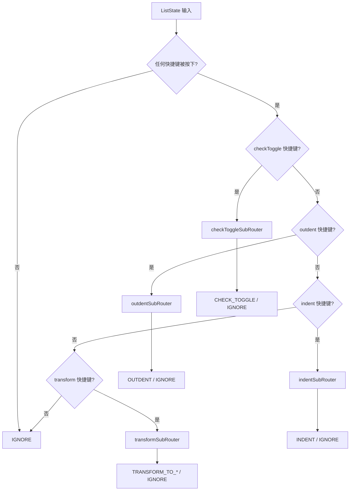

# 列表状态空间归并设计文档

## 1. 概述

### 1.1 背景

当前 `keydown.list` 模块有 4 个独立的中间件，每个都有自己的状态提取和路由器：

| 中间件 | 状态类型 | 路由器 | 功能 |
|--------|----------|--------|------|
| `listCheckToggleMiddleware` | `CheckToggleState` | `checkToggleRouter` | 任务列表切换 |
| `listOutdentMiddleware` | `OutdentState` | `outdentRouter` | 列表缩出 |
| `listIndentMiddleware` | `IndentState` | `indentRouter` | 列表缩进 |
| `listTransformMiddleware` | `TransformState` | `transformRouter` | 列表类型转换 |

### 1.2 问题

1. **重复的状态提取**：4 个中间件各自提取状态，存在大量重复计算
2. **分散的入口**：在 `keydown.ts` 中需要分别调用 4 个中间件
3. **状态空间碎片化**：相似的状态字段分散在不同类型中

### 1.3 目标

将 4 个中间件合并为一个统一的入口 `listMiddleware`，使用：
- 统一的状态空间 `ListStateSchema`
- 主路由器 `listMasterRouter` + 子分发器模式
- 单次状态提取，多路由决策

---

## 2. 统一状态空间设计

### 2.1 现有状态字段分析

#### CheckToggleState（2 字段）
```typescript
{
    isCheckToggleKey: boolean;  // 是否按下任务列表切换快捷键
    hasTaskItem: boolean;       // 光标是否在任务列表项中
}
```

#### OutdentState（6 字段）
```typescript
{
    isOutdentKey: boolean;         // 是否按下列表缩出快捷键
    hasSelectElements: boolean;    // 是否有多选元素
    isContinuousSelection: boolean; // 多选元素是否连续
    isFirstSelectInList: boolean;  // 第一个选中元素是否在列表中
    isInListItem: boolean;         // 当前元素是否在列表项中
    isInCodeBlock: boolean;        // 当前元素是否在代码块中
}
```

#### IndentState（7 字段）
```typescript
{
    isIndentKey: boolean;          // 是否按下列表缩进快捷键
    hasSelectElements: boolean;    // 是否有多选元素
    isContinuousSelection: boolean; // 多选元素是否连续
    isFirstSelectInList: boolean;  // 第一个选中元素是否在列表中
    isInListItem: boolean;         // 当前元素是否在列表项中
    isInCodeBlock: boolean;        // 当前元素是否在代码块中
    hasPreviousSibling: boolean;   // 是否有前一个兄弟元素
}
```

#### TransformState（9 字段）
```typescript
{
    isListKey: boolean;            // 是否按下无序列表快捷键
    isOListKey: boolean;           // 是否按下有序列表快捷键
    isCheckKey: boolean;           // 是否按下任务列表快捷键
    isQuoteKey: boolean;           // 是否按下引用快捷键
    isSingleSelect: boolean;       // 是否单选
    isContinuousSelection: boolean; // 选中元素是否连续
    hasListItem: boolean;          // 选中元素中是否包含列表项
    currentType: "NodeParagraph" | "NodeList" | "NodeHeading" | "other";
    currentSubtype?: "u" | "o" | "t" | null;
}
```

### 2.2 字段归并分析

| 字段名 | 来源 | 归并策略 |
|--------|------|----------|
| `isCheckToggleKey` | CheckToggle | 保留，快捷键类 |
| `isOutdentKey` | Outdent | 保留，快捷键类 |
| `isIndentKey` | Indent | 保留，快捷键类 |
| `isListKey` | Transform | 保留，快捷键类 |
| `isOListKey` | Transform | 保留，快捷键类 |
| `isCheckKey` | Transform | 保留，快捷键类 |
| `isQuoteKey` | Transform | 保留，快捷键类 |
| `hasTaskItem` | CheckToggle | 保留，上下文类 |
| `hasSelectElements` | Outdent/Indent | 合并为一个 |
| `isContinuousSelection` | Outdent/Indent/Transform | 合并为一个 |
| `isFirstSelectInList` | Outdent/Indent | 合并为一个 |
| `isInListItem` | Outdent/Indent | 合并为一个 |
| `isInCodeBlock` | Outdent/Indent | 合并为一个 |
| `hasPreviousSibling` | Indent | 保留，Indent 专用 |
| `isSingleSelect` | Transform | 保留，Transform 专用 |
| `hasListItem` | Transform | 保留，Transform 专用 |
| `currentType` | Transform | 保留，Transform 专用 |
| `currentSubtype` | Transform | 保留，Transform 专用 |

### 2.3 统一状态空间定义

```typescript
import { type, type Type } from "arktype";

/**
 * 统一列表状态空间 Schema
 * 
 * 设计原则：
 * 1. 快捷键状态：所有快捷键检测结果
 * 2. 选区状态：多选、连续性、位置等
 * 3. 上下文状态：当前块类型、列表类型等
 */
export const ListStateSchema: Type<{
    // ===== 快捷键状态 =====
    hotkeys: {
        checkToggle: boolean;  // 任务列表切换
        outdent: boolean;      // 缩出
        indent: boolean;       // 缩进
        list: boolean;         // 无序列表
        oList: boolean;        // 有序列表
        check: boolean;        // 任务列表
        quote: boolean;        // 引用
    };
    
    // ===== 选区状态 =====
    selection: {
        hasMultiple: boolean;       // 是否有多选元素
        isContinuous: boolean;      // 多选是否连续
        firstInList: boolean;       // 第一个选中元素是否在列表中
        hasListItem: boolean;       // 选中元素中是否包含列表项
        isSingle: boolean;          // 是否单选（selectCount <= 1）
    };
    
    // ===== 上下文状态 =====
    context: {
        inListItem: boolean;        // 当前元素是否在列表项中
        inCodeBlock: boolean;       // 当前元素是否在代码块中
        hasTaskItem: boolean;       // 光标是否在任务列表项中
        hasPreviousSibling: boolean; // 是否有前一个兄弟元素
        blockType: "NodeParagraph" | "NodeList" | "NodeHeading" | "other";
        listSubtype: "u" | "o" | "t" | null;
    };
}> = type({
    hotkeys: {
        checkToggle: "boolean",
        outdent: "boolean",
        indent: "boolean",
        list: "boolean",
        oList: "boolean",
        check: "boolean",
        quote: "boolean"
    },
    selection: {
        hasMultiple: "boolean",
        isContinuous: "boolean",
        firstInList: "boolean",
        hasListItem: "boolean",
        isSingle: "boolean"
    },
    context: {
        inListItem: "boolean",
        inCodeBlock: "boolean",
        hasTaskItem: "boolean",
        hasPreviousSibling: "boolean",
        blockType: "'NodeParagraph' | 'NodeList' | 'NodeHeading' | 'other'",
        listSubtype: "'u' | 'o' | 't' | null"
    }
});

export type ListState = typeof ListStateSchema.infer;
```

---

## 3. 主路由器设计

### 3.1 路由决策树



### 3.2 子路由器设计

#### 3.2.1 CheckToggle 子路由器

```typescript
/**
 * 任务列表切换子路由器
 * 
 * 前置条件：hotkeys.checkToggle = true
 * 决策逻辑：
 * - 在任务列表项中 -> CHECK_TOGGLE
 * - 否则 -> IGNORE
 */
const checkToggleSubRouter = calibur
    .universe(type({
        context: {
            hasTaskItem: "boolean"
        }
    }))
    .split(
        type({ context: { hasTaskItem: "false" } }),
        () => LIST_COMMANDS.IGNORE
    )
    .remain(() => LIST_COMMANDS.CHECK_TOGGLE)
    .build();
```

#### 3.2.2 Outdent 子路由器

```typescript
/**
 * 列表缩出子路由器
 * 
 * 前置条件：hotkeys.outdent = true
 * 决策逻辑：
 * - 有多选 + 不连续 -> IGNORE
 * - 有多选 + 连续 + 第一个不在列表 -> IGNORE
 * - 有多选 + 连续 + 第一个在列表 -> OUTDENT
 * - 无多选 + 在代码块 -> IGNORE
 * - 无多选 + 不在列表项 -> IGNORE
 * - 无多选 + 在列表项 -> OUTDENT
 */
const outdentSubRouter = calibur
    .universe(type({
        selection: {
            hasMultiple: "boolean",
            isContinuous: "boolean",
            firstInList: "boolean"
        },
        context: {
            inListItem: "boolean",
            inCodeBlock: "boolean"
        }
    }))
    // 有多选但不连续
    .split(
        type({ selection: { hasMultiple: "true", isContinuous: "false" } }),
        () => LIST_COMMANDS.IGNORE
    )
    // 有多选且连续但第一个不在列表
    .split(
        type({ 
            selection: { hasMultiple: "true", isContinuous: "true", firstInList: "false" } 
        }),
        () => LIST_COMMANDS.IGNORE
    )
    // 有多选且连续且第一个在列表
    .split(
        type({ 
            selection: { hasMultiple: "true", isContinuous: "true", firstInList: "true" } 
        }),
        () => LIST_COMMANDS.OUTDENT
    )
    // 无多选但在代码块
    .split(
        type({ 
            selection: { hasMultiple: "false" }, 
            context: { inCodeBlock: "true" } 
        }),
        () => LIST_COMMANDS.IGNORE
    )
    // 无多选且不在列表项
    .split(
        type({ 
            selection: { hasMultiple: "false" }, 
            context: { inCodeBlock: "false", inListItem: "false" } 
        }),
        () => LIST_COMMANDS.IGNORE
    )
    // 无多选且在列表项
    .remain(() => LIST_COMMANDS.OUTDENT)
    .build();
```

#### 3.2.3 Indent 子路由器

```typescript
/**
 * 列表缩进子路由器
 * 
 * 前置条件：hotkeys.indent = true
 * 决策逻辑：与 outdent 类似，但需要检查 hasPreviousSibling
 */
const indentSubRouter = calibur
    .universe(type({
        selection: {
            hasMultiple: "boolean",
            isContinuous: "boolean",
            firstInList: "boolean"
        },
        context: {
            inListItem: "boolean",
            inCodeBlock: "boolean",
            hasPreviousSibling: "boolean"
        }
    }))
    // 有多选但不连续
    .split(
        type({ selection: { hasMultiple: "true", isContinuous: "false" } }),
        () => LIST_COMMANDS.IGNORE
    )
    // 有多选且连续但第一个不在列表
    .split(
        type({ 
            selection: { hasMultiple: "true", isContinuous: "true", firstInList: "false" } 
        }),
        () => LIST_COMMANDS.IGNORE
    )
    // 有多选且连续且第一个在列表
    .split(
        type({ 
            selection: { hasMultiple: "true", isContinuous: "true", firstInList: "true" } 
        }),
        () => LIST_COMMANDS.INDENT
    )
    // 无多选但在代码块
    .split(
        type({ 
            selection: { hasMultiple: "false" }, 
            context: { inCodeBlock: "true" } 
        }),
        () => LIST_COMMANDS.IGNORE
    )
    // 无多选且不在列表项
    .split(
        type({ 
            selection: { hasMultiple: "false" }, 
            context: { inCodeBlock: "false", inListItem: "false" } 
        }),
        () => LIST_COMMANDS.IGNORE
    )
    // 无多选且在列表项
    .remain(() => LIST_COMMANDS.INDENT)
    .build();
```

#### 3.2.4 Transform 子路由器

```typescript
/**
 * 列表转换子路由器
 *
 * 前置条件：hotkeys.list | hotkeys.oList | hotkeys.check | hotkeys.quote = true
 * 决策逻辑：根据当前块类型和目标类型决定转换命令
 *
 * 注：完整规则与现有 router.transform.ts 一致，此处仅展示结构
 */
const transformSubRouter = calibur
    .universe(type({
        hotkeys: {
            list: "boolean",
            oList: "boolean",
            check: "boolean",
            quote: "boolean"
        },
        selection: {
            isSingle: "boolean",
            isContinuous: "boolean",
            hasListItem: "boolean"
        },
        context: {
            blockType: "'NodeParagraph' | 'NodeList' | 'NodeHeading' | 'other'",
            listSubtype: "'u' | 'o' | 't' | null"
        }
    }))
    // ===== 单选 + 段落场景 =====
    .split(
        type({
            selection: { isSingle: "true" },
            context: { blockType: "'NodeParagraph'" },
            hotkeys: { list: "true" }
        }),
        () => LIST_COMMANDS.TRANSFORM_TO_UL
    )
    .split(
        type({
            selection: { isSingle: "true" },
            context: { blockType: "'NodeParagraph'" },
            hotkeys: { oList: "true" }
        }),
        () => LIST_COMMANDS.TRANSFORM_TO_OL
    )
    .split(
        type({
            selection: { isSingle: "true" },
            context: { blockType: "'NodeParagraph'" },
            hotkeys: { check: "true" }
        }),
        () => LIST_COMMANDS.TRANSFORM_TO_TL
    )
    .split(
        type({
            selection: { isSingle: "true" },
            context: { blockType: "'NodeParagraph'" },
            hotkeys: { quote: "true" }
        }),
        () => LIST_COMMANDS.TRANSFORM_TO_QUOTE
    )
    // ===== 单选 + 列表类型转换 =====
    // 无序列表 -> 有序/任务
    .split(
        type({
            selection: { isSingle: "true" },
            context: { blockType: "'NodeList'", listSubtype: "'u'" },
            hotkeys: { oList: "true" }
        }),
        () => LIST_COMMANDS.TRANSFORM_TO_OL
    )
    .split(
        type({
            selection: { isSingle: "true" },
            context: { blockType: "'NodeList'", listSubtype: "'u'" },
            hotkeys: { check: "true" }
        }),
        () => LIST_COMMANDS.TRANSFORM_TO_TL
    )
    // 有序列表 -> 无序/任务
    .split(
        type({
            selection: { isSingle: "true" },
            context: { blockType: "'NodeList'", listSubtype: "'o'" },
            hotkeys: { list: "true" }
        }),
        () => LIST_COMMANDS.TRANSFORM_TO_UL
    )
    .split(
        type({
            selection: { isSingle: "true" },
            context: { blockType: "'NodeList'", listSubtype: "'o'" },
            hotkeys: { check: "true" }
        }),
        () => LIST_COMMANDS.TRANSFORM_TO_TL
    )
    // 任务列表 -> 无序/有序
    .split(
        type({
            selection: { isSingle: "true" },
            context: { blockType: "'NodeList'", listSubtype: "'t'" },
            hotkeys: { list: "true" }
        }),
        () => LIST_COMMANDS.TRANSFORM_TO_UL
    )
    .split(
        type({
            selection: { isSingle: "true" },
            context: { blockType: "'NodeList'", listSubtype: "'t'" },
            hotkeys: { oList: "true" }
        }),
        () => LIST_COMMANDS.TRANSFORM_TO_OL
    )
    // ===== 单选 + 标题 + 引用 =====
    .split(
        type({
            selection: { isSingle: "true" },
            context: { blockType: "'NodeHeading'" },
            hotkeys: { quote: "true" }
        }),
        () => LIST_COMMANDS.TRANSFORM_TO_QUOTE
    )
    // ===== 多选场景 =====
    .split(
        type({ selection: { isSingle: "false", isContinuous: "false" } }),
        () => LIST_COMMANDS.IGNORE
    )
    .split(
        type({ selection: { isSingle: "false", hasListItem: "true" } }),
        () => LIST_COMMANDS.IGNORE
    )
    // 多选 + 连续 + 无列表项
    .split(
        type({
            selection: { isSingle: "false", isContinuous: "true", hasListItem: "false" },
            hotkeys: { list: "true" }
        }),
        () => LIST_COMMANDS.TRANSFORM_TO_UL
    )
    .split(
        type({
            selection: { isSingle: "false", isContinuous: "true", hasListItem: "false" },
            hotkeys: { oList: "true" }
        }),
        () => LIST_COMMANDS.TRANSFORM_TO_OL
    )
    .split(
        type({
            selection: { isSingle: "false", isContinuous: "true", hasListItem: "false" },
            hotkeys: { check: "true" }
        }),
        () => LIST_COMMANDS.TRANSFORM_TO_TL
    )
    .split(
        type({
            selection: { isSingle: "false", isContinuous: "true", hasListItem: "false" },
            hotkeys: { quote: "true" }
        }),
        () => LIST_COMMANDS.TRANSFORM_TO_QUOTE
    )
    .remain(() => LIST_COMMANDS.IGNORE)
    .build();
```

### 3.3 主路由器实现

```typescript
/**
 * 列表主路由器
 *
 * 使用 .split() + 子分发器模式
 * 根据快捷键类型委托给对应的子路由器
 */
export const listMasterRouter = calibur
    .universe(ListStateSchema)
    // 快速路径：没有按下任何列表相关快捷键
    .split(
        type({
            hotkeys: {
                checkToggle: "false",
                outdent: "false",
                indent: "false",
                list: "false",
                oList: "false",
                check: "false",
                quote: "false"
            }
        }),
        () => LIST_COMMANDS.IGNORE
    )
    // CheckToggle 快捷键 - 委托给子路由器
    .split(
        type({ hotkeys: { checkToggle: "true" } }),
        (state) => checkToggleSubRouter({ context: state.context })
    )
    // Outdent 快捷键 - 委托给子路由器
    .split(
        type({ hotkeys: { outdent: "true" } }),
        (state) => outdentSubRouter({
            selection: state.selection,
            context: state.context
        })
    )
    // Indent 快捷键 - 委托给子路由器
    .split(
        type({ hotkeys: { indent: "true" } }),
        (state) => indentSubRouter({
            selection: state.selection,
            context: state.context
        })
    )
    // Transform 快捷键（list/oList/check/quote 任一为 true）
    .remain((state) => transformSubRouter({
        hotkeys: state.hotkeys,
        selection: state.selection,
        context: state.context
    }))
    .build();
```

---

## 4. 单一入口中间件设计

### 4.1 状态提取函数

```typescript
/**
 * 统一状态提取函数
 *
 * 合并原有 4 个状态提取函数的逻辑
 * 一次性提取所有决策所需的状态
 *
 * @同步豁免: 需要绝对同步的DOM访问
 */
export const extractListState = (
    event: KeyboardEvent,
    protyle: IProtyle,
    nodeElement: HTMLElement,
    range: Range
): ListState => {
    const config = getSiyuanConfig();
    
    // ===== 快捷键状态提取 =====
    const hotkeys = {
        checkToggle: matchHotKey(config.keymap.editor.list.checkToggle.custom, event),
        outdent: matchHotKey(config.keymap.editor.list.outdent.custom, event),
        indent: matchHotKey(config.keymap.editor.list.indent.custom, event),
        list: matchHotKey(config.keymap.editor.insert?.list?.custom ?? "", event),
        oList: matchHotKey(config.keymap.editor.insert?.["ordered-list"]?.custom ?? "", event),
        check: matchHotKey(config.keymap.editor.insert?.check?.custom ?? "", event),
        quote: matchHotKey(config.keymap.editor.insert?.quote?.custom ?? "", event)
    };
    
    // 快速路径：如果没有按下任何快捷键，返回最小状态
    const anyHotkeyPressed = Object.values(hotkeys).some(v => v);
    if (!anyHotkeyPressed) {
        return {
            hotkeys,
            selection: {
                hasMultiple: false,
                isContinuous: false,
                firstInList: false,
                hasListItem: false,
                isSingle: true
            },
            context: {
                inListItem: false,
                inCodeBlock: false,
                hasTaskItem: false,
                hasPreviousSibling: false,
                blockType: "other",
                listSubtype: null
            }
        };
    }
    
    // ===== 选区状态提取 =====
    const selectElements = protyle.wysiwyg?.element.querySelectorAll(
        ".protyle-wysiwyg--select"
    ) ?? [];
    const selectCount = selectElements.length;
    
    const selection = {
        hasMultiple: selectCount > 0,
        isContinuous: selectCount > 0 ? checkContinuousSelection(selectElements) : false,
        firstInList: selectCount > 0 && selectElements[0]
            ? (selectElements[0].classList.contains("li") ||
               selectElements[0].parentElement?.classList.contains("li") || false)
            : false,
        hasListItem: checkHasListItem(selectElements),
        isSingle: selectCount <= 1
    };
    
    // ===== 上下文状态提取 =====
    const taskItemElement = hasClosestByAttribute(range.startContainer, "data-subtype", "t");
    const targetElement = selectCount === 1 ? selectElements[0] : nodeElement;
    const dataType = targetElement?.getAttribute("data-type") || "";
    const dataSubtype = targetElement?.getAttribute("data-subtype") || "";
    
    const context = {
        inListItem: nodeElement.parentElement?.classList.contains("li") ?? false,
        inCodeBlock: nodeElement.getAttribute("data-type") === "NodeCodeBlock",
        hasTaskItem: !!taskItemElement,
        hasPreviousSibling: !!(nodeElement.parentElement?.previousElementSibling),
        blockType: parseBlockType(dataType),
        listSubtype: parseListSubtype(dataSubtype)
    };
    
    return { hotkeys, selection, context };
};
```

### 4.2 单一入口中间件

```typescript
/**
 * 统一列表中间件
 *
 * 替代原有的 4 个独立中间件：
 * - listCheckToggleMiddleware
 * - listOutdentMiddleware
 * - listIndentMiddleware
 * - listTransformMiddleware
 *
 * 执行流程：
 * 1. 提取统一状态
 * 2. 主路由器决策
 * 3. 执行命令
 */
export const listMiddleware = async (
    event: KeyboardEvent,
    protyle: IProtyle,
    nodeElement: HTMLElement,
    range: Range,
    controller: AbortController
) => {
    // 步骤 1: 提取统一状态
    const state = extractListState(event, protyle, nodeElement, range);
    
    // 步骤 2: 路由决策
    const command = listMasterRouter(state);
    
    // 步骤 3: 执行命令
    if (command !== LIST_COMMANDS.IGNORE) {
        await executeCommand(command, event, protyle, nodeElement, range, controller);
    }
};
```

### 4.3 与现有代码的集成

在 [`keydown.ts`](app/src/protyle/wysiwyg/keydown.ts) 中，原有的 4 次调用：

```typescript
// 原有代码（第 390-408 行）
await listOutdentMiddleware(event, protyle, nodeElement, range, controller);
if (signal.aborted) return;
await listIndentMiddleware(event, protyle, nodeElement, range, controller);
if (signal.aborted) return;
await listTransformMiddleware(event, protyle, nodeElement, range, controller);
if (signal.aborted) return;
// ... 其他中间件 ...
await listCheckToggleMiddleware(event, protyle, nodeElement, range, controller);
```

将被替换为单次调用：

```typescript
// 新代码
await listMiddleware(event, protyle, nodeElement, range, controller);
if (signal.aborted) return;
```

---

## 5. 迁移计划

### 5.1 文件变更清单

| 操作 | 文件路径 | 说明 |
|------|----------|------|
| 新增 | `keydown.list/types.unified.ts` | 统一状态类型定义 |
| 新增 | `keydown.list/state.unified.ts` | 统一状态提取函数 |
| 新增 | `keydown.list/router.master.ts` | 主路由器和子路由器 |
| 新增 | `keydown.list/middleware.ts` | 统一入口中间件 |
| 修改 | `keydown.list/index.ts` | 导出新的统一中间件 |
| 修改 | `keydown.ts` | 替换 4 次调用为 1 次 |
| 保留 | `keydown.list/middlewares/*.ts` | 暂时保留，标记废弃 |
| 保留 | `keydown.list/router.ts` | 暂时保留，标记废弃 |
| 保留 | `keydown.list/router.transform.ts` | 暂时保留，标记废弃 |
| 保留 | `keydown.list/state.ts` | 暂时保留，标记废弃 |
| 保留 | `keydown.list/state.transform.ts` | 暂时保留，标记废弃 |

### 5.2 实施步骤

#### 阶段 1：新增统一实现

1. 创建 `types.unified.ts`，定义 `ListStateSchema`
2. 创建 `state.unified.ts`，实现 `extractListState`
3. 创建 `router.master.ts`，实现主路由器和子路由器
4. 创建 `middleware.ts`，实现 `listMiddleware`
5. 编写单元测试验证行为等价性

#### 阶段 2：集成与验证

1. 修改 `index.ts`，同时导出新旧中间件
2. 在 `keydown.ts` 中添加特性开关
3. 进行集成测试
4. 收集性能数据对比

#### 阶段 3：切换与清理

1. 默认启用新实现
2. 标记旧实现为 `@deprecated`
3. 观察一段时间后删除旧代码

### 5.3 向后兼容性考虑

1. **行为等价性**：新实现必须与原有 4 个中间件的行为完全一致
2. **特性开关**：提供配置项在新旧实现间切换
3. **渐进式迁移**：保留旧代码直到新实现稳定

### 5.4 测试策略

#### 单元测试

```typescript
describe("listMasterRouter 行为等价性", () => {
    // 测试 CheckToggle 场景
    it("应该与 checkToggleRouter 行为一致", () => {
        const state = createTestState({ hotkeys: { checkToggle: true } });
        const oldResult = checkToggleRouter(extractCheckToggleState(...));
        const newResult = listMasterRouter(state);
        expect(newResult).toBe(oldResult);
    });
    
    // 测试 Outdent/Indent/Transform 场景类似
});
```

#### 集成测试

1. 在真实编辑器环境中测试所有列表操作
2. 验证快捷键响应正确
3. 验证多选场景正确处理

#### 性能测试

1. 对比状态提取时间
2. 对比路由决策时间
3. 验证快速路径优化效果

---

## 6. 设计决策说明

### 6.1 为什么使用嵌套对象结构

将状态分为 `hotkeys`、`selection`、`context` 三个嵌套对象：

1. **语义清晰**：每个分组有明确的职责
2. **便于子路由器**：子路由器只需接收相关的状态子集
3. **便于扩展**：新增字段时不影响其他分组

### 6.2 为什么使用子分发器模式

参考 [`texteditor.test.ts`](packages/caliburRouter/tests/realworld/texteditor.test.ts:373) 的设计：

1. **关注点分离**：每个子路由器只处理一类操作
2. **可测试性**：子路由器可以独立测试
3. **可维护性**：修改一类操作不影响其他

### 6.3 快速路径优化

在状态提取和路由决策中都实现了快速路径：

1. **状态提取**：如果没有按下任何快捷键，返回最小状态
2. **路由决策**：第一个 split 检查所有快捷键是否为 false

这确保了大多数按键事件能够快速返回，不执行不必要的计算。

---

## 7. 附录

### 7.1 命令常量定义

```typescript
// commands.ts
export const LIST_COMMANDS = {
    CHECK_TOGGLE: "CHECK_TOGGLE",
    OUTDENT: "OUTDENT",
    INDENT: "INDENT",
    TRANSFORM_TO_UL: "TRANSFORM_TO_UL",
    TRANSFORM_TO_OL: "TRANSFORM_TO_OL",
    TRANSFORM_TO_TL: "TRANSFORM_TO_TL",
    TRANSFORM_TO_QUOTE: "TRANSFORM_TO_QUOTE",
    IGNORE: "IGNORE"
} as const;
```

### 7.2 辅助函数

```typescript
// 检查选中元素是否连续
const checkContinuousSelection = (selectElements: NodeListOf<Element>): boolean => {
    for (let i = 0; i < selectElements.length - 1; i++) {
        const current = selectElements[i];
        const next = selectElements[i + 1];
        if (current?.nextElementSibling && next !== current.nextElementSibling) {
            return false;
        }
    }
    return true;
};

// 检查选中元素中是否包含列表项
const checkHasListItem = (selectElements: NodeListOf<Element>): boolean => {
    for (const element of selectElements) {
        if (element?.classList.contains("li")) return true;
    }
    return false;
};

// 解析块类型
const parseBlockType = (dataType: string): ListState["context"]["blockType"] => {
    if (dataType === "NodeParagraph") return "NodeParagraph";
    if (dataType === "NodeList") return "NodeList";
    if (dataType === "NodeHeading") return "NodeHeading";
    return "other";
};

// 解析列表子类型
const parseListSubtype = (dataSubtype: string): ListState["context"]["listSubtype"] => {
    if (dataSubtype === "u" || dataSubtype === "o" || dataSubtype === "t") {
        return dataSubtype;
    }
    return null;
};
```
