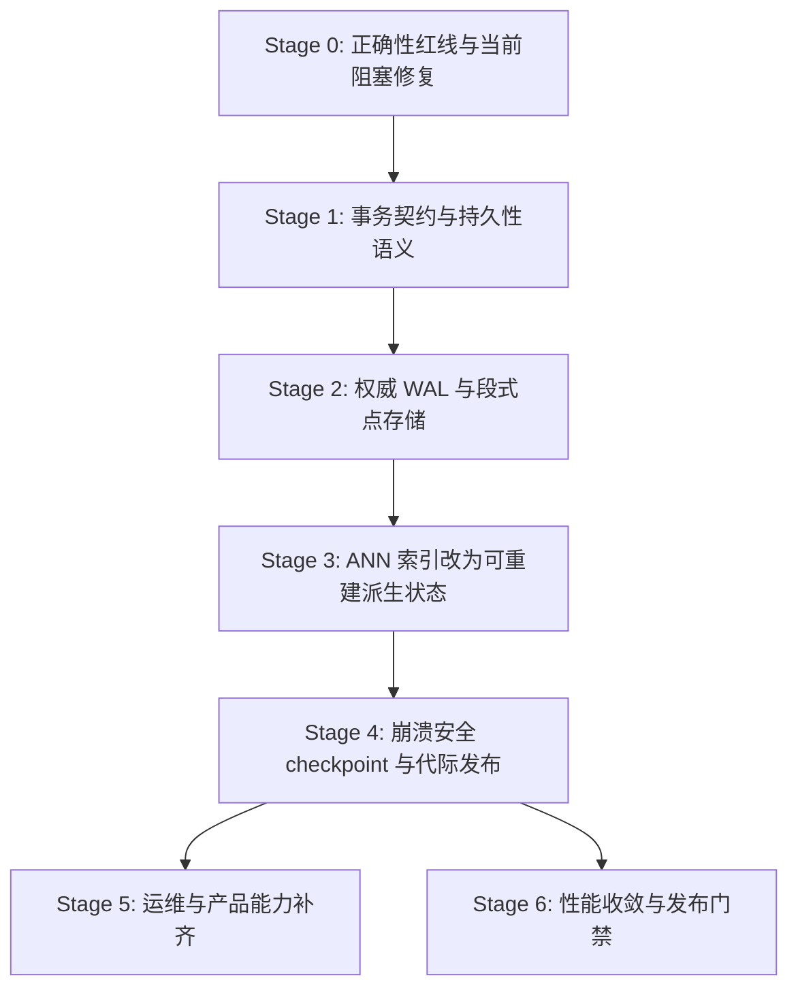

# 嵌入式向量数据库可靠性修复执行跟踪（TikTocTak）

> **目标**：将 [`嵌入式向量数据库成熟度差距评估.ttt.md`](./嵌入式向量数据库成熟度差距评估.ttt.md) 中的 Stage 0—6 改进路线转化为可执行的实施计划，按里程碑逐步修复 `packages/vectordb` 的正确性阻塞、并发崩溃、资源生命周期和错误传播问题，最终建立可自动化的稳定门禁。当前第一里程碑仅处理 Stage 0：当前可复现的 DiskVamana 小集合搜索错误、Windows mmap 生命周期/文件占用、HNSW 并发崩溃、错误传播与稳定门禁；后续事务/WAL/代际发布作为依赖 Stage 0 的后续阶段。
>
> **流程**：这是一个滚动更新的执行路线图。
> 1. 从"近期计划"中认领一个任务。
> 2. 完成根因调查、代码修复和测试验证。
> 3. 将完成任务移动到"已归档/已完成"区域。
> 4. 将"中期计划"中的条目提升到"近期计划"。

---

## 🎯 核心原则

1. **证据优先**：不得仅根据评估文档的结论性描述直接修改代码，必须由 debug 子任务先行根因调查，确认实际失败路径后再修复。
2. **不掩盖问题**：不得通过降低并发度、放宽断言或跳过测试来消除失败信号；修复必须针对根因。
3. **备份先行**：任何涉及生产代码或测试代码的复杂修改开始前，必须先备份原始文件。
4. **门禁固化**：每个修复必须伴随可重复执行的验证命令，禁止以历史通过记录覆盖当前测试结果。
5. **阶段隔离**：Stage 0 只处理当前可复现的正确性阻塞，不得提前实现事务协议、WAL 或代际发布。
6. **规程遵守**：并发 bug 修复遵循 [`后端Go并发bug修复.procedure.md`](../../规程/测试与修复/后端Go并发bug修复.procedure.md)，测试编写遵循 [`后端Go测试编写.procedure.md`](../../规程/测试与修复/后端Go测试编写.procedure.md)，模块实现遵循 [`Go模块实现.procedure.md`](../../规程/后端开发/Go模块实现.procedure.md)，代码重构遵循 [`Go后端代码重构.procedure.md`](../../规程/代码质量/Go后端代码重构.procedure.md)。

### 验证检查清单

- [x] 已阅读评估文档和全部适用规程。
- [x] 已确认 Stage 0 范围仅包含当前可复现的阻塞问题。
- [x] 近期计划不超过 5 项，任何时刻仅一个 `[-]`。
- [x] 每项任务包含证据、范围、依赖、验收标准、验证命令和失败记录位置。
- [x] 复杂修改前已包含备份原始文件任务。
- [x] 评估结论未被当作已验证的实现细节，根因调查保留给后续执行任务。

---

## 📐 里程碑与阶段依赖

**当前里程碑**：Stage 1 — 定义事务、持久性和恢复契约。Stage 0 已于 2026-07-11 完成全部自动化门禁和持续 30 分钟并发压力门禁。

**后续里程碑**：
- Stage 2：实现权威 WAL 与段式点存储，依赖 Stage 1 完成。
- Stage 3：把 ANN 索引改为可重建派生状态。
- Stage 4：实现崩溃安全的 checkpoint、compaction 与代际发布。
- Stage 5：补齐成熟数据库的运维与产品能力。
- Stage 6：性能收敛与发布门禁。

各后续阶段的详细工作包和验收标准见评估文档 [`嵌入式向量数据库成熟度差距评估.ttt.md`](./嵌入式向量数据库成熟度差距评估.ttt.md) 的 Stage 1—6 章节。

---

## 🟢 近期计划

> **当前里程碑**：Stage 1 — 定义事务、持久性和恢复契约
>
> **适用规程**：[`后端Go测试编写.procedure.md`](../../规程/测试与修复/后端Go测试编写.procedure.md)、[`Go模块实现.procedure.md`](../../规程/后端开发/Go模块实现.procedure.md)、[`Go后端代码重构.procedure.md`](../../规程/代码质量/Go后端代码重构.procedure.md)

- [-] **Stage 1: 定义事务、持久性和恢复契约（P0）**【已提升 2026-07-11】
  - **背景**：评估文档 Stage 1 要求将公开写接口升级为带上下文和写选项的批次接口，明确定义可见性、失败语义和磁盘格式兼容策略。
  - **证据**：Stage 0 已建立稳定错误和并发门禁，但当前公开接口仍以单操作和即时索引持久化语义为主，尚未形成可供 WAL、恢复和代际发布共同遵循的事务契约。具体接口现状和兼容边界必须以源码调查为准。
  - **范围**：调查现有数据库、集合、持久化和恢复入口；定义 `WriteBatch`、`WriteOptions`、`WriteResult`、`DurabilityMode`、线性化可见性、失败原子性、取消语义和磁盘格式兼容策略；保留现有公开写接口的兼容包装层。不得在本阶段提前实现 WAL、段式点存储或代际发布。
  - **依赖**：Stage 0 全部完成。
  - **验收标准**：
    - API 契约测试覆盖空批次、重复 ID、同批次更新后删除、跨批次覆盖、取消、同步失败和部分索引失败。
    - 每个公开失败可通过 `errors.Is` 分类，取消路径保留 `context.Canceled` 或 `context.DeadlineExceeded`。
    - 兼容包装层行为与现有公开接口一致并有测试覆盖。
    - 磁盘格式兼容策略明确版本识别、拒绝条件和升级边界。
    - 不包含 Stage 2 的 WAL 或段式点存储实现。
  - **验证命令**：`cd packages/vectordb && go test ./... -short -count=20 -timeout 600s`；`cd packages/vectordb && go test -race ./... -short -count=5 -timeout 600s`。
  - **失败记录位置**：本文档"⚠️ 失败记录"章节。
  - **当前状态**：已从中期计划提升，下一步为现有写入、持久化和恢复契约调查。

---

## 🟡 中期计划

> 以下阶段依赖当前里程碑完成，再从中期计划逐步提升。

- [ ] **Stage 2: 实现权威 WAL 与段式点存储（P0）**
  - **背景**：评估文档 Stage 2，建立与索引无关的事实来源，使 HNSW/Vamana 损坏时仍可恢复全部已提交点。
  - **主要步骤**：新增 `storage/wal.go`、`storage/manifest.go`、`storage/segment.go`、`storage/generation.go` 和根包 `recovery.go`；实现 WAL 格式、权威点存储和恢复协议。
  - **依赖**：Stage 1 完成。
  - **验收标准**：10,000 次随机进程终止测试中恢复后满足"已确认提交全部存在，未提交批次全部不可见"；WAL 和段文件损坏测试系统必须检测损坏且不得 panic；100,000 个随机批次与内存参考模型逐 LSN 对比完全一致。
  - **参考文档**：评估文档 Stage 2 章节。

---

## 🔴 远期计划

- [ ] **Stage 3: 把 ANN 索引改为可重建派生状态（P0）**
  - **愿景**：消除"索引文件即数据库"的结构性风险，避免每次公开写入触发全量 DiskVamana 重建。
  - **依赖**：Stage 2 完成。

- [ ] **Stage 4: 实现崩溃安全的 checkpoint、compaction 与代际发布（P0）**
  - **愿景**：任何时刻磁盘上至少保留一个可打开的完整代际，新代际不会通过删除旧文件来"就地替换"。
  - **依赖**：Stage 3 完成。

- [ ] **Stage 5: 补齐成熟数据库的运维与产品能力（P1）**
  - **愿景**：在可靠存储基础上补齐可观测性、资源治理、维护接口、元数据过滤和升级迁移。
  - **依赖**：Stage 4 完成。

- [ ] **Stage 6: 性能收敛与发布门禁（P1）**
  - **愿景**：可靠性达标后再进行 group commit、SIMD、缓存和图算法优化，建立发布矩阵。
  - **依赖**：Stage 4 完成。

---

## ⚠️ 失败记录

> 本章节记录任务执行过程中的失败，包括工具调用失败、验证失败和被否决的行动。每条记录包含：任务编号、失败时间、失败描述、根因分析和后续行动。

| 任务编号 | 失败时间 | 失败描述 | 根因分析 | 后续行动 |
|---|---|---|---|---|
| Phase 0-1 | 2026-07-11 00:08:22 +08:00 | 首次备份复制与校验命令退出码为 255，未执行文件复制。 | 命令实际由 `cmd.exe` 解析，PowerShell 变量语法被识别为无效命令。 | 显式调用 `pwsh.exe -NoProfile -Command` 执行同一范围的文件复制与校验，不使用命令编辑源码。 |
| Phase 0-3 | 2026-07-11 01:41:34 +08:00 | 首次备份校验命令退出码为 1，未输出校验值。 | 终端实际由 `cmd.exe` 解析，直接提交的 PowerShell 变量语法无法执行。 | 改用显式解释器执行只读校验；发现文本工具创建的备份发生换行转换后，使用二进制复制重新覆盖，并以 SHA-256 确认原样一致。 |
| Phase 0-2 | 2026-07-11 00:29:01 +08:00 | 修改 [`build.go`](../../../packages/vectordb/vamana/build.go) 前未确认该文件已列入 [`manifest.md`](./backups/嵌入式向量数据库可靠性修复-20260710/manifest.md)。 | Phase 0-1 的备份清单覆盖 19 个预先识别的文件，但遗漏了实际根因所在的并行建图文件；发现时该文件已修改，不能再补建原始备份。 | 保留已完成的最小修复并如实记录此流程偏差；后续阶段开始前逐个核对实际修改目标是否存在于清单。 |
| Phase 0-2 | 2026-07-11 00:56:18 +08:00 | `go test ./... -short -count=1 -timeout 240s` 触发 [`TestConcurrentSearchAndDelete`](../../../packages/vectordb/race_test.go) 的 `fatal error: concurrent map read and map write`。 | HNSW 删除路径的 [`recomputeNeighbors`](../../../packages/vectordb/hnsw/delete.go) 并发读写共享邻接映射；这是独立的 Phase 0-3 已知阻塞。 | 不在 Phase 0-2 修改 HNSW；待 Phase 0-3 按 TTT 顺序调查并修复。 |
| Phase 0-2 | 2026-07-11 00:56:18 +08:00 | `go vet ./...` 在 [`io_mmap_windows.go`](../../../packages/vectordb/storage/io_mmap_windows.go) 报告 `possible misuse of unsafe.Pointer`。 | Windows mmap 实现的零拷贝映射切片转换未满足 vet 检查；问题位于 Phase 0-4 的 Windows 资源与 mmap 范围。 | 不在 Phase 0-2 修改 Windows mmap；待 Phase 0-4 结合文件占用问题统一调查。 |
| Phase 0-2 | 2026-07-11 01:02:47 +08:00 | 排除 HNSW 崩溃后运行其余根包短测试 `-count=20`，[`TestBug_VamanaInsertUpdateRace`](../../../packages/vectordb/vamana_concurrent_bug_test.go) 每轮均因 `TempDir RemoveAll cleanup` 无法删除仍被占用的 `vamana.index` 失败。 | 重开集合后仍有 Windows mmap 文件句柄未关闭；这是 Phase 0-4 的已知资源生命周期阻塞。 | 不在 Phase 0-2 修改 mmap 生命周期；Phase 0-2 的全包 20 次门禁尚未满足，待 Phase 0-3 和 Phase 0-4 解除阻塞后重跑。 |
| Phase 0-2 | 2026-07-11 01:03:48 +08:00 | 在核实 `-short` 的数据规模和跳过条件前，错误启动了根包短测试的 `-count=20`。 | 将跨阶段的全包验收命令机械地视为本子任务的即时门禁，未先按测试范围和数据量做执行成本评估。 | 后续只按本子任务直接要求运行目标测试多次、一次精确排除已知 HNSW 崩溃的根包短测及相关 Vamana 测试；1M 和外部数据集测试必须先检查 `-short`/数据集门控后再决定是否执行。 |
| Phase 0-3 | 2026-07-11 02:13:50 +08:00 | `go test . -short -count=1 -timeout 300s` 的根包回归被 [`TestBug_VamanaInsertUpdateRace`](../../../packages/vectordb/vamana_concurrent_bug_test.go) 清理 `vamana.index` 时的 Windows 文件占用失败阻塞。 | HNSW 定向竞态测试和 [`hnsw`](../../../packages/vectordb/hnsw/) 子包竞态测试均已通过；失败路径仅涉及 DiskVamana mmap 文件句柄，属于 Phase 0-4 的独立已知缺陷。 | 不在 Phase 0-3 修改 mmap 生命周期；继续运行 Phase 0-3 定向验证和规定全包门禁，并如实区分独立阻塞。 |
| Phase 0-3 | 2026-07-11 02:37:15 +08:00 | 最终全包门禁 `go test -race ./... -short -count=5 -timeout 600s` 的首次执行被外部中断，未产生可用验收结果。 | 工具调用返回“Task was interrupted before this tool call could be completed”，没有测试通过或失败证据。 | 重新执行同一门禁；仅记录重试产生的客观结果。 |
| Phase 0-3 | 2026-07-11 02:43:32 +08:00 | 重试全包门禁时工具再次返回中断，但终端仍显示同一 `go test -race ./... -short -count=5 -timeout 600s` 进程正在运行；随后用于只读查询进程的命令因终端由 `cmd.exe` 解析而退出码 255。 | 第二次调用未能同步返回已运行进程的结果；附加查询命令使用了错误的命令解释器，未影响测试进程或源码。 | 不启动第三个重复全包门禁；等待现有终端进程结束并获取其客观结果。 |
| Phase 0-3 | 2026-07-11 03:50 +08:00 | 仅根据超时瞬间的堆栈位置，将 HNSW visited epoch 贸然改为每次搜索对象池。 | 超时堆栈只能说明采样瞬间位于 `IsVisited`，未先完整分析接口、扩容、并发搜索和 race 放大成本，判断证据不足。 | 精确回退对象池和接口改动，恢复锁安全的 epoch 实现；定向编译与 `-race` 测试通过后再使用单次计时和 CPU profile 分析。 |
| Phase 0-3 | 2026-07-11 15:52 +08:00 | HNSW SIFT 10K 在 race 下单次约 122 秒，`-count=5` 会占用约 10 分钟并挤压包级门禁。 | 该用例使用外部 SIFT 数据、构建 10,000 个 128 维节点并计算 100 个查询真值，属于规模/性能验证；非 race 单次约 5.22 秒，race 放大约 23 倍。 | 不修改生产锁结构；将该规模测试与 100K/1M 测试一致地从 `-short` 门禁中分层，保留非 `-short` 定向运行。 |
| Phase 0-5 | 2026-07-11 19:57 +08:00 | 首次调整两项大型测试后，`go test -race ./vamana -short -count=5` 仍在 `TestNodeCacheHitRate` 超时。 | NodeCache 文件中还存在 20K hit-rate、5K 并发和 5K parity 构建测试未按规模分层；超时栈显示正在构建 20,000 个节点。 | 审查同文件全部构建规模，将 5K—20K 规模型用例在 `-short` 下跳过；重跑完整 `-race ./... -short -count=5` 后通过。 |
| Phase 0-5 | 2026-07-11 21:14 +08:00 | 30 分钟门禁前的首次备份命令退出码为 255，未执行复制。 | 工具终端由 `cmd.exe` 解析，直接提交的 PowerShell 变量语法无法执行。 | 显式调用 `pwsh.exe -NoProfile -Command` 进行二进制复制和 SHA-256 校验，源文件与备份哈希一致。 |
| Phase 0-5 | 2026-07-11 21:16 +08:00 | 首次串联 `gofmt` 与定向测试时退出码为 2，命令中的每个参数被当作独立文件名。 | 当前终端未按预期解析分号命令链。 | 显式调用 `cmd.exe /d /c` 并使用 `&&` 串联格式化和测试，定向 race 测试通过。 |

### 调查记录

| 调查编号 | 调查时间 | 调查范围 | 结论 |
|---|---|---|---|
| 调查-001 | 2026-07-11 01:35 +08:00 | 恢复上下文，确定下一执行项 | Phase 0-2 核心修复已完成但全包验证被 0-3/0-4 阻塞；下一执行项为 Phase 0-3；`persistence.go` 未备份，执行前需补备份；`vamana/build.go` 无有效备份（备份目录中存在损坏文件名）。 |
| 调查-002 | 2026-07-11 15:49 +08:00 | 对 `-race -count=5` 超时进行单次计时和 CPU profile | HNSW SIFT 10K 非 race 构建 4.79 秒、总计 5.22 秒；race 构建 118.33 秒、总计 122.40 秒。profile 中 race runtime 占主要采样，`IsVisited` 累计 8.53%，不能据此证明 visited 锁是唯一根因。Vamana NodeCache 10K race 单次 25.94 秒，但同文件 20K 等用例重复五次会挤压包级 600 秒门禁。 |
| 调查-003 | 2026-07-11 20:43 +08:00 | Stage 0 自动化门禁复核 | `go test ./... -short -count=20 -timeout 600s` 与 `go test -race ./... -short -count=5 -timeout 600s` 均通过；稳定错误定向测试、Windows 生命周期测试、HNSW 并发测试和并发压力测试均在 race 下通过。剩余未执行项仅为持续 30 分钟压力运行。 |
| 调查-004 | 2026-07-11 21:49 +08:00 | Stage 0 持续压力门禁复核 | `VECTORDB_STRESS_DURATION=30m go test -race . -short -run "^TestConcurrentStress_UpsertSearchFlushClose$" -count=1 -v -timeout 35m` 持续运行 1800.13 秒并通过，总耗时 1801.840 秒；无数据竞争、丢 ID、重复外部 ID、计数偏差、死锁或 panic，关闭错误和重开持久化断言均通过。 |

---

## 🏁 已归档/已完成

- [x] **Phase 0-4: Windows mmap 生命周期与文件占用修复（P0）**【已完成 2026-07-11】
  - **根因**：Windows mmap 的底层关闭顺序正确，实际缺陷是集合在 `FlushToDisk` 关闭、替换并重新发布 `Index` 时，没有阻止并发搜索、插入、删除和状态提取继续引用旧索引，导致旧 reader 仍在使用且集合字段存在数据竞争。
  - **修复概要**：使用集合读写锁保护 `Index` 的完整使用期和发布期，使用独立 `flushMu` 串行化刷新与关闭；替换文件前关闭临时索引和当前索引，关闭错误不再吞掉；新增 100 次关闭后立即重命名和删除目录的回归测试，全程不使用 `time.Sleep`。
  - **验证结果**：[`TestBug_VamanaInsertUpdateRace()`](../../../packages/vectordb/vamana_concurrent_bug_test.go:23) 在 `-race -count=20` 下通过；Windows reader 关闭测试与集合目录立即重命名/删除测试通过；相关生命周期门禁在 `-race -count=5` 下通过。
  - **成果文件**：[`vamana_collection.go`](../../../packages/vectordb/vamana_collection.go)、[`vamana_concurrent_bug_test.go`](../../../packages/vectordb/vamana_concurrent_bug_test.go) 及相关 Windows 生命周期测试文件。
  - **参考文档**：[`后端Go并发bug修复.procedure.md`](../../规程/测试与修复/后端Go并发bug修复.procedure.md)、[`后端Go测试编写.procedure.md`](../../规程/测试与修复/后端Go测试编写.procedure.md)

- [x] **Phase 0-2: DiskVamana 小集合搜索错误根因调查与修复（P0）**【已完成 2026-07-11】
  - **完成情况**：修复 DiskVamana 小集合插入、建图和搜索状态一致性问题，并新增对应失败场景回归测试。
  - **验证结果**：解除 Phase 0-3/0-4 阻塞后，`go test ./... -short -count=20 -timeout 600s` 全包门禁通过，根包 236.867 秒、Vamana 子包 191.376 秒，无最近邻断言失败。
  - **成果文件**：[`vamana_collection.go`](../../../packages/vectordb/vamana_collection.go)、[`build.go`](../../../packages/vectordb/vamana/build.go) 及相关小集合搜索回归测试文件。
  - **失败**：[`build.go`](../../../packages/vectordb/vamana/build.go) 未包含在初始备份清单中，此流程偏差已记录于“⚠️ 失败记录”。
  - **参考文档**：[`后端Go测试编写.procedure.md`](../../规程/测试与修复/后端Go测试编写.procedure.md)、[`Go模块实现.procedure.md`](../../规程/后端开发/Go模块实现.procedure.md)

- [x] **Phase 0-5: 错误传播修复与稳定门禁建立（P0）**【已完成 2026-07-11】
  - **完成情况**：公开集合契约已提供错误感知的搜索和删除路径；DiskVamana 搜索、删除、刷新、关闭以及损坏集合打开不再把底层错误转换为空结果、成功或“集合不存在”；关闭、维度、损坏、忙、只读和持久化失败均可通过稳定错误或 `errors.Is` 分类。
  - **稳定门禁**：`go test ./... -short -count=20 -timeout 600s` 与 `go test -race ./... -short -count=5 -timeout 600s` 均通过；HNSW SIFT 10K 与 Vamana NodeCache 5K—20K 规模测试已从 `-short` 正确分层，非短测试入口仍保留。
  - **持续压力结果**：[`TestConcurrentStress_UpsertSearchFlushClose()`](../../../packages/vectordb/vamana_concurrent_bug_test.go:121) 支持通过 `VECTORDB_STRESS_DURATION` 配置持续时间；32 个查询协程、4 个写协程和 1 个 checkpoint 协程在 race 检测下持续运行 1800.13 秒并通过，总耗时 1801.840 秒，无丢 ID、重复外部 ID、计数偏差、死锁、panic 或数据竞争，关闭错误和重开持久化断言通过。
  - **备份**：持续门禁适配前的测试文件备份位于 [`phase-0-5-before-30m-gate`](./backups/嵌入式向量数据库可靠性修复-20260710/checkpoints/phase-0-5-before-30m-gate/)，源文件与备份 SHA-256 均为 `2A4A58186F1AE5C3D357BDC5907FF0DE7C139095F68A306E346321DF80BC3A43`。
  - **成果文件**：[`vamana_concurrent_bug_test.go`](../../../packages/vectordb/vamana_concurrent_bug_test.go)、[`public.go`](../../../packages/vectordb/public.go)、[`vamana_collection.go`](../../../packages/vectordb/vamana_collection.go)、[`database.go`](../../../packages/vectordb/database.go)、[`collection.go`](../../../packages/vectordb/collection.go) 及相关稳定错误、生命周期和规模门禁测试文件。
  - **失败**：两次命令解释器不匹配均未改动源码，已记录于“⚠️ 失败记录”；改用显式解释器后完成备份校验、格式化和测试。
  - **参考文档**：[`后端Go并发bug修复.procedure.md`](../../规程/测试与修复/后端Go并发bug修复.procedure.md)、[`后端Go测试编写.procedure.md`](../../规程/测试与修复/后端Go测试编写.procedure.md)、[`Go模块实现.procedure.md`](../../规程/后端开发/Go模块实现.procedure.md)

- [x] **Phase 0-3: HNSW 并发崩溃根因调查与修复（P0）**【已完成 2026-07-11】
  - **背景**：评估文档证据五记录 HNSW 并发删改触发 `fatal error: concurrent map read and map write`。此问题涉及并发安全，是 Stage 0 的核心阻塞。
  - **根因类别**：HNSW 共享状态无锁读取。`GetLevelNeighborRecords` 返回原始切片不持有锁；`recomputeNeighbors` 和入口点遍历无锁读 `Deleted` map；`VectorStore` 所有距离计算和 `GetUnsafe` 无锁访问底层切片；`Delete` 的入口点重选在 `Deleted` map 已释放锁后继续遍历 `Neighbors`。
  - **修复概要**：`nodeLocks` 改为 `[]*sync.RWMutex` 避免切片扩容复制锁；所有邻居读路径（`GetLevelNeighborRecords`、`GetLevelNeighborIDs`、`GetItemLevel`）持 `Mu.RLock + nodeLocks[docID].RLock` 并返回副本；所有邻居写路径持 `Mu.RLock + nodeLocks[docID].Lock`；`Deleted` map 读通过 `IsDeleted()` 方法持 `Mu.RLock` 保护；新增 `Snapshot()`/`Restore()` 用于持久化一致快照；`VectorStore` 所有距离计算和 `GetUnsafe` 持 `mu.RLock`；`InsertPoint`/`DeletePoint` 的集合元数据操作合并为单次 `c.Mu.Lock`。
  - **修改文件**：`hnsw/types.go`、`hnsw/utils.go`、`hnsw/delete.go`、`hnsw/build.go`、`hnsw_proxy.go`、`store.go`、`persistence.go`、`race_test.go`（增强验证断言）
  - **定向验证**：
    - `go test -race . -short -run "^TestConcurrentSearchAndDelete$" -count=50 -timeout 600s` → 50/50 PASS (53.207s)，零竞态
    - `go test -race ./hnsw -short -count=1 -timeout 300s` → PASS (2.321s)，HNSW 子包全部竞态安全
  - **历史门禁阻塞证据**：`go test . -short -count=1` 曾仅因 `TestBug_VamanaInsertUpdateRace` 的 Windows mmap 文件占用清理失败而阻塞，后由 Phase 0-4 修复。
  - **最终门禁**：`go test -race ./... -short -count=5 -timeout 600s` 已通过，根包 169.263 秒、HNSW 子包 10.504 秒、Vamana 子包 147.122 秒，无数据竞争、fatal map 崩溃或超时。
  - **完成状态**：本项缺陷及最终全包门禁均已完成。
  - **成果文件**：上述 8 个修改文件
  - **参考文档**：[`后端Go并发bug修复.procedure.md`](../../规程/测试与修复/后端Go并发bug修复.procedure.md)

- [x] **Phase 0-1: 备份原始文件（P0）**【已完成 2026-07-11】
  - **背景**：规程要求任何复杂修改开始前必须备份原始文件，确保修改错误后可恢复并核对重构正确性。
  - **证据**：[`负面记录.md`](../../.roo/rules/负面记录.md) 中“复杂任务开始前不备份原始文件”规则；评估文档 Stage 0 涉及多文件修改。
  - **执行范围**：按本次子任务的用户直接指令，备份 Stage 0 当前已知可能修改的 19 个文件；备份放置在不会被 Go 包编译扫描的 [`嵌入式向量数据库可靠性修复-20260710`](./backups/嵌入式向量数据库可靠性修复-20260710/) 目录，并保持源文件相对路径。
  - **完成情况**：19 个源文件均已完成原样复制，未修改任何生产代码或测试代码；完整源路径、备份路径、文件大小和 SHA-256 见 [`manifest.md`](./backups/嵌入式向量数据库可靠性修复-20260710/manifest.md)。
  - **验证**：最终校验结果为 19 个源文件与备份文件的文件大小、SHA-256 全部一致，差异数为 0；清单记录完整性检查缺失数为 0。
  - **失败**：首次复制与校验命令因实际命令解释器不匹配而退出，未产生文件复制；失败已记录在“⚠️ 失败记录”，随后显式使用正确解释器重试并通过全部校验。
  - **成果文件**：[`嵌入式向量数据库可靠性修复-20260710`](./backups/嵌入式向量数据库可靠性修复-20260710/)、[`manifest.md`](./backups/嵌入式向量数据库可靠性修复-20260710/manifest.md)
  - **参考文档**：[`tiktoctac文档(ttt)编写规程.procedure.md`](../../规程/tiktoctac文档(ttt)编写规程.procedure.md)、[`后端Go并发bug修复.procedure.md`](../../规程/测试与修复/后端Go并发bug修复.procedure.md)、[`Go后端代码重构.procedure.md`](../../规程/代码质量/Go后端代码重构.procedure.md)

- [x] **创建实施跟踪文档（P0）**【已完成 2026-07-10】
  - **背景**：评估文档已完成，需要将 Stage 0—6 改进路线转化为可执行的实施计划，建立滚动跟踪机制。
  - **完成情况**：已创建本文档，将评估路线转为 Stage 0—6 里程碑结构；近期计划包含 5 项 Stage 0 任务（备份原始文件、DiskVamana 搜索修复、HNSW 并发修复、Windows mmap 修复、错误传播与稳定门禁），每项包含证据、范围、依赖、验收标准、验证命令和失败记录位置；中期计划包含 Stage 1—2，远期计划包含 Stage 3—6。评估结论未被当作已验证实现细节，根因调查保留给后续 debug 子任务。
  - **规程冲突**：发现一处规程例外，已按用户指令优先处理。[`tiktoctac文档(ttt)编写规程.procedure.md`](../../规程/tiktoctac文档(ttt)编写规程.procedure.md) 第 3.2 节规定"不得在近期计划中放置超过2个P0任务"，但用户指令明确要求第一里程碑处理 Stage 0 全部 5 项任务且评估文档将 Stage 0 全部标记为 P0。根据"用户直接指令高于一切任务要求或者规程描述"原则，近期计划保留 5 项 P0 任务。其余规程要求（单任务进行、验收标准完整、归档流程）均已遵守。评估文档 Stage 0 验收标准与 [`后端Go并发bug修复.procedure.md`](../../规程/测试与修复/后端Go并发bug修复.procedure.md) 第 5.1 节"修复后必须在受影响的包上运行 `go test -race` 并通过"一致，无冲突。
  - **成果文件**：[`嵌入式向量数据库可靠性修复.ttt.md`](./嵌入式向量数据库可靠性修复.ttt.md)
  - **参考文档**：[`嵌入式向量数据库成熟度差距评估.ttt.md`](./嵌入式向量数据库成熟度差距评估.ttt.md)、[`tiktoctac文档(ttt)编写规程.procedure.md`](../../规程/tiktoctac文档(ttt)编写规程.procedure.md)、[`后端Go并发bug修复.procedure.md`](../../规程/测试与修复/后端Go并发bug修复.procedure.md)、[`后端Go测试编写.procedure.md`](../../规程/测试与修复/后端Go测试编写.procedure.md)、[`Go模块实现.procedure.md`](../../规程/后端开发/Go模块实现.procedure.md)、[`Go后端代码重构.procedure.md`](../../规程/代码质量/Go后端代码重构.procedure.md)

---

## ℹ️ 如何维护此文档

1. **完成归档**：任务完成后，必须剪切粘贴到【已归档/已完成】列表，并标记 `[x]` 和完成日期。
2. **单任务进行**：任何时刻只允许一个任务标记为 `[-]`。
3. **证据驱动**：新发现必须关联到源码、测试、配置或可复现实验，不凭印象修改结论。
4. **滚动修正**：如果证据推翻初始分类，应更新计划和判定标准，而不是维持原假设。
5. **失败记录**：每次任务失败必须在"⚠️ 失败记录"章节追加记录，包含任务编号、失败时间、失败描述、根因分析和后续行动。
6. **阶段提升**：当前里程碑完成后，将下一阶段从中期计划提升到近期计划，并保持单一进行中任务。