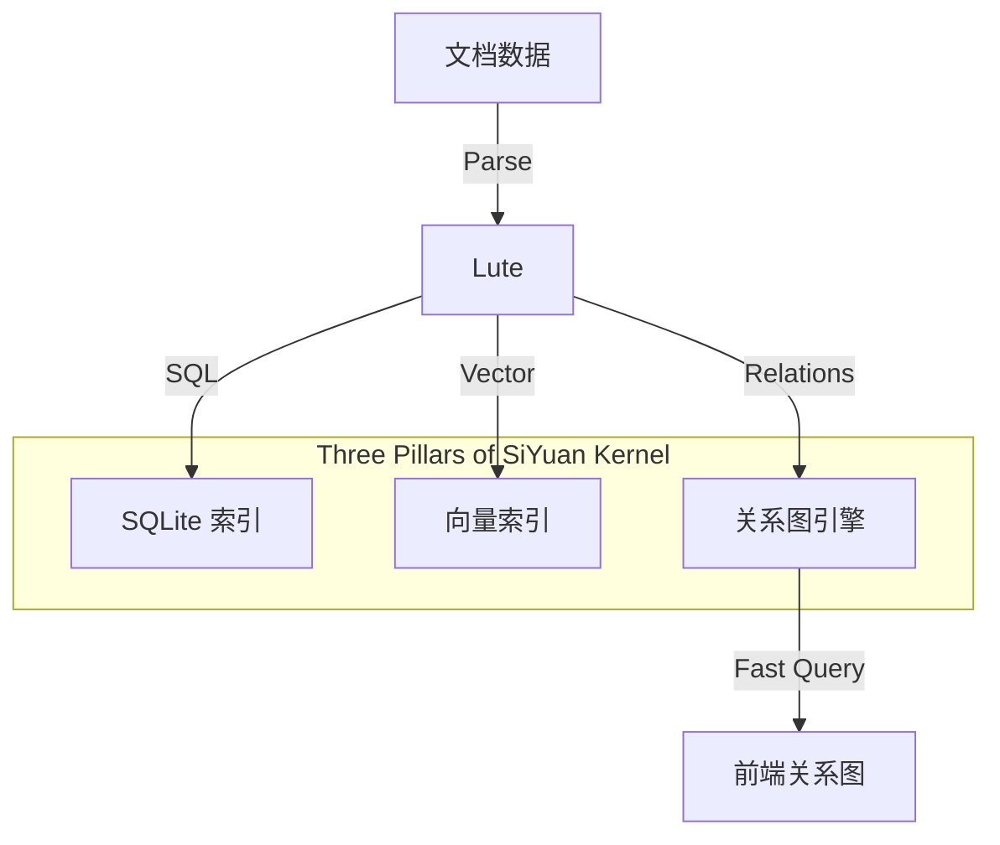

# 后端关系图引擎增强计划 (Relation Graph Enhancement)

> **目标**: 将"关系图"提升为与 SQLite 结构化索引、Vector 向量索引同等地位的"一等公民"，解决性能瓶颈并赋予语义能力。
> **状态**: 🟢 规划中
> **优先级**: P1

## 1. 现状问题 (Current Issues)

### 1.1 性能羸弱 (Performance)
- **实时构建**: 当前关系图 (`kernel/model/graph.go`) 每次请求都会执行复杂的 SQL 查询 (`sql.DefRefs -> SELECT * FROM refs ...`)。
- **内存抖动**: 查询结果需要在内存中重新构建为 `GraphNode` 和 `GraphLink` 对象图，大库（10w+ 块）场景下导致巨大的 CPU/内存开销。
- **无法扩展**: 随着数据量增长，实时 SQL 聚合的性能将呈线性下降，无法支撑百万级节点。

### 1.2 语义缺失 (Semantic Gap)
- **弱连接**: 目前的 `href` 引用仅代表"A 提到了 B"，缺乏"为什么提到"的语义。
- **无标签**: `GraphLink` 结构体中仅有 `Ref` (bool) 和 `Arrows`，缺失 `RelationType` (如: "支持", "反对", "包含", "相关")。

## 2. 总体架构愿景 (Architecture Vision)

我们需要引入一个持久化的 **GraphEngine** (关系图引擎)，位于 `kernel/graph` (新建)。



## 3. 详细改进计划 (Detailed Implementation Plan)

### Phase 1: 语义增强 (Semantic Enhancement)

> **目标**: 解决"关系图的双向链接没有关系标签定义"的问题，采用"Post-Processing"策略绕过 Lute 限制。

#### 3.1 数据库 Schema 变更
- **Modify** `kernel/sql/database.go`:
    - 更新 `refs` 表结构，新增字段:
        - `relation_type` TEXT: 存储关系类型 (e.g., "support", "oppose")。
        - `tags` TEXT: 存储自定义标签 (e.g., "important,verified")。

#### 3.2 语义语法与解析 (Semantic Syntax & Parsing)

- **语法 (Syntax)**: 采用 **Span Wrapping** 策略。
    - 用户（或 UI）通过在链接/块引用外包裹强调符 `*` 并附加 IAL 属性来定义关系。
    - Format: `*[Link Text](URL)*{: custom-type="relation" custom-tags="tag1,tag2"}`
    - Example: `*((20240101-ID))*{: custom-type="support"}`
    
- **解析逻辑 (Parsing Logic)**:
    - **无需修改 Lute 源码**。Lute 原生支持将 IAL 属性附加到 `NodeEmphasis` (强调) 节点。
    - **Modify** `kernel/sql/block_ref.go`:
        - 在遍历 AST 提取引用时，检查 `NodeLink` 或 `NodeBlockRef` 的 **父节点** (Parent)。
        - 如果父节点是 `NodeEmphasis` 或 `NodeStrong` 且包含 `custom-type` 属性：
            - 将该属性提取为关系的 `relation_type`。
            - 将 `custom-tags` 提取为 `tags`。
    - **优势**: 符合 Markdown 标准扩展语法，无 Hack，解析逻辑简单稳健。

#### 3.3 验证计划
- **Unit Test**: `kernel/sql/block_ref_test.go` 测试 Span 包裹的 AST 结构解析。
- **Manual**: 手动创建带属性链接，检查 `refs` 表数据。

---

### Phase 2: 图引擎设计 (Graph Engine Design)

> **目标**: 引入**内存驻留**的图数据结构，替代每次查询时的实时 SQL 构建，实现 O(1) 级别的关系查询性能。

#### 3.4 数据结构 (Data Structures)

在 `kernel/graph` 包中实现：

```go
package graph

import "sync"

// GraphEngine 管理全局关系图
type GraphEngine struct {
    sync.RWMutex
    
    // 节点索引: ID -> Node Metadata
    Nodes map[string]*Node
    
    // 邻接表 (Adjacency List)
    //为了快速查询双向链接，维护两套索引
    OutEdges map[string][]*Edge // 出边: ID -> [Link1, Link2...]
    InEdges  map[string][]*Edge // 入边: ID -> [Link1, Link2...]
}

type Node struct {
    ID    string
    Type  string // 块类型 (d, h, etc.)
    Box   string // 所属笔记本
    Path  string // 文档路径
}

type Edge struct {
    FromID   string
    ToID     string
    Type     string // constant.RelationType (e.g., "ref", "support")
    Tags     []string
    Metadata map[string]string // 其它扩展属性
}
```

#### 3.5 持久化与启动 (Persistence & Startup)

- **冷启动 (Cold Start)**:
    - 系统启动时，`GraphEngine` 初始化。
    - **全量加载**: 执行 `SELECT * FROM refs` 从 SQLite 加载所有引用关系，构建内存图。
    - **性能优化**: 如果全量加载超过阈值 (e.g., 5s)，可启用 **Snapshot** 机制。
        - `SaveSnapshot()`: 将 `GraphEngine` 序列化为二进制文件 (`graph.bin`)。
        - `LoadSnapshot()`: 启动时优先加载快照，再重放快照后的 SQL 增量日志 (可选，或直接重新加载 refs)。

- **增量更新 (Incremental Updates)**:
    - 监听 `EventBus` 的 `EvtSQLInsertRefs`, `EvtSQLDeleteRefs` 等事件。
    - **实时同步**: 当 SQL 发生写入时，同步更新内存中的 `OutEdges` 和 `InEdges`。
    - 保证内存图与 SQLite 数据强一致。

#### 3.6 查询接口 (Query API)

```go
// 获取指定节点的关系图数据 (替代复杂的 SQL JOIN)
func (ge *GraphEngine) GetGraph(centerID string, depth int) (*model.Graph, error) {
    ge.RLock()
    defer ge.RUnlock()
    
    // BFS 遍历内存中的 OutEdges/InEdges
    // ...
    // 瞬间返回结果
}
```

## 4. 执行路线图 (Roadmap)
- [x] **Design**: Phase 1 Schema & Polyfill Strategy.
- [x] **Design**: Phase 2 Graph Engine Architecture.
- [ ] **Implementation**: Phase 1 (Schema & Indexing Logic).
- [ ] **Implementation**: Phase 2 (GraphEngine, Event Listeners).
- [ ] **Frontend**: Adapt UI to render Semantic Edges.
