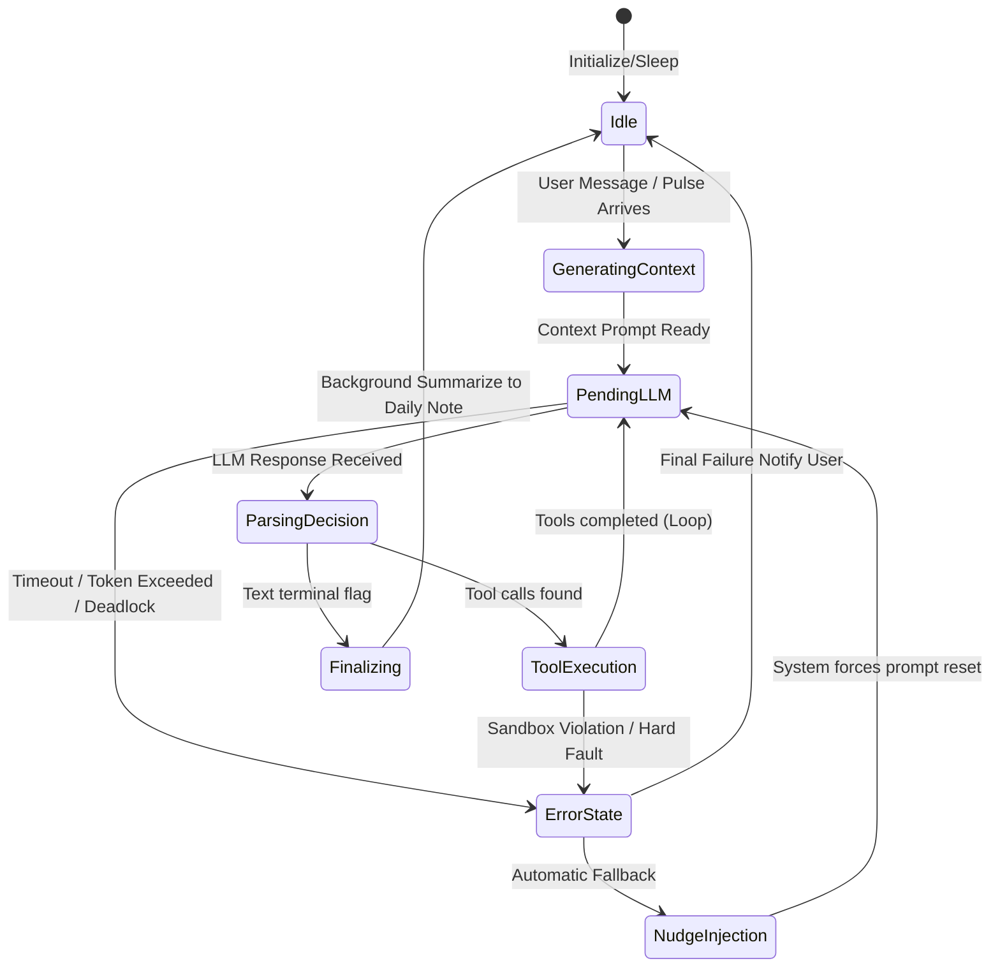

# Go Agent 核心系统设计 (Siyuan-Native Architecture)

## 1. 概述 (Overview)

**目标**: 构筑一个高性能、安全、可观测、具备持久记忆和动态能力扩展的通用 Agent 运行时（Runtime）。该运行时作为 S-forge（思源笔记内核）的子模块，深度集成并完全依赖原生的笔记能力（万物皆 Block、双向链接、每日日记）来实现其长短期认知。

**设计原则**:
1. **Siyuan-Native (思源原生化)**: 这是织（Zhi）的系统土壤。完全抛弃外挂数据库表（如额外的 SQLite 表结构）的思路，将长、中、短期记忆与人格配置统统以**物理存在且用户立等可查的 Siyuan Block** 为介质进行存储和检索。
2. **接口驱动 (Interface-Driven)**: 核心规约全部通过 Go `interface` 定义，解耦具体的大模型提供商实现和认知模块。
3. **状态可知 (State Machine)**: 会话和思考过程状态机化，确保每一环均可监控与恢复。
4. **脉搏机制 (Pulse & Event-Driven)**: 将 UI 触发、定时任务触发（Cron）、心跳触发（Heartbeat）统一接入消息总线，使 Agent 能无缝休眠或在后台默默执行自省、档案整理等“自发”行为。

## 2. 系统架构 (System Architecture)

系统采用典型的分层架构，确保组件间的单向依赖，并在运行时层提供统一的拦截和审计能力。

```mermaid
graph TD
    subgraph 接口与事件层 (Interface & Triggers)
        API[HTTP API]
        RPC[Siyuan RPC]
        Cron[Cronjob & Heartbeat]
        MsgBus[Message Bus / Event Emitter]
    end

    subgraph 运行时调度层 (Runtime Engine)
        SessionMgr[Session Manager]
        Budget[Budget & Rate Limiter]
        CtxBuilder[Context Builder]
    end

    subgraph 认知内核层 (Cognitive Core - Ghost)
        GhostIntf((Ghost Interface))
        Router[Request Router]
        LLM[LLM Gateway - go-openai]
        SubAgent[Specialized Sub-Agents]
    end

    subgraph 基础设施与能力层 (Native Infrastructure)
        ToolReg[Tool Registry]
        Sandbox[Security Sandbox]
        SiyuanMem[Siyuan Native Memory System]
        SiyuanIntf[Siyuan Block APIs & VectorDB]
    end

    %% Data Flow
    API --> SessionMgr
    RPC --> SessionMgr
    Cron --> MsgBus
    MsgBus --> SessionMgr

    SessionMgr --> Budget
    SessionMgr --> CtxBuilder
    CtxBuilder --> GhostIntf

    GhostIntf --> Router
    Router --> LLM
    Router --> SubAgent

    LLM --> ToolReg
    SubAgent --> ToolReg
    ToolReg --> Sandbox
    Sandbox --> SiyuanIntf

    CtxBuilder --> SiyuanMem
    SiyuanMem --> SiyuanIntf
```

## 3. 核心概念与领域接口 (Domain Interfaces)

为避免具体实现上的过度耦合，系统中核心组件依赖于明确的 `interface` 设计。

### 3.1 认知内核接口 (The Ghost)

认知层对外的唯一暴露点，屏蔽了内部 MAGI 决策模型、系统提示词拼接、响应反序列化等所有复杂度。把 Ghost 作为纯粹的计算资源进行投喂。

```go
package agent

import "context"

// Ghost 认知内核契约
type Ghost interface {
    // Think 接收当前上下文，返回下一个执行决策
    Think(ctx context.Context, session Session, prompt ContextPrompt) (Decision, error)
}

// Decision 认知维度的核心决定
type Decision struct {
    IsTerminal bool           // true 则结束循环，返回纯文本；false 则需要进一步执行工具
    Content    string         // 文本回复内容（如果是思考过程或者最终结论）
    ToolCalls  []ToolRequest  // 需要运行时执行的工具行为队列
    Metrics    CognitiveMeta  // 当前思考帧的脑波状态反馈（例如 SyncRate、工作模式）
}
```

### 3.2 Siyuan 原生记忆抽象 (Native Memory System)

这里的记忆引擎不再是在独立的 SQL 数据库里建表，而是基于 Siyuan 的笔记、日记、属性块搭建。

```go
// MemoryStore 统合的长中短记忆存取接口 (由思源原生 Block 提供支撑)
type MemoryStore interface {
    // Short-term: 会话内对话流处理与滑动窗口
    AppendHistory(ctx context.Context, sessionID string, msg Message) error
    GetHistoryWindow(ctx context.Context, sessionID string, maxTokens int) ([]Message, error)
    
    // Mid/Long-term: 知识与情景记忆
    // SearchFacts 基于 kernel/vectordb 检索特定的 Block ID 及对应文本内容
    SearchFacts(ctx context.Context, query string, topK int) ([]FactBlock, error)
    
    // SaveFact 主动将总结/记忆保存为当日日常笔记 (Daily Note) 中的一个 Block
    SaveFact(ctx context.Context, topic string, factContent string) (blockID string, err error)
    
    // Core: 核心人格/系统属性读写
    // LoadPersonaConfig 直接按文档 ID (Soul Document) 提取系统设定的 Block
    LoadPersonaConfig(ctx context.Context, soulDocID string) (Persona, error)
}
```

### 3.3 行为工具系统 (Action Toolkit)

在运行时中挂载的所有“身体”能力，具备统一的安全规范和资源消耗标记。

```go
// Tool 原子级的能力插件
type Tool interface {
    Name() string
    Description() string
    Schema() map[string]any // 构建 OpenAI Function Calling 的 JSON Schema
    Execute(ctx context.Context, args []byte) (result []byte, err error)
}

// ToolRegistry 工具池管理器
type ToolRegistry interface {
    Register(t Tool)
    Get(name string) (Tool, error)
    // 支持按批次并行触发工具，带超时熔断
    ExecuteBatch(ctx context.Context, calls []ToolRequest) []ToolResult 
}
```

## 4. 运行机制 (Operational Mechanisms)

### 4.1 会话状态与事件驱动模型 (Session & Event-Driven)

Agent 挂载在 MessageBus 上消费消息。这就使得定时整理档案的 Cron 任务、或者纯粹监控机器状态的 Heartbeat（如每隔 6 小时产生一个自我审视脉搏）都可以轻易注入。



### 4.2 ReAct 思考回路生命周期 (Thinking Loop)

当 Agent 苏醒时，调度层与上下文组件将协同合作，直到完成用户的意图或自身的任务。在执行过程中，使用并行队列管理异步 ToolCalls。

## 5. 记忆金字塔 (Siyuan-Native Memory Taxonomy)

我们抛弃外部外挂知识库的思维，必须将认知完全寄托于思源原生的万物互联结构中：

1. **短期工作记忆 (Working Memory) - 缓存与会话级**
   - **载体**: 驻留内存的 `Session` 对象及临时切片（滑动窗口）。
   - **归档降级**: 超过 Token 或者轮次限制后，触发大模型的内部对话摘要生成。**完成的会话脉络将以紧凑的形式（`![[Ref]]` 链接引用的格式），直接转化成文本块，写入当日对应的 Siyuan Daily Note（日记文档）的特定层级下。**
2. **中期经历记忆 (Episodic Memory) - Siyuan 每日笔记与 Block**
   - **载体**: 使用专门的“工作日志层级/块”。
   - **机制**: 在长时间交互中产生的重要决策、环境感知、搜索或工具的结论，调用原生 API 作为 Markdown 直接落盘到笔记里。支持用户不仅能通过 UI 阅读它们，还能通过手动修改这些 Block 实现“修改/指正代理人的记忆”。代理在下次唤醒时，读取到的就已经是被用户纠正后的 Block。
3. **长期语义与事实框架 (Semantic & Soul Memory) - Siyuan VectorDB 与双链**
   - **载体**: 一个纯粹处于特定笔记本内的“灵魂文档 (Soul Document)”。
   - **机制**: 个人喜好、禁忌规则、系统核心设定，全都是该页面下带有特定打标（如定制属性 `custom-agent-soul`）的 Block。借由 `kernel/vectordb` 进行向量化。需要随时结合原生的原生块层级查询以及 Vector 高精检索，来支撑运行时刻的 Context。

## 6. 非功能性架构设计 (Non-Functional Resilience)

作为长期存活在内核级别的工程引擎，核心在于对混乱状态的兜底与保护。

### 6.1 容错与防御性自动化
- **循环熔断 (Nudge Injection)**: 当工具连续返回长错误，导致 Agent 被困在连续的尝试/失败循环中时，`SessionManager` 需要在达到 N 次循环时注入系统级的 **Nudge Message** 强制要求其跳出当前循环寻找替代方案。这是防止无人值守任务期间算力耗尽的命门。
- **Token 限额强行阻断**: 当单次工作流 Token 耗穿预算天花板，系统触发抛出式回退，清理当前 Working Memory 并产生错误报告留待人类检查。

### 6.2 并发与资源控制
- **Goroutine 防泄漏**: 使用 `golang.org/x/sync/errgroup` 管理并发的工具请求，对于每一个 Session 控制最大并发子任务数量，杜绝失控的协程。
- **环境污染隔离**: 涉及执行环境（如 Shell、文件系统）的 Tool 必须通过严格的前置拦截器，锁定活动空间约束至 `$WORKSPACE` 相关合法路径内。

### 6.3 审计与可观测性
- **标准化埋点**: 对于每次 Tool 的耗时、返回 Code、LLM 请求的耗时、Token 计算以及 `SyncRate` 指标进行统一的日志系统集中打印。这些均可使用 Siyuan 自身的标准错误和行为日志基建。

## 7. 实施里程碑 (Milestones)

按照循序渐进法构建思源原生架构：

### 阶段一: Alpha 核心回路构建 (Skeleton)
- [ ] 确立基础设施目录与 Interface 设计。
- [ ] 落实消息总线 `MessageBus` 和基于 Siyuan API 的 `SessionMgr` 骨架。
- [ ] 挂载基于 `go-openai` 的伪 Ghost 实现（单 LLM 直连），先跑通核心的同步思考与终端状态切换机制。

### 阶段二: Beta 长中短记忆的 Siyuan 本地化 (Siyuan-ization)
- [ ] 实现原生的 `MemoryStore`，将工作流输出和抽取摘要对接到 Siyuan 的 **Daily Note / 块写入接口**。
- [ ] 完成“灵魂文档”读取接口，实现 `LoadPersonaConfig`。
- [ ] 结合 `kernel/vectordb` 对接块语义高维检索。

### 阶段三: RC 自我保护与深层能力挂载 (Armor & Arms)
- [ ] 引入 `Budget` 运算和 Nudge 自动阻断。
- [ ] 研发安全校验沙箱 (Sandbox Filter)，集成在 `ToolRegistry` 前端，然后实装文件和 Cmd 操作核心工具。
- [ ] 加入心跳和后台闲时调度 (Heartbeat / Cronjob)，让程序定期可以自己醒来阅读/反思。

### 阶段四: Release 认知切换 (Brain Transfusion)
- [ ] 完整注入 **MAGI 架构的真实 Ghost**，正式接入多重模型反馈、情绪渲染与同步率指标探测系统。
