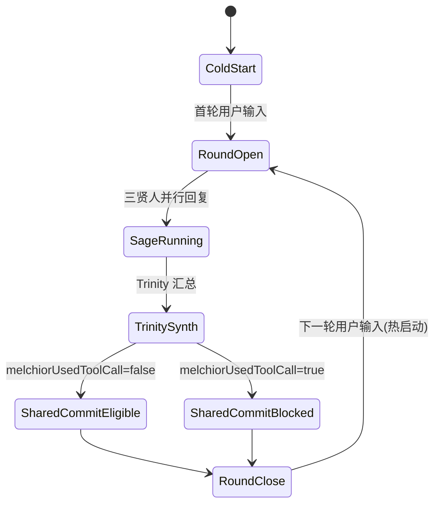

# MAGI 多轮历史堆栈协议（Phase 1 冻结版）

> 版本：`v1.0.0-phase1`
> 
> 生效范围：`app/src/magi/composables/useMagi.consensus.ts`、`app/src/magi/core/wise/mockWise.ops.ts`、后续 `historyStack` 模块。
> 
> 目标：冻结“什么写入历史、何时写入、谁能看到”的可执行规则，作为 Phase 2~5 的唯一行为基线。

---

## 1. 协议术语

- **轮次（Round）**：一次用户输入触发的完整共识链路。
- **私有历史栈**：每个贤者实例自身 `contextMessages`，受 `memorySize` 截断。
- **公共历史候选**：本轮 Trinity 最终 `speak.content` 原文，仅在 `melchiorUsedToolCall=false` 时可进入下一轮私有栈。
- **冷启动**：会话初次激活（或显式重置后首轮），允许注入一次唤醒提示。
- **热启动**：首轮后连续轮次，不允许重复注入唤醒提示。

---

## 2. 轮次历史条目模型（冻结）

```ts
interface RoundHistoryEntry {
  roundId: string;               // 例: "r-000123"
  owner: "MELCHIOR-01" | "BALTHASAR-02" | "CASPER-03" | "TRINITY-00";
  role: "user" | "assistant" | "system";
  content: string;               // 原文，禁止包装前缀/标签
  source:
    | "user-input"
    | "sage-reply"
    | "trinity-speak"
    | "system-coldstart";
  eligiblePolicy:
    | "private-only"            // 仅 owner 私有可见
    | "trinity-shared-eligible" // 可下发到三贤人私有栈
    | "trinity-shared-blocked"; // 明确禁止下发
  timestamp: number;             // unix ms
}
```

### 2.1 字段约束

1. `content` 必须为最终可见原文，不得注入 `source=echo` 包装。
2. `content` 不得添加“上一轮Trinity综合输出：”等解释性前缀。
3. `eligiblePolicy` 与 `melchiorUsedToolCall` 关系为：
   - `false` -> `trinity-shared-eligible`
   - `true`  -> `trinity-shared-blocked`
4. `timestamp` 采用写入时刻，不允许缺省。

---

## 3. 历史写入矩阵（冻结）

| 条件 | 写入对象 | 写入内容 | eligiblePolicy | 下一轮三贤人可见性 |
|---|---|---|---|---|
| 用户输入到达 | 各贤者私有栈 | 用户原文 | `private-only` | 仅各自实例可见 |
| 贤者本轮回复完成 | 对应贤者私有栈 | 贤者回复原文 | `private-only` | 仅该实例可见 |
| Trinity 产出，且 `melchiorUsedToolCall=false` | 三贤人各自私有栈 | `speak.content` 原文 | `trinity-shared-eligible` | 下一轮可见 |
| Trinity 产出，且 `melchiorUsedToolCall=true` | 不下发三贤人 | 无 | `trinity-shared-blocked` | 下一轮不可见 |

---

## 4. 冷启动/热启动边界（冻结）

1. 冷启动轮次允许一次性注入唤醒提示（`source=system-coldstart`）。
2. 进入热启动后，禁止每轮重复注入唤醒提示。
3. 任何热启动轮次均不得以整包 `overrideMessages` 覆盖私有历史栈主路径。
4. `overrideMessages` 仅允许用于 Trinity 特殊编排路径，不可用于三贤人常规回复主路径。

---

## 5. 状态机（冻结）



### 5.1 转移守卫

- `SharedCommitEligible`：必须存在 Trinity `speak.content` 非空原文。
- `SharedCommitBlocked`：即使 Trinity 有输出，也禁止注入三贤人私有栈。

---

## 6. 示例轮次（可审计）

### 示例 A：`melchiorUsedToolCall=false`

- **Round 1**：
  1. 用户输入 U1 写入三贤人私有栈。
  2. 三贤人各自产出 A1/B1/C1，写入各自私有栈。
  3. Trinity 产出 T1（`speak.content` 原文）。
  4. 因 `melchiorUsedToolCall=false`，T1 原文下发到三贤人各自私有栈。
- **Round 2 可见性断言**：
  - MELCHIOR 窗口包含 T1 原文（逐字一致）。
  - BALTHASAR 窗口包含 T1 原文（逐字一致）。
  - CASPER 窗口包含 T1 原文（逐字一致）。

### 示例 B：`melchiorUsedToolCall=true`

- **Round 7**：
  1. Trinity 产出 T7（存在文本）。
  2. 因 `melchiorUsedToolCall=true`，标记 `trinity-shared-blocked`。
  3. 不向三贤人私有栈写入 T7。
- **Round 8 可见性断言**：
  - 三贤人窗口中均不得新增 T7（由公共历史注入产生）。

---

## 7. 代码落地约束（Phase 2 之前必须遵守）

1. 真实判定源必须来自流式 `tool_calls` 实测聚合结果。
2. Trinity 注入文本来源必须是最终 `speak.content`，禁止二次包装。
3. 历史读写入口需收拢到单点管理器（Phase 2 引入 `historyStack`）。
4. 导出链路必须保留审计证据：`roundId`、判定源、注入目标、原文摘要/hash。

---

## 8. 验收映射（对应 TTT Phase 1）

- [x] 历史条目模型已冻结并可直接编码。
- [x] 三贤人历史写入矩阵已冻结。
- [x] 冷/热启动边界已冻结。
- [x] 文档明确禁止 `source=echo` 和“上一轮Trinity综合输出：”前缀。
- [x] 包含状态机和示例轮次，可作为后续实现与测试基线。
