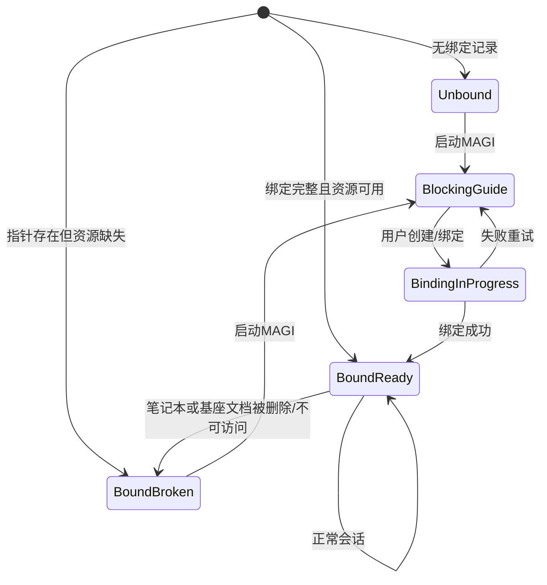

# MAGI 工作空间管理 AI 主笔记本设计

> 目标：为 MAGI 建立工作空间级、可执行、可恢复的主 AI 笔记本管理机制，保证“无主笔记本不对话、文本尽量笔记化、单工作空间唯一主 AI 笔记本”。主笔记本判定规则为：主文档（人格基座）位于哪个笔记本，哪个笔记本就是主 AI 笔记本。

## 1. 设计冻结（本版）

1. 无主 AI 笔记本时，`MAGI` 对话入口必须硬阻断。
2. 每个工作空间只能绑定一个主文档（`personaBaseDocId`，Single Source of Truth），其所在笔记本自动视为主 AI 笔记本。
3. 主文档 ID 固定为绑定权威；笔记本重命名或文档移动不改变绑定 ID 语义。
4. 主 AI 笔记本中的固定文档仅保留一个：`人格基座`。
5. 旧工作空间检测到未绑定时，必须引导打开人格种子创建界面（问卷入口）。
6. 所有可笔记化的文本内容优先以笔记块形式保存；配置仅保存非文本指针与状态。
7. 主文档唯一性只以绑定配置中的 `personaBaseDocId` 判定；文档属性仅作标记与审计，不参与唯一性判定。

## 2. 范围与非目标

### 2.1 范围

1. 工作空间级主文档绑定协议（由主文档归属推导主 AI 笔记本）。
2. 启动期绑定检查与硬阻断策略。
3. 主 AI 笔记本文本存储边界（笔记 vs 配置 vs 私有文件）。
4. 旧工作空间迁移引导策略。
5. 故障恢复与边界条件处理。

### 2.2 非目标

1. 临时对话模式（另案讨论）。
2. 多主笔记本轮换策略。
3. 主 AI 笔记本以外的复杂固定文档体系。

## 3. 术语

1. `主AI笔记本`：由 `personaBaseDocId` 所在 `Notebook(Box)` 推导出的主容器。
2. `人格基座文档（人格核心配置文档）`：工作空间唯一绑定文档，承载人格描述文本基线，并作为主笔记本归属判定源。
3. `绑定状态`：前端与后端可解析出的 “已绑定/未绑定/损坏/缺失” 状态集合。

## 4. 存储分层

## 4.1 笔记本层（文本主存）

主 AI 笔记本必须承载以下文本内容：

1. 人格基座文本（职业/生活/本能需求/综合描述等）。
2. 可笔记化的会话原文与总结文本（包括用户/AI文本）。
3. 可审计的文本事件摘要（例如人格重载结果、落盘异常说明）。

说明：
1. 文本优先写入笔记块，不以配置 JSON 作为文本主存。
2. 具体块样式可沿用既有 Callout 语义（`quote/light/info/warning` 等）。

## 4.2 配置层（非文本指针）

配置层只保存绑定所需最小元数据，建议结构：

```json
{
  "schemaVersion": "MAGI-MAIN-NOTEBOOK-v1",
  "personaBaseDocId": "20260304120100-def5678",
  "updatedAt": "2026-03-04T12:01:00Z"
}
```

配置文件路径固定为：`/data/private/magi/magi_main_notebook_binding.json`

约束：
1. `personaBaseDocId` 必填，缺失时触发修复流程。
2. 启动期通过 `personaBaseDocId` 解析文档归属笔记本；该笔记本即主 AI 笔记本。
3. 配置中不得存储长文本人格描述正文。
4. 主文档唯一性仅以 `personaBaseDocId` 判定，不依赖文档属性去做唯一性断言。

## 4.3 私有文件层（结构化中间产物）

1. `/data/private` 继续保存人格采样中间文件（如 `sample/profile` JSON）。
2. 这些文件不是运行时文本主存；其中描述文本需同步进人格基座文档。

## 5. 主AI笔记本结构

## 5.1 固定文档

仅固定一个文档：

1. 文档名：`人格基座`
2. 推荐标识：`custom-magi-persona-base=true`（仅标记用途，不参与唯一性判定）
3. 内容分区（建议）：
   - 主体元信息（组织、角色、职业目标）
   - 四轨描述（职业/生活/本能需求/综合）
   - 最近更新信息（更新时间、来源）

## 5.2 可变内容

1. 会话与记忆文本可以按日记模式追加，不强制固定文档名。
2. 文档命名与层级允许用户调整；系统绑定判定仅依赖配置中的 `personaBaseDocId`，主笔记本由该文档归属推导。

## 6. 启动与运行状态机



关键语义：
1. `BlockingGuide` 状态下禁止发送 MAGI 对话请求。
2. 仅 `BoundReady` 允许进入 `sendUserMessage`。

## 7. 核心流程

## 7.1 冷启动检查流程

1. 启动读取主 AI 笔记本绑定配置（`/data/private/magi/magi_main_notebook_binding.json`）。
2. 校验 `personaBaseDocId` 是否存在且可访问，并解析其归属笔记本。
3. 若文档不存在则尝试自动重建人格基座文档，并更新 `personaBaseDocId`。
4. 任一步失败进入阻断引导态，不允许发送消息。

## 7.2 无绑定阻断流程

1. 展示阻断引导 UI（不可跳过）。
2. 用户可选择：
   - 创建新主 AI 笔记本（允许命名）
   - 绑定现有笔记本
   - 打开人格种子创建界面（旧空间引导主路径）
3. 绑定成功后才解除阻断。

## 7.3 创建新主AI笔记本流程

1. 调用 `/api/notebook/createNotebook` 创建笔记本（名称可自定义）。
2. 在该笔记本内创建或定位 `人格基座` 文档。
3. 写入绑定配置（`personaBaseDocId`）。
4. 追加系统可见消息：绑定完成并可开始对话。

## 7.4 绑定现有笔记本流程

1. 用户选择工作空间中现有笔记本。
2. 若无人格基座文档，则自动创建。
3. 完成绑定并写配置。
4. 不修改该笔记本原有名称和结构。

## 7.5 人格采样文本写入流程

人格采样成功后：

1. `sample/profile` 继续保存到 `/data/private`。
2. 四轨描述与主体元信息以文本块写入 `人格基座` 文档。
3. 若写入失败，保留失败事件并提示用户修复；不静默吞掉。

## 7.6 旧工作空间迁移引导流程

触发条件：
1. 存在历史 MAGI 资产（如 active seed 指针或 sample/profile）但无主 AI 笔记本绑定。

行为：
1. 启动即阻断对话。
2. 默认引导打开人格种子创建界面。
3. 用户完成创建/绑定后解除阻断。

## 8. 边界条件矩阵

| 场景 | 检测点 | 处理策略 |
|---|---|---|
| 无绑定配置 | 启动校验 | 硬阻断 + 引导创建/绑定 |
| 绑定文档归属笔记本已删除/不可访问 | 由 `personaBaseDocId` 解析归属失败 | 硬阻断 + 重新绑定 |
| 人格基座文档丢失 | doc ID 无效 | 自动重建失败则阻断 |
| 只读模式 | `CheckReadonly` | 禁止创建/修改，提示退出只读后继续 |
| 创建笔记本 API 失败 | 接口返回非0 | 保持阻断态并可重试 |
| 多窗口并发绑定 | 配置时间戳冲突 | 以后写覆盖前写，提示“绑定已更新” |
| 绑定后手动改名 | 名称变化 | 不影响绑定（以 ID 为准） |
| 绑定文档移动到其他笔记本 | doc 所属 notebook 变化 | 主 AI 笔记本随文档归属自动变更 |
| 存在多个历史标记文档 | 发现多个 `custom-magi-persona-base=true` | 不作为冲突；仅以配置 `personaBaseDocId` 为准 |
| 人格写入失败 | 块写入失败 | 记录错误事件，不允许静默成功 |
| MAGI对话时检测丢失 | 发送前 guard | 本轮拒绝并转入阻断引导态 |

## 9. 与现有实现的接线建议

## 9.1 前端

1. `app/src/magi/entry/MagiRoot.ctx.ts`
   - 启动期增加主 AI 笔记本绑定校验。
   - 未通过时强制显示阻断引导，不触发 `sendUserMessage`。
2. `app/src/magi/composables/useMagi.ts`
   - 增加“运行前 binding guard”入口。
3. `app/src/magi/entry/persona-seed-panel/*`
   - 保存问卷后将描述文本写入人格基座文档。

## 9.2 后端

1. `kernel/api/magi.go` 后续应统一承接对话并落盘。
2. 主 AI 笔记本绑定配置建议提供后端读写接口，避免仅前端自管状态。

## 10. 验收标准

1. 无主 AI 笔记本时，MAGI 输入框不可触发对话请求。
2. 完成创建/绑定后，同会话内可立即解除阻断并对话。
3. 人格采样文本可在 `人格基座` 文档中直接查看。
4. 删除已绑定笔记本后，下一次发送前被拦截并进入修复引导。
5. 重命名主 AI 笔记本不影响 MAGI 可用性。

## 11. 待评审项（后续迭代）

1. 主 AI 笔记本同步/发布策略需单独冻结（本版不展开）。
2. 临时对话模式与主存模式切换策略另案设计。
