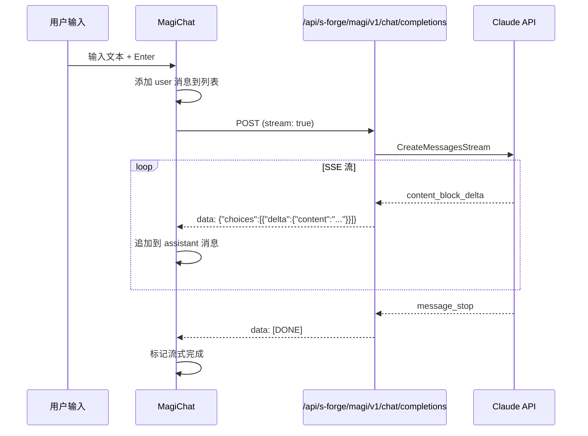
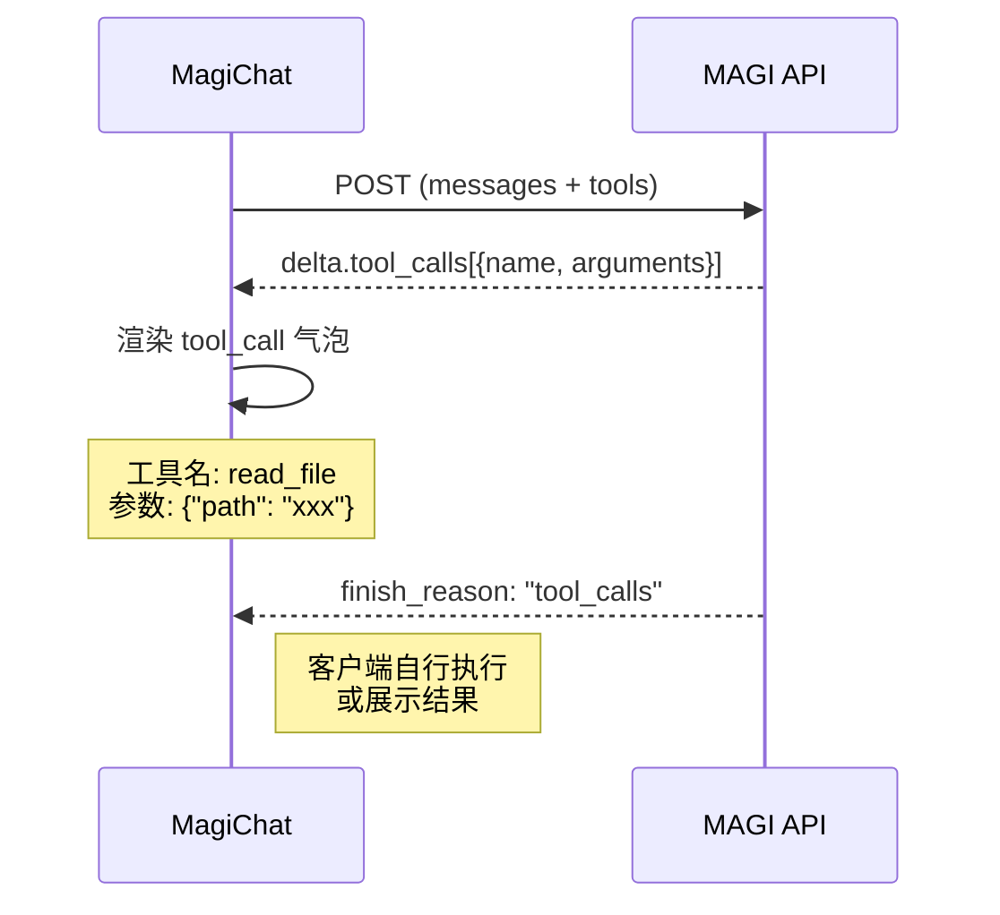

# MAGI 独立聊天面板设计

## 1. 定位与目标

**核心定位**：独立于思源笔记编辑器的 Agent 聊天界面，面向日常对话和 Agent 任务交互。

**与现有界面的关系**：
- **笔记内嵌 AI 助手**：针对当前文档的上下文辅助（已有，很糙）  
- **独立聊天面板（本设计）**：自由对话 + Agent 任务，不依赖笔记编辑上下文

**设计目标**：
1. 作为 MAGI 系统的标准人机交互入口
2. 移动端优先——手机上的**主要交互界面**
3. 支持流式输出、Markdown 渲染、代码高亮
4. 可选展示 Agent 工具调用过程（tool_use 可视化）
5. 后续可接入三贤人系统的共识流程可视化

## 2. 视觉风格

参考 `d:\dev\siyuan-note\toread\MAGI` 项目的 EVA 新世纪福音战士美学：

| 元素 | 规格 |
|------|------|
| 背景 | 深黑 `rgba(0,0,0,0.9)` + 微弱青色网格纹理 |
| 主色 | 青色 `#0ff`（用户/UI）、绿色 `#0f0`（AI 回复）|
| 警告色 | 黄色 `#ff0`（系统）、红色 `#f00`（错误）|
| 字体 | `'MS Gothic', monospace` 为主，中文回退思源宋体 |
| 光效 | `text-shadow: 0 0 10px currentColor` 霓虹发光 |
| 扫描线 | `background-size: 100% 4px` 半透明条纹叠加 |
| 气泡 | 深色底 + 左侧 3px 彩色边框标识角色（参考：`d:\dev\siyuan-note\toread\MAGI\components\MessageBubble.vue`） |
| 动画 | 打字光标 `█` 闪烁、消息淡入、思考内容折叠 |

### 配色参考

```
用户消息：  border-left: 3px solid #0ff;  bg: rgba(0, 20, 30, 0.9)
AI 回复：   border-left: 3px solid #0f0;  bg: rgba(0, 30, 0, 0.9)
系统消息：  居中对齐，border: none;        bg: rgba(30, 30, 0, 0.5)
错误：      border-left: 3px solid #f00;  bg: rgba(30, 0, 0, 0.9)
Tool 调用：  border-left: 3px solid #909;  bg: rgba(20, 0, 20, 0.9)
```

## 3. 页面结构

```
┌─────────────────────────────┐
│  HEADER (状态栏)             │  ← 连接状态、模型名称、同步率
├─────────────────────────────┤
│                             │
│  MESSAGE LIST               │  ← 消息气泡列表，自动滚底
│  (flex-direction: column)   │
│                             │
│  ┌─────────┐                │
│  │ USER    │ ←────── 右对齐  │
│  └─────────┘                │
│                             │
│  ┌───────────────┐          │
│  │ AI (streaming)│ ← 左对齐  │
│  │ █ (cursor)    │          │
│  └───────────────┘          │
│                             │
├─────────────────────────────┤
│  INPUT AREA                 │  ← textarea + 发送按钮
│  [________________] [↵]     │
└─────────────────────────────┘
```

### 移动端适配
- 消息气泡 `width: 95%`，去除多余边距
- 输入框固定底部，带安全区适配 (`env(safe-area-inset-bottom)`)
- Header 可折叠为单行状态指示灯

## 4. 组件设计

### 4.1 `MagiChat.vue` — 主页面

**职责**：组装所有子组件，管理全局状态（消息列表、连接状态、流式请求）

**核心状态**：
```typescript
interface 聊天状态 {
  消息列表: 消息[];        // 完整对话历史
  输入内容: string;         // 当前输入框文本
  是否加载中: boolean;      // 是否正在等待 AI 回复
  连接状态: '已连接' | '断开' | '重连中';
  当前模型: string;         // 如 'claude-sonnet-4-6'
}
```

### 4.2 `ChatMessage.vue` — 消息气泡

**职责**：渲染单条消息，支持多种类型

**消息类型**：
| 类型 | 对齐 | 边框色 | 特殊处理 |
|------|------|--------|----------|
| `user` | 右对齐 | #0ff | 纯文本 |
| `assistant` | 左对齐 | #0f0 | Markdown 渲染、流式打字、思考折叠 |
| `system` | 居中 | #ff0 | 小字号、半透明 |
| `error` | 左对齐 | #f00 | 错误堆栈折叠 |
| `tool_call` | 左对齐 | #909 | 工具名 + 参数 JSON 折叠 |
| `tool_result` | 左对齐 | #666 | 执行结果折叠 |

**流式渲染**：
- [ ] 消息气泡样式（参考 `d:\dev\siyuan-note\toread\MAGI\components\MessageBubble.vue`）
- 后续 chunk 追加到气泡内容，显示闪烁光标 `█`
- 收到 `[DONE]` 后移除光标，渲染最终 Markdown

### 4.3 `ChatInput.vue` — 输入区域

**职责**：文本输入 + 发送

**交互**：
- `Enter` 发送，`Shift+Enter` 换行
- 发送后自动清空并 focus
- 加载中时禁用发送按钮，显示 "AI 思考中..." 状态

### 4.4 `ChatHeader.vue` — 状态栏

**职责**：显示连接状态和模型信息

**内容**：
- 左侧：`MAGI SYSTEM` 标题（霓虹绿色）
- 右侧：模型名称 + 连接状态 LED 灯（绿/黄/红）

## 5. 数据流



### Tool Use 数据流



## 6. 技术选型

### 不使用第三方聊天组件的理由
- MAGI 的 EVA 视觉风格极其定制化，第三方组件改样式比自己写还费劲
- 核心组件其实就 3 个（消息列表 + 消息气泡 + 输入框），自己搓更可控
- 后续要接入三贤人共识可视化等高度定制的 UI，必须完全掌控

### Markdown 渲染
- 使用 `markdown-it` 或项目已有的 Lute 渲染器
- 代码高亮使用 `highlight.js`

### 路由与挂载
- **方案 A（推荐）**：作为思源的独立页面 `/stage/magi-chat/`，通过 iframe 或直接路由加载
- **方案 B**：作为侧边栏 Dock 插件，类似现有的 AI 聊天面板

## 7. 与后端的接口

复用已实现的 MAGI API：

```
POST /api/s-forge/magi/v1/chat/completions
Authorization: Token <api_token>
Content-Type: application/json

{
  "messages": [...],
  "model": "claude-sonnet-4-6",
  "stream": true,
  "tools": [...] // 可选
}
```

响应：标准 OpenAI SSE 流（已在 `kernel/util/claude.go` 中实现完整的 Claude 协议转换层）

## 8. 后续扩展

1. **对话持久化**（Phase 2）：每条消息自动写入思源日记
2. **三贤人面板**：拆分模式下显示三个 AI 的独立回复 + 共识结果
3. **Agent 执行可视化**：tool_use 的实时进度展示
4. **会话管理**：多会话切换、历史记录搜索（参考现有 `d:\dev\siyuan-note\toread\MAGI\components\MagiMainPanel.vue` 的交互逻辑）
5. **语音输入**：移动端集成语音识别
