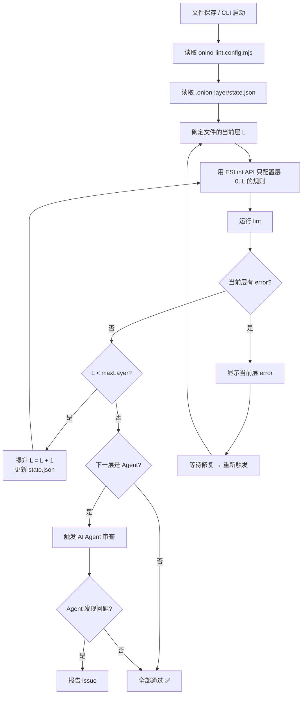

# 洋葱式层级错误体系设计

## 1. 设计目标

实现一个**原生理解多层 lint 配置**的完整系统，核心原则：

> **内层有 error 时，外层规则根本不需要执行**，而非"跑完所有规则再过滤"。

系统包含三个组件：

```
┌─────────────────────────────────────────────┐
│               onino-lint CLI                 │  CI/命令行使用
│  逐层调用 ESLint Linter API，有 error 即停   │
└──────────────────┬──────────────────────────┘
                   │ 共享核心
                   ▼
┌─────────────────────────────────────────────┐
│            @onion-lint/core                  │  核心库
│  层配置解析 / 规则分组 / 状态持久化            │
└──────┬──────────────────────────┬───────────┘
       │                          │
       ▼                          ▼
┌──────────────┐    ┌─────────────────────────┐
│ ESLint Plugin│    │  vscode-onion-lint       │
│ onino-layer  │    │  原生理解多层的 VS Code   │
│ .mjs         │    │  扩展（替代 ESLint 插件）  │
└──────────────┘    └─────────────────────────┘
```

### 1.1 终极愿景：从 Lint 到 AI 的完整管线

洋葱层的内层是 ESLint 规则，当所有 lint 层清零后，最外层触发一个 **AI Agent** 进行代码审查：

```
Layer 0: 类型安全 (TypeScript)             ← 自动执行
Layer 1: 语法风格 (semi, quotes...)        ← 自动执行
Layer 2: 代码质量 (code-size, alias...)    ← 自动执行
Layer 3: 架构约束 (imports, export...)     ← 自动执行
Layer 4: 注释文档 (function-comment...)    ← 自动执行
Layer 5: AI Agent 审查                     ← Lint 全部通过后触发
```

AI Agent 不需要关注低级问题（lint 已保证），聚焦于**架构合理性、逻辑缺陷、可维护性**。

---

## 2. 组件架构

### 2.1 @onion-lint/core（核心库）

不依赖 ESLint 或 VS Code API，纯逻辑层。

```
src/
├── config.ts            # LayerConfig 类型定义 + 配置解析
├── classifier.ts        # 规则 ID → 层索引 的分配器
├── state.ts             # 文件级层状态管理 + 持久化
├── layer-runner.ts      # 逐层执行逻辑
└── index.ts             # 统一导出
```

#### LayerConfig 类型

```typescript
interface OnionLintConfig {
    layers: LayerConfig[];
    /** 状态文件路径（默认 .onion-layer/state.json） */
    stateDir?: string;
    /** 未匹配规则的默认归属层 */
    unmatchedDefaultLayer?: number;
}

interface LayerConfig {
    id: string;
    description?: string;
    /** Glob 模式匹配规则 ID */
    patterns: string[];
    exclude?: string[];
    /** 是否阻断（有 error 时停下），默认 true */
    blocking?: boolean;
}

interface AgentLayerConfig extends LayerConfig {
    type: "agent";
    /** Agent 调用的命令或 HTTP 端点 */
    handler: {
        command?: string;    // CLI 命令
        url?: string;        // HTTP 端点
    };
    /** Agent 审查模式 */
    mode: "diff" | "full-file";
    /** 注入 Agent 的 prompt 模板 */
    prompt: string;
}
```

#### 状态管理

```typescript
interface LayerState {
    version: number;
    files: Record<string, FileLayerState>;
}

interface FileLayerState {
    /** 该文件已通过的层索引（-1 = 初始，0 = 第一层未通过） */
    passedLayer: number;
    /** 各层通过的时间戳，用于判断过期 */
    timestamps: Record<number, string>;
    /** 文件内容 hash，用于检测变更后重置层状态 */
    contentHash: string;
}
```

### 2.2 ESLint Plugin（app/0_lints/onion-layer.mjs）

现有的 ESLint 插件体系，主要作用：

1. **注册自定义处理器** → `processor.postprocess` 过滤外层 message
2. **暴露 `createLayerRules()`** → 根据层配置生成只包含指定层的 `rules` 对象
3. **暴露 `createLayerBlocks()`** → 生成多个 Flat Config block，每层一个

```mjs
// eslint.config.mjs
import { createLayerBlocks } from "./0_lints/onion-layer.mjs";
import config from "./onion-lint.config.mjs";

export default [
    ...createLayerBlocks(config, { mode: "ide" }),
    // ... 其他通用配置
];
```

### 2.3 vscode-onion-lint（VS Code 扩展）

**这是核心创新点**——一个全新的 VS Code 扩展，原生理解多层 lint 配置：

#### 架构

```
┌──────────────────────────────────────────────┐
│               VS Code Extension               │
│                                              │
│  ActivationEvents:                            │
│    - onLanguage:typescript                    │
│    - onLanguage:javascript                    │
│    - onCommand:onion-lint.showLayer           │
│                                              │
│  核心流程:                                     │
│  文件保存 → 读取 .onion-layer/state.json       │
│           → 从当前文件的 passedLayer 开始检查   │
│           → 有 error → 只显示当前层 error      │
│           → 无 error → 提升到下一层            │
│                                              │
│  问题面板渲染:                                  │
│    Layer 0 ❌ @typescript-eslint/no-explicit-any│
│    Layer 1 ⏳ (等待 Layer 0 修复)             │
│    Layer 2 ⏳                                  │
└──────────────────────────────────────────────┘
```

#### VS Code 扩展功能清单

| 功能 | 说明 |
|------|------|
| **层状态指示器** | 状态栏显示当前文件的层状态 `🧅 L2/5` |
| **逐层检查** | 不依赖内置 ESLint 扩展，直接调用 ESLint API 逐层执行 |
| **层过滤渲染** | 问题面板只显示当前层及内层的 error，外层显示"等待中" |
| **状态持久化** | 自动维护 `.onion-layer/state.json` |
| **文件变更检测** | 文件内容变更后自动重置该文件的层状态 |
| **命令面板** | `Onion: 显示所有层` / `Onion: 重置文件层状态` / `Onion: 跳过层` |
| **配置热重载** | `onion-lint.config.mjs` 变更后自动重新加载 |

#### VS Code 扩展文件结构

```
vscode-onion-lint/
├── package.json
├── src/
│   ├── extension.ts          # 入口 + 激活/销毁
│   ├── layer-indicator.ts    # 状态栏 UI 组件
│   ├── layer-manager.ts      # 逐层检查 + 结果缓存
│   ├── problem-renderer.ts   # 问题面板渲染器
│   ├── state-sync.ts         # 文件变更 → 状态重置逻辑
│   └── config-loader.ts      # 加载 onion-lint.config.mjs
├── test/
└── .vscodeignore
```

---

## 3. 状态管理

### 3.1 文件状态生命周期

```
文件创建/打开
       │
       ▼
passedLayer = -1  ── 初始状态，尚未检查
       │
       ▼  [保存触发 lint]
从 layer 0 开始逐层检查
       │
  ┌────┴────┐
  │ 有 error │  → 停在当前层，passedLayer = 当前层 - 1
  └────┬────┘
       │ 无 error → 提升到下一层
       ▼
passedLayer = layerIndex
       │
       ▼  [文件发生变更]
passedLayer = -1 ← 重置（内容 hash 不匹配时）
```

### 3.2 状态文件设计

```json
{
    "version": 1,
    "layers": ["typescript", "syntax", "code-quality", "architecture", "documentation", "agent"],
    "files": {
        "src/app.ts": {
            "passedLayer": 2,
            "timestamps": { "0": "2026-06-06T10:00:00Z", "1": "2026-06-06T10:01:00Z", "2": "2026-06-06T10:02:00Z" },
            "contentHash": "sha256-abc123..."
        },
        "src/util/foo.ts": {
            "passedLayer": 0,
            "timestamps": { "0": "2026-06-06T09:00:00Z" },
            "contentHash": "sha256-def456..."
        }
    }
}
```

---

## 4. VS Code 扩展渲染设计

### 4.1 问题面板分层渲染

不再是一扁平的 error 列表，而是**按层分组**：

```
❌ Layer 0: 类型安全 (2 errors)
    line:10  @typescript-eslint/no-explicit-any  Unexpected any.
    line:42  @typescript-eslint/no-non-null-assertion  Unexpected non-null assertion.
────────────────────────────────────────────────────
⏳ Layer 1: 语法风格 (等待 Layer 0 修复)
⏳ Layer 2: 代码质量 (等待 Layer 0 修复)
```

### 4.2 状态栏指示器

```
[🧅 Typescript]  ← Layer 0 有 error
[🧅 L2/5 ✅]     ← 已通过 Layer 2，等待下一层检查
[🧅 全部通过 ✅]  ← 所有层通过
```

### 4.3 编辑器装饰

- **当前层 error** → 红色波浪线（正常）
- **外层被屏蔽的 error** → 灰色/虚线波浪线（"活的等待"状态）
- 悬停时显示 `⏳ 此规则在 Layer N，当前 Layer M 尚未通过`

---

## 5. vs 现有 VS Code ESLint 插件

| 维度 | 现有 vscode-eslint | vscode-onion-lint |
|------|-------------------|-------------------|
| 规则执行 | 一次跑全部规则 | 逐层执行，跳过外层 |
| 问题显示 | 所有 error 平铺 | 按层分组，只显示当前层 |
| 性能 | 文件越大越慢 | 内层有 error 即停 |
| 状态持久化 | 无 | 文件级层状态 |
| AI 集成 | 无 | 最外层可触发 Agent |
| 配置热重载 | 需重启 | 自动检测 |
| 对现有生态 | 完全替代 ESLint 插件 | 替代 ESLint 插件 |

---

## 6. 文件结构

```
app/
├── 0_lints/
│   ├── onion-layer.mjs             # ESLint 插件适配器
│   ├── task-checker.mjs            # 保留（规则本身）
│   └── ...其他规则文件（无需改动）
├── onion-lint.config.mjs           # 洋葱层配置（统一配置源）
├── eslint.config.mjs               # 修改：引入 createLayerBlocks()
└── scripts/
    └── onion-lint.mjs              # CLI 入口

vscode-onion-lint/                   # VS Code 扩展（独立仓库 or monorepo）
├── package.json
├── src/
│   ├── extension.ts
│   ├── layer-indicator.ts
│   ├── layer-manager.ts
│   ├── problem-renderer.ts
│   ├── state-sync.ts
│   └── config-loader.ts
├── test/
└── .vscodeignore
```

---

## 7. 配置示例

### onion-lint.config.mjs

```mjs
export default {
    layers: [
        {
            id: "typescript",
            description: "TypeScript 类型和安全规则",
            patterns: ["@typescript-eslint/*"],
        },
        {
            id: "syntax",
            description: "语法和代码风格",
            patterns: ["semi", "quotes", "curly", "brace-style", "no-restricted-syntax"],
        },
        {
            id: "code-quality",
            description: "代码质量规则",
            patterns: ["code-size/*", "no-alias-usage/*", "no-large-inline-array/*",
                       "no-trivial-wrapper/*", "no-extends/*", "no-nested-function/*"],
        },
        {
            id: "architecture",
            description: "架构约束",
            patterns: ["no-export-forwarding/*", "folder-item-limit/*",
                       "explicit-return-type-reason/*", "no-inline-callback/*"],
        },
        {
            id: "documentation",
            description: "注释要求",
            patterns: ["function-comment/*", "require-if-comment/*", "require-timeout-comment/*",
                       "require-async-export/*", "require-import-comment/*", "require-export-comment/*"],
        },
        {
            id: "meta",
            description: "元工作流检查",
            patterns: ["task-checker/*"],
        },
        {
            id: "ai-review",
            type: "agent",
            description: "AI 架构审查",
            patterns: [],
            handler: {
                command: "node scripts/ai-review.mjs",
            },
            prompt: `你正在审查一个 TypeScript 前端项目。文件已通过所有 lint 规则。
请关注：1) 是否有潜在的类型安全性问题 2) 是否有不合理的架构决策
3) 是否有边界条件未处理 4) 可维护性建议`,
            mode: "diff",
        },
    ],
};
```

---

## 8. 执行流程图



---

## 9. 实现 todo 清单

### 阶段 1: 核心库 + ESLint 插件

- [ ] 创建 `app/0_lints/onion-layer.mjs` - 核心库：类型定义 + 配置解析 + 分类器
- [ ] 实现 `classifier.ts` 规则 ID → 层索引分配（Glob → RegExp 转换）
- [ ] 实现 `state.ts` 文件级层状态持久化（JSON 文件读写 + content hash 检测）
- [ ] 实现 `createLayerBlocks()` 生成多个 Flat Config 配置块
- [ ] 实现 `processor.postprocess` 后处理器（IDE 辅助过滤）
- [ ] 创建 `onion-lint.config.mjs` 项目配置
- [ ] 修改 `eslint.config.mjs` 导入并使用 `createLayerBlocks()`
- [ ] 创建 `scripts/onion-lint.mjs` CLI Runner
- [ ] 在 `package.json` 添加 `lint:onion` 脚本

### 阶段 2: VS Code 扩展

- [ ] 初始化 `vscode-onion-lint/` 项目（yo code scaffold）
- [ ] 实现 `config-loader.ts` 加载 `onion-lint.config.mjs`
- [ ] 实现 `state-sync.ts` 文件变更检测 + 状态重置
- [ ] 实现 `layer-manager.ts` 逐层调用 ESLint Linter API
- [ ] 实现 `layer-indicator.ts` 状态栏组件
- [ ] 实现 `problem-renderer.ts` 按层分组渲染
- [ ] 注册命令：`显示所有层` / `重置文件状态` / `跳过层`
- [ ] 添加配置项：`onion-lint.stateDir` / `onion-lint.enableAgent`

### 阶段 3: AI Agent 集成

- [ ] 实现 Agent 层触发协议（Lint 全通过 → 调用 handler）
- [ ] 创建 `scripts/ai-review.mjs` 示例 Agent 脚本
- [ ] 设计 Agent 输出格式（与问题面板兼容）
- [ ] 实现 Agent 结果注入问题面板

### 阶段 4: 测试与迁移

- [ ] 编写核心库单元测试
- [ ] VS Code 扩展集成测试
- [ ] 与现有 `eslint.config.mjs` 规则做兼容性验证
- [ ] 编写迁移文档
- [ ] 配置 CI pipeline
