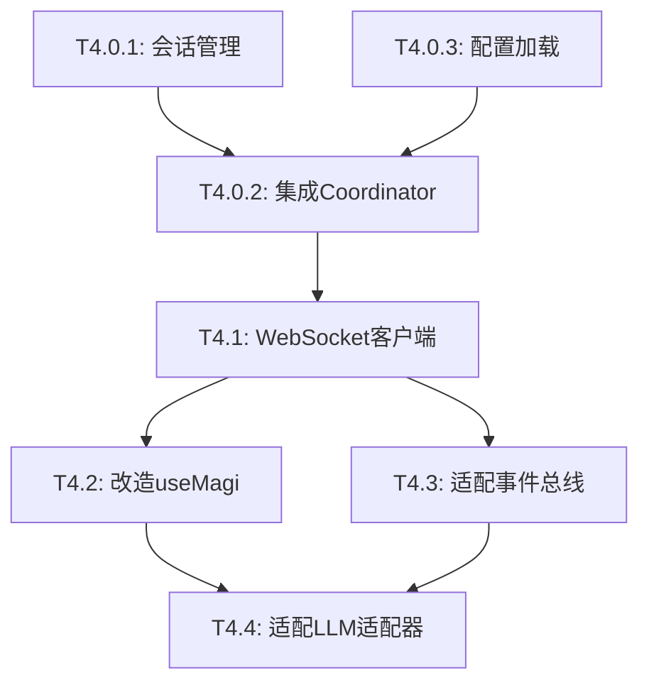

# Phase 4 现状与任务规划调研报告

> **调研时间**: 2026-03-07  
> **调研目标**: 明确Phase 4实际需要完成的工作，避免盲目开工  
> **调研范围**: 后端HTTP接口、前端MAGI实现、WebSocket集成状态

---

## 一、Phase 4 原始任务描述

根据 [`docs/ttt/MAGI后端迁移.ttt.md`](../ttt/MAGI后端迁移.ttt.md) 的定义，Phase 4包含4个任务：

- **T4.1**: 实现 WebSocket 客户端（前端）
- **T4.2**: 改造 useMagi composable（移除LLM调用逻辑，接入WebSocket）
- **T4.3**: 适配事件总线（将WebSocket消息映射到事件总线）
- **T4.4**: 适配 LLM 适配器（改造为WebSocket模式）

---

## 二、后端HTTP接口现状

### 2.1 `/api/s-forge/magi/v1/chat/completions`

**实现文件**: [`kernel/api/magi.go`](../../kernel/api/magi.go)

**当前功能**:
- ✅ 接收OpenAI格式的chat completion请求
- ✅ 支持流式和同步两种模式
- ✅ 通过队列实现串行化处理（保证Trinity上下文注入单线程原则）
- ❌ **未集成Coordinator决策流程**
- ❌ **未集成WebSocket推送**

**实现逻辑**:
```go
// 当前实现：直接调用底层LLM工具函数
func handleMagiTask(task *MagiRequest) {
    // ...
    if req.Stream {
        magiChatStream(c, msg, contextMsgs, client, req)
    } else {
        magiChatSync(c, msg, contextMsgs, client, req)
    }
}

// magiChatSync 直接调用 util.ChatGPT
// magiChatStream 直接调用 client.CreateChatCompletionStream
```

**问题分析**:
- 这个接口目前只是一个简单的LLM代理转发层
- 没有调用 `kernel/magi/coordinator` 包中的决策逻辑
- 没有触发三贤人响应收集、投票、Trinity统合等流程
- 没有通过WebSocket推送决策过程事件

### 2.2 `/api/s-forge/magi/v1/messages`

**实现文件**: [`kernel/api/magi_messages.go`](../../kernel/api/magi_messages.go)

**当前功能**:
- ✅ 接收Claude格式的messages请求
- ✅ 支持流式和同步两种模式
- ✅ 协议转换（Claude格式 <-> OpenAI格式）
- ✅ 通过队列实现串行化处理
- ❌ **未集成Coordinator决策流程**
- ❌ **未集成WebSocket推送**

**实现逻辑**:
```go
// 当前实现：协议转换后直接调用LLM
func dispatchMagiClaudeReq(c *gin.Context, req anthropic.MessagesRequest) {
    if model.Conf.AI.OpenAI.APIProvider == "Claude" {
        // 直接调用Claude API
        magiMessagesStreamClaude(c, req)
    } else {
        // 转换为OpenAI格式后调用
        magiMessagesStreamOpenAI(c, req)
    }
}
```

**问题分析**:
- 同样只是协议转换和LLM代理层
- 没有集成MAGI决策逻辑
- 没有WebSocket推送

---

## 三、后端已完成模块（Phase 0-3）

### 3.1 核心决策模块（Phase 1-2）

| 模块 | 文件 | 状态 | 测试 |
|------|------|------|------|
| LLM客户端 | `kernel/magi/llm/client.go` | ✅ 完成 | 6个测试通过 |
| 流式处理器 | `kernel/magi/stream/processor.go` | ✅ 完成 | 12个测试通过 |
| 贤者实例 | `kernel/magi/sages/sage.go` | ✅ 完成 | 7个测试通过 |
| 响应收集器 | `kernel/magi/coordinator/collector.go` | ✅ 完成 | 4个测试通过 |
| Trinity统合 | `kernel/magi/coordinator/trinity.go` | ✅ 完成 | 7个测试通过 |
| 投票决策 | `kernel/magi/coordinator/voting.go` | ✅ 完成 | 10个测试通过 |
| 决策协调器 | `kernel/magi/coordinator/coordinator.go` | ✅ 完成 | 5个测试通过 |

**总计**: 51个单元测试全部通过

### 3.2 WebSocket推送模块（Phase 3）

| 模块 | 文件 | 状态 | 测试 |
|------|------|------|------|
| WebSocket封装 | `kernel/magi/websocket/pusher.go` | ✅ 完成 | 67行代码 |
| 事件推送 | `kernel/magi/websocket/events.go` | ✅ 完成 | 13个测试通过 |

**功能清单**:
- ✅ 轮次开始推送（ROUND_STARTED）
- ✅ 贤者响应推送（SEEL_REPLY_STARTED/COMPLETED/FAILED/CHUNK）
- ✅ 投票进度推送（SEEL_VOTE_UPDATED）
- ✅ Trinity统合推送（TRINITY_SYNTHESIS_COMPLETED）
- ✅ 共识消息推送（CONSENSUS_EMITTED）
- ✅ 错误推送（ROUND_FAILED）

**Coordinator集成状态**:
- ✅ Coordinator已添加sessionId参数
- ✅ 已在关键节点调用WebSocket推送函数
- ✅ 推送失败仅记录日志，不影响决策流程

---

## 四、前端MAGI实现现状

### 4.1 核心架构

**主要文件**:
- `app/src/magi/composables/useMagi.ts` - 状态管理composable
- `app/src/magi/composables/useMagi.consensus.ts` - 共识决策逻辑
- `app/src/magi/composables/magiConsensus.ts` - 决策协调逻辑
- `app/src/magi/adapters/magiStandardLLMAdapter.ts` - LLM适配器

**当前实现方式**:
```
用户输入
  ↓
useMagi.sendUserMessage()
  ↓
sendUserMessageWithConsensus()
  ↓
processSagesResponses() ← 前端本地实现
  ↓
handleTrinitySummary() ← 前端本地实现
  ↓
processVoting() ← 前端本地实现
  ↓
直接调用LLM API（HTTP）
```

### 4.2 WebSocket客户端现状

**搜索结果**: 
- ❌ 前端MAGI模块中**没有WebSocket客户端实现**
- ✅ 思源笔记有全局WebSocket连接（`app/src/layout/Model.ts`）
- ❌ MAGI没有复用全局WebSocket，也没有独立WebSocket

**现有WebSocket**:
```typescript
// app/src/layout/Model.ts
const websocketURL = `${window.location.protocol === "https:" ? "wss" : "ws"}://${window.location.host}/ws`;
const ws = new WebSocket(`${websocketURL}?app=${Constants.SIYUAN_APPID}&id=${options.id}`);
```

这是思源笔记的全局WebSocket，用于笔记同步等功能，不是MAGI专用的。

### 4.3 决策逻辑位置

**前端完全实现了决策逻辑**:
- ✅ 三贤人响应收集（`magiConsensus.ts:processSagesResponses`）
- ✅ 审慎决策判断（`magiConsensus.ts:需要审慎决策`）
- ✅ 投票流程（`magiConsensus.ts:processVoting`）
- ✅ Trinity统合（`magiConsensus.ts:handleTrinitySummary`）
- ✅ 真实投票决策（`consensus/realVote.ts:获取真实投票决策`）

**问题**:
- 这些逻辑应该在后端执行，前端只应监听WebSocket事件
- 前端直接调用LLM API，存在安全性问题（API Key暴露）

---

## 五、现状与目标的差距分析

### 5.1 后端缺失部分

| 缺失项 | 影响 | 优先级 |
|--------|------|--------|
| HTTP接口未集成Coordinator | 后端决策逻辑无法被调用 | **P0** |
| HTTP接口未集成WebSocket推送 | 前端无法接收决策过程事件 | **P0** |
| 缺少会话管理机制 | 无法关联HTTP请求和WebSocket连接 | **P0** |
| 缺少配置加载逻辑 | 无法读取SEEL配置 | **P1** |

### 5.2 前端缺失部分

| 缺失项 | 影响 | 优先级 |
|--------|------|--------|
| 没有WebSocket客户端 | 无法接收后端推送 | **P0** |
| useMagi未改造 | 仍在本地执行决策逻辑 | **P0** |
| 事件总线未适配 | WebSocket消息无法映射到UI | **P1** |
| LLM适配器未改造 | 仍在直接调用LLM API | **P1** |

### 5.3 架构差距

**当前架构**:
```
前端 ──HTTP──> 后端LLM代理 ──> LLM API
 │
 └─> 本地决策逻辑（三贤人、投票、Trinity）
```

**目标架构**:
```
前端 ──HTTP──> 后端Coordinator ──> LLM API
 ↑                    │
 └────WebSocket───────┘ (推送决策过程)
```

---

## 六、Phase 4 实际任务清单

基于现状分析，Phase 4需要完成以下工作：

### 6.1 后端任务（新增，原TTT未包含）

#### T4.0.1: 实现会话管理机制
- **目标**: 关联HTTP请求和WebSocket连接
- **实现**: 
  - 生成sessionId并返回给前端
  - 维护sessionId到WebSocket连接的映射
  - 实现会话超时清理
- **产出**: `kernel/magi/session/manager.go`

#### T4.0.2: 集成Coordinator到HTTP接口
- **目标**: 让HTTP接口调用完整的MAGI决策流程
- **实现**:
  - 修改`magiChat`和`magiMessages`接口
  - 调用`coordinator.CoordinateDecision()`
  - 传递sessionId以触发WebSocket推送
- **产出**: 修改`kernel/api/magi.go`和`kernel/api/magi_messages.go`

#### T4.0.3: 实现配置加载逻辑
- **目标**: 从文件系统加载SEEL配置
- **实现**:
  - 读取用户的SEEL配置文件
  - 解析配置并初始化贤者实例
  - 实现配置热重载
- **产出**: `kernel/magi/config/loader.go`

### 6.2 前端任务（原TTT已包含）

#### T4.1: 实现 WebSocket 客户端
- **目标**: 创建MAGI专用的WebSocket连接管理器
- **实现**:
  - 连接到后端WebSocket端点
  - 实现自动重连机制
  - 实现消息队列和事件分发
- **产出**: `app/src/magi/websocket/client.ts`

#### T4.2: 改造 useMagi composable
- **目标**: 移除本地决策逻辑，改为监听WebSocket事件
- **实现**:
  - 移除`processSagesResponses`等本地决策函数
  - 接入WebSocket客户端
  - 通过WebSocket事件更新UI状态
- **产出**: 修改`app/src/magi/composables/useMagi.ts`

#### T4.3: 适配事件总线
- **目标**: 将WebSocket消息映射到MAGI事件总线
- **实现**:
  - 解析WebSocket消息
  - 触发对应的事件总线事件
  - 保持现有事件接口不变
- **产出**: 修改`app/src/magi/events/magiEventBus.ts`

#### T4.4: 适配 LLM 适配器
- **目标**: 改造为WebSocket模式
- **实现**:
  - 修改`createMagiStandardLLMAdapter`
  - 通过WebSocket发送请求
  - 通过WebSocket接收响应
- **产出**: 修改`app/src/magi/adapters/magiStandardLLMAdapter.ts`

---

## 七、任务依赖关系



**关键路径**: T4.0.1 → T4.0.2 → T4.1 → T4.2 → T4.4

---

## 八、风险与注意事项

### 8.1 技术风险

1. **会话管理复杂度**
   - WebSocket连接可能在HTTP请求之前或之后建立
   - 需要处理连接断开重连的场景
   - 需要处理会话超时清理

2. **前端状态同步**
   - WebSocket事件是异步的，可能乱序
   - 需要处理事件丢失和重复
   - 需要保证UI状态一致性

3. **向后兼容性**
   - 前端改造期间需要保持现有功能可用
   - 可能需要实现双模式（本地决策 vs WebSocket）

### 8.2 规程要求

根据 `.roo/rules/规程.md`:
- ✅ 任务开始前必须创建ttt文档
- ✅ 任务必须有对应的规程
- ✅ 复杂修改前必须备份原始文件
- ✅ 禁止使用命令行编辑代码文件

### 8.3 测试策略

1. **单元测试**: 每个新增模块都需要单元测试
2. **集成测试**: 完整的HTTP → Coordinator → WebSocket流程测试
3. **对比测试**: 验证前后端决策结果一致性
4. **回归测试**: 确保前端UI功能完整性

---

## 九、工作量估算

| 任务 | 预计代码量 | 复杂度 |
|------|-----------|--------|
| T4.0.1: 会话管理 | ~200行 | 中 |
| T4.0.2: 集成Coordinator | ~300行 | 高 |
| T4.0.3: 配置加载 | ~150行 | 中 |
| T4.1: WebSocket客户端 | ~400行 | 高 |
| T4.2: 改造useMagi | ~200行 | 高 |
| T4.3: 适配事件总线 | ~150行 | 中 |
| T4.4: 适配LLM适配器 | ~200行 | 中 |
| **总计** | **~1600行** | - |

**注**: 不包括测试代码和文档

---

## 十、下一步行动建议

### 10.1 立即行动

1. **创建Phase 4详细ttt文档**
   - 路径: `docs/ttt/MAGI后端迁移_Phase4_前端适配.ttt.md`
   - 包含所有7个任务的详细说明

2. **编写Phase 4规程**
   - 路径: `docs/规程/MAGI后端迁移_Phase4.procedure.md`
   - 定义前后端集成的规范和约束

### 10.2 任务执行顺序

**第一批（后端基础）**:
1. T4.0.1: 会话管理机制
2. T4.0.3: 配置加载逻辑

**第二批（后端集成）**:
3. T4.0.2: 集成Coordinator到HTTP接口

**第三批（前端适配）**:
4. T4.1: WebSocket客户端
5. T4.2: 改造useMagi
6. T4.3: 适配事件总线

**第四批（完整集成）**:
7. T4.4: 适配LLM适配器

### 10.3 验收标准

- [ ] 前端通过WebSocket接收到所有决策过程事件
- [ ] 前端UI能正确显示三贤人响应、投票、Trinity统合
- [ ] 前端不再直接调用LLM API
- [ ] 后端HTTP接口调用完整的Coordinator决策流程
- [ ] 所有单元测试和集成测试通过
- [ ] 决策结果与前端本地实现完全一致

---

## 十一、总结

### 11.1 核心发现

1. **后端HTTP接口是空壳**: 虽然接口存在，但只是LLM代理转发，没有集成MAGI决策逻辑
2. **WebSocket推送已就绪**: Phase 3已完成WebSocket封装和事件推送，但HTTP接口未调用
3. **前端完全本地化**: 前端实现了完整的决策逻辑，这是Phase 4需要迁移的核心部分
4. **缺少会话管理**: 这是原TTT未考虑到的关键模块，必须补充

### 11.2 任务调整

**原Phase 4任务**: 4个前端适配任务  
**实际Phase 4任务**: 3个后端任务 + 4个前端任务 = **7个任务**

**新增任务**:
- T4.0.1: 会话管理机制
- T4.0.2: 集成Coordinator到HTTP接口
- T4.0.3: 配置加载逻辑

### 11.3 关键路径

```
会话管理 → 集成Coordinator → WebSocket客户端 → 改造useMagi → 适配LLM适配器
```

**预计完成时间**: 需要3-4个工作周期（假设每个周期处理2-3个任务）

---

**调研完成时间**: 2026-03-07 09:33 (UTC+8)  
**调研人员**: AI Assistant (Architect Mode)  
**文档版本**: v1.0
