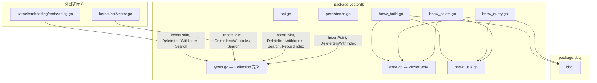

# HNSW 文件迁移到独立子目录 — 架构设计方案

## 1. 问题陈述

当前 `kernel/vectordb/` 根目录中散落着 5 个 HNSW 实现文件和 4 个测试文件。
这些文件中的核心方法（`InsertPoint`, `Search`, `DeleteItemWithIndex` 等）
全部定义为 `Collection` 类型的方法，而 `Collection` 定义在 `package vectordb`。

Go 语言不允许在外部包中为类型定义方法，因此**简单地将文件移动到 `hnsw/` 子包是不可行的**。

## 2. 现状分析

### 2.1 待迁移文件

| 文件 | 内容 | 方法接收者 |
|------|------|-----------|
| `hnsw_build.go` | InsertPoint, buildHNSWIndex, greedySearch, searchLevel, selectNeighborsHeuristic | `*Collection` |
| `hnsw_delete.go` | DeleteItemWithIndex, recomputeNeighbors, RebuildIndex | `*Collection` |
| `hnsw_query.go` | Search, greedySearchVec, searchLevelVec; SearchResult 类型 | `*Collection` |
| `hnsw_utils.go` | RandomLevel, InitItemNeighbors, GetItemLevel, GetLevelNeighborIDs 等 | 包级函数，参数为 `*Collection` |
| 4 个测试文件 | 单元测试和基准测试 | — |

### 2.2 依赖关系图



### 2.3 关键约束

1. **Go 方法规则**：方法只能在定义类型的包中声明
2. **外部 API 稳定性**：`Collection.InsertPoint()`, `Collection.Search()`, `Collection.DeleteItemWithIndex()` 被多处调用
3. **`VectorStore` 耦合**：HNSW 算法深度依赖 `VectorStore` 的距离计算和 BBQ 量化能力
4. **`hnsw_utils.go` 已是函数式**：工具函数已经以 `*Collection` 为参数，不是方法

## 3. 方案评估

### 方案 A：提取独立 HNSWIndex 类型（推荐）

**核心思路**：参照 `vamana/` 包的模式，创建独立的 `HNSWIndex` 类型，
将 HNSW 图算法完全封装在 `hnsw/` 子包中。`Collection` 持有 `*hnsw.HNSWIndex`
并提供薄代理方法保持外部 API 不变。

#### 3.1 新的 HNSWIndex 类型

```go
// kernel/vectordb/hnsw/index.go
package hnsw

type HNSWIndex struct {
    config    Config
    dimension int

    // 图结构
    neighbors [][][]uint32  // neighbors[nodeID][level] -> []neighborIDs
    deleted   map[uint32]bool
    entryPoint uint32
    maxLayer   int

    // 距离计算接口（由外部注入）
    distancer Distancer

    mu sync.RWMutex
}
```

#### 3.2 距离计算接口

```go
// kernel/vectordb/hnsw/distancer.go
package hnsw

// Distancer 距离计算抽象
// 由 vectordb.VectorStore 实现，解耦 HNSW 算法与存储层
type Distancer interface {
    // ComputeDistance 计算两个已索引节点间的距离
    ComputeDistance(a, b uint32, metric string) float32
    // ComputeDistanceFromVector 计算查询向量与已索引节点的距离
    ComputeDistanceFromVector(query []float32, id uint32, metric string) float32
    // ComputeBBQDistance 计算两个已索引节点间的 BBQ 量化距离
    ComputeBBQDistance(a, b uint32) float32
    // ComputeBBQDistanceFromQuery 计算量化查询与已索引节点的 BBQ 距离
    ComputeBBQDistanceFromQuery(queryPacked []byte, queryCorr QuantizationResult, id uint32) float32
    // QuantizeQuery 对查询向量进行量化
    QuantizeQuery(query []float32) ([]byte, QuantizationResult)
    // NewSearchEpoch / IsVisited / MarkVisited — visited set 管理
    NewSearchEpoch() uint32
    IsVisited(id uint32, epoch uint32) bool
    MarkVisited(id uint32, epoch uint32)
}
```

#### 3.3 Collection 的薄代理层

```go
// kernel/vectordb/types.go（修改）
type Collection struct {
    // ... 现有字段 ...
    HNSWIdx *hnsw.HNSWIndex  // 新增：HNSW 索引引用
}

// kernel/vectordb/hnsw_proxy.go（新文件，留在 vectordb 包）
func (c *Collection) InsertPoint(point Point) error {
    return c.HNSWIdx.Insert(/* 转换参数 */)
}

func (c *Collection) Search(queryVec []float32, k int, efSearch int) []SearchResult {
    results := c.HNSWIdx.Search(queryVec, k, efSearch)
    return convertToSearchResults(results, c)
}

func (c *Collection) DeleteItemWithIndex(id string) {
    docID, ok := c.GetDocID(id)
    if !ok { return }
    c.HNSWIdx.Delete(uint32(docID))
    // ... ID 映射清理 ...
}
```

#### 3.4 迁移后目录结构

```
kernel/vectordb/
├── hnsw/
│   ├── index.go          — HNSWIndex 类型定义 + 构造函数
│   ├── build.go          — Insert, buildIndex, greedySearch, searchLevel, selectNeighbors
│   ├── delete.go         — Delete, recomputeNeighbors, RebuildIndex
│   ├── query.go          — Search, greedySearchVec, searchLevelVec
│   ├── utils.go          — RandomLevel, ExpectedNeighborCount, heap 等
│   ├── distancer.go      — Distancer 接口定义
│   ├── config.go         — HNSWConfig
│   ├── types.go          — SearchResult, NeighborRecord 等
│   ├── build_test.go
│   ├── delete_test.go
│   ├── query_test.go
│   └── benchmark_test.go
├── hnsw_proxy.go         — Collection 薄代理方法（留在 vectordb 包）
├── types.go              — Collection 定义（增加 HNSWIdx 字段）
├── store.go              — VectorStore（实现 hnsw.Distancer）
├── api.go
├── persistence.go
└── ...
```

#### 3.5 改动范围评估

| 改动项 | 范围 | 风险 |
|--------|------|------|
| 创建 `hnsw/` 包及新类型 | 新增 ~8 个文件 | 低 — 纯新增 |
| `Collection` 增加 `HNSWIdx` 字段 | `types.go` 1 处 | 低 |
| 创建 `hnsw_proxy.go` 代理层 | 新增 1 个文件 | 低 — 签名不变 |
| `VectorStore` 实现 `Distancer` 接口 | `store.go` 新增适配方法 | 低 — 已有方法签名兼容 |
| `persistence.go` 适配序列化 | 中等修改 | 中 — 需要处理 HNSWIndex 的序列化 |
| 删除原 `hnsw_*.go` 文件 | 删除 5 个文件 | 低 — 代码已迁移 |
| 外部调用方 | **零改动** | 无 — 代理层保持签名不变 |

### 方案 B：接口委托模式（备选）

**思路**：定义 `HNSWOperator` 接口在 `hnsw/` 包中，`Collection` 实现该接口。
HNSW 算法函数接受 `HNSWOperator` 接口参数而非具体类型。

```go
// kernel/vectordb/hnsw/operator.go
package hnsw

type HNSWOperator interface {
    GetNeighbors(id uint32, level int) []uint32
    SetNeighbors(id uint32, level int, neighbors []uint32)
    ComputeDistance(a, b uint32) float32
    // ... 更多操作 ...
}

func Insert(op HNSWOperator, point InsertRequest) error { ... }
func Search(op HNSWOperator, query []float32, k int) []Result { ... }
```

**优点**：改动较小，`Collection` 仍然持有图数据。
**缺点**：
- 接口方法数量多（>15 个），接口过于庞大
- HNSW 状态（entryPoint, maxLayer）仍分散在 `Collection` 中
- 不如方案 A 内聚，`hnsw/` 包不自包含

### 方案 C：保持同包，仅用目录注释区分（最小改动）

**思路**：不创建子包，仅重命名文件并添加清晰的包注释。

**优点**：零风险，零改动。
**缺点**：不解决根本的目录组织问题，违背 review 建议。

## 4. 推荐方案

**推荐方案 A：提取独立 HNSWIndex 类型**。

理由：
1. **与 vamana 包一致**：遵循项目已有的组织模式
2. **高内聚**：HNSW 算法、图结构、配置完全封装在 `hnsw/` 包内
3. **外部 API 零破坏**：通过代理层保持 `Collection` 方法签名不变
4. **可测试性提升**：`HNSWIndex` 可独立测试，不依赖 `Collection` 的 ID 映射等
5. **`Distancer` 接口**：解耦算法与存储，未来可替换距离计算实现

## 5. 实施步骤

### 阶段一：创建 hnsw 包骨架

1. 创建 `kernel/vectordb/hnsw/` 目录
2. 定义 `Distancer` 接口（`distancer.go`）
3. 定义 `HNSWIndex` 类型和 `Config`（`index.go`, `config.go`）
4. 定义包内类型：`NeighborRecord`, `SearchResult`, `HeapItem` 等（`types.go`）

### 阶段二：迁移算法实现

5. 迁移 `hnsw_build.go` → `hnsw/build.go`（方法接收者改为 `*HNSWIndex`）
6. 迁移 `hnsw_query.go` → `hnsw/query.go`
7. 迁移 `hnsw_delete.go` → `hnsw/delete.go`
8. 迁移 `hnsw_utils.go` → `hnsw/utils.go`（包级函数参数改为 `*HNSWIndex`）
9. 迁移 `heap.go` → `hnsw/heap.go`

### 阶段三：集成与适配

10. `VectorStore` 实现 `Distancer` 接口（`store.go` 新增适配方法或包装器）
11. `Collection` 增加 `HNSWIdx` 字段，创建 `hnsw_proxy.go` 代理层
12. 修改 `NewCollection` 初始化 `HNSWIndex`
13. 修改 `persistence.go` 适配 `HNSWIndex` 的序列化/反序列化

### 阶段四：测试与清理

14. 迁移测试文件到 `hnsw/` 包
15. 确保所有外部调用方编译通过
16. 删除原 `hnsw_*.go` 文件
17. 运行完整测试套件

## 6. 风险与缓解

| 风险 | 缓解措施 |
|------|----------|
| 序列化格式变更导致数据不兼容 | `SnapshotData` 结构保持不变，在 `persistence.go` 中做转换 |
| `Distancer` 接口过大 | 可拆分为 `DistanceComputer` + `VisitedTracker` 两个小接口 |
| BBQ 量化类型跨包引用 | `hnsw/` 包直接依赖 `bbq/` 包，或在 `Distancer` 接口中抽象 |
| `heap.go` 被 HNSW 和其他代码共用 | 检查是否有非 HNSW 代码使用 heap，如有则保留副本或提取公共包 |
