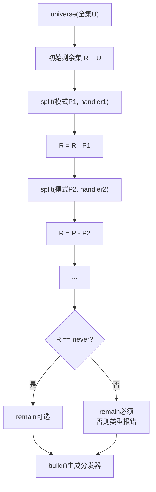

# CalibURRouter 设计文档

> 一个基于集合论的类型安全模式匹配引擎，通过集合切割实现穷尽式状态空间分发

## 1. 设计理念

### 1.1 问题场景

以编辑器键盘事件处理为例（见 `app/src/protyle/wysiwyg/keydown.ts`）：

```ts
// 当前的实现方式：线性中间件链 + 手动abort检查
await deleteKeyMiddleware(event, protyle, nodeElement, range, controller);
if (signal.aborted) { return; }
await softEnterMiddleware(editorContext);
if (signal.aborted) { return; }
await enterKeyMiddleware(event, protyle, nodeElement, range, controller);
if (signal.aborted) { return; }
// ... 60+ 个类似的分支
```

**问题**：
- 状态空间（按键 × 修饰符 × 块类型 × 选区状态 × ...）的覆盖难以验证
- 处理器之间的优先级和互斥关系隐含在代码顺序中
- 无法在编译期检测遗漏或冲突

**目标**：将用户编辑事件的**状态空间**确定性地分发映射到**编辑器命令空间**。

### 1.2 核心思想

CalibURRouter将模式匹配问题转化为**集合论问题**：

- **全集（Universe）**：所有可能的输入模式构成的状态空间
- **子集（Split）**：从全集中切割出的、互不重叠的模式分区
- **剩余集（Remain）**：处理切割后的所有剩余情况

```
状态空间 U = { key, modifiers, blockType, selectionState, ... }
       ↓ 集合切割
U = S₁ ∪ S₂ ∪ ... ∪ Sₙ ∪ R  (互不相交，完全覆盖)
       ↓ 映射
命令空间 = { DeleteCommand, EnterCommand, TabCommand, ... }
```

### 1.3 数学基础

设 $U$ 为全集，模式分发本质上是对 $U$ 的一个**划分** $\{S_1, S_2, ..., S_n, R\}$，满足：

- **互不相交**：$S_i \cap S_j = \emptyset$ （$i \neq j$）
- **完全覆盖**：$S_1 \cup S_2 \cup ... \cup S_n \cup R = U$

类型系统在编译期强制这两个约束，消除运行时"无法匹配"或"重复匹配"的意外。

### 1.4 设计目标

1. **类型安全**：编译期检测模式重叠和遗漏
2. **穷尽匹配**：强制处理全集的每一部分
3. **精确推断**：handler的参数类型由切割后的模式精确推断
4. **领域无关**：核心层不耦合任何特定领域（HTTP、键盘事件等）

## 2. 技术选型

### 2.1 Schema引擎：ArkType

选择 [ArkType](https://arktype.io) 作为schema引擎，理由：

| 特性 | ArkType | Zod | Effect Schema |
|------|---------|-----|---------------|
| 类型推断 | 1:1 精确 | 良好 | 优秀 |
| 集合运算 | 原生支持 | 有限 | 支持 |
| 深度introspection | ✅ | 有限 | ✅ |
| 子类型判断 `.extends()` | ✅ | 有限 | ✅ |

> [!IMPORTANT]
> 为保证集合论基础的严谨性，我们只使用ArkType中有坚实数学基础的特性子集。

### 2.2 备选方案

- **Effect Schema**：类型系统更强大，但包体积较大
- **自研**：基于TypeScript类型体操，灵活但工作量大

## 3. 核心架构

### 3.1 三层结构

```
┌─────────────────────────────────────────────────────────┐
│  应用层 (Application Layer)                              │
│  - 键盘事件分发器                                         │
│  - HTTP路由（可选扩展）                                   │
│  - 状态机转换                                             │
└─────────────────────────────────────────────────────────┘
                           ↓ 使用
┌─────────────────────────────────────────────────────────┐
│  模式层 (Pattern Layer)                                  │
│  - 模式定义 DSL                                          │
│  - 模式组合（与、或、非）                                  │
│  - 模式精化（refinement）                                │
└─────────────────────────────────────────────────────────┘
                           ↓ 基于
┌─────────────────────────────────────────────────────────┐
│  核心层 (Core Layer)                                     │
│  - 全集定义 (universe)                                   │
│  - 集合切割 (split)                                      │
│  - 剩余处理 (remain)                                     │
│  - 类型约束系统                                           │
└─────────────────────────────────────────────────────────┘
```

### 3.2 核心层 API

核心层完全**领域无关**，只处理模式和集合：

```ts
import { calibur } from "calibur-router/core";
import { type } from "arktype";

// 1. 定义状态空间全集
const matcher = calibur.universe(
  type({
    // 完全由使用者定义，核心层不预设任何字段
    按键: "string",
    修饰符: { ctrl: "boolean", shift: "boolean", alt: "boolean" },
    块类型: "'段落' | '标题' | '代码块' | '列表' | '表格'",
    选区状态: "'collapsed' | 'expanded' | 'cross-block'"
  })
);

// 2. 切割子集，每个子集映射到一个处理器
matcher.split(
  type({
    按键: "'Enter'",
    修饰符: { ctrl: "false", shift: "false", alt: "false" },
    块类型: "'段落'"
  }),
  (state) => {
    // state 的类型由模式精确推断
    return { 命令: "换行", 块类型: state.块类型 };
  }
);

matcher.split(
  type({
    按键: "'Enter'",
    修饰符: { ctrl: "false", shift: "true", alt: "false" }
  }),
  (state) => ({ 命令: "软换行" })
);

matcher.split(
  type({
    按键: "'Tab'",
    块类型: "'列表'"
  }),
  (state) => ({ 命令: "列表缩进" })
);

// 3. 处理剩余模式（强制调用，否则类型报错）
matcher.remain((state) => {
  return { 命令: "无操作", 原因: "未匹配任何模式" };
});

// 4. 构建分发器
const dispatch = matcher.build();

// 5. 使用
const result = dispatch({
  按键: "Enter",
  修饰符: { ctrl: false, shift: false, alt: false },
  块类型: "段落",
  选区状态: "collapsed"
});
// result = { 命令: "换行", 块类型: "段落" }
```

### 3.3 键盘事件分发示例

将 `keydown.ts` 用 CalibURRouter 重构：

```ts
import { calibur } from "calibur-router/core";
import { type } from "arktype";

// 定义编辑器键盘事件的状态空间
const 键盘事件全集 = type({
  按键: "string",
  修饰符: {
    ctrl: "boolean",
    shift: "boolean",
    alt: "boolean",
    meta: "boolean"
  },
  块类型: "'NodeParagraph' | 'NodeHeading' | 'NodeCodeBlock' | 'NodeList' | 'NodeTable' | 'NodeHTMLBlock' | string",
  输入法状态: "'composing' | 'idle'",
  选区类型: "'collapsed' | 'range' | 'cross-block'",
  面板状态: {
    hint显示: "boolean",
    菜单显示: "boolean",
    属性面板: "boolean"
  }
});

const 编辑器分发 = calibur.universe(键盘事件全集);

// 守卫：输入法激活时直接跳过大部分处理
编辑器分发.split(
  type({ 输入法状态: "'composing'" }),
  () => ({ 终止: true, 原因: "输入法处理中" })
);

// 守卫：HTML块特殊处理
编辑器分发.split(
  type({ 块类型: "'NodeHTMLBlock'" }),
  (state) => ({ 命令: "html块守卫", 透传: true })
);

// 特定快捷键处理
编辑器分发.split(
  type({
    按键: "'Delete'",
    修饰符: { ctrl: "false", shift: "false" }
  }),
  () => ({ 命令: "删除" })
);

编辑器分发.split(
  type({
    按键: "'Enter'",
    修饰符: { ctrl: "false", shift: "true", alt: "false" }
  }),
  () => ({ 命令: "软换行" })
);

编辑器分发.split(
  type({
    按键: "'Enter'",
    修饰符: { ctrl: "false", shift: "false", alt: "true" }
  }),
  () => ({ 命令: "alt回车行为" })
);

编辑器分发.split(
  type({
    按键: "'Enter'",
    修饰符: { ctrl: "false", shift: "false", alt: "false" }
  }),
  () => ({ 命令: "换行" })
);

编辑器分发.split(
  type({
    按键: "'Tab'",
    块类型: "'NodeList'"
  }),
  () => ({ 命令: "列表缩进" })
);

编辑器分发.split(
  type({
    按键: "'Tab'",
    修饰符: { shift: "true" },
    块类型: "'NodeList'"
  }),
  () => ({ 命令: "列表减缩进" })
);

// Hint面板导航
编辑器分发.split(
  type({
    按键: "'ArrowUp' | 'ArrowDown'",
    面板状态: { hint显示: "true" }
  }),
  () => ({ 命令: "hint导航" })
);

// 剩余模式
编辑器分发.remain((state) => {
  return { 命令: "默认按键处理", state };
});

export const keydownDispatcher = 编辑器分发.build();
```

## 4. 类型系统设计

### 4.1 核心类型

```ts
// 分发器状态类型：追踪全集和剩余集
type MatcherState<Universe, Remaining> = {
  全集: Universe;
  剩余: Remaining;
};

// 切割后的分发器类型：剩余集被缩小
type SplitResult<State, Pattern> = MatcherState<
  State["全集"],
  Exclude<State["剩余"], Pattern>
>;

// 强制处理剩余集的约束
type RequireRemain<Remaining> = 
  [Remaining] extends [never] 
    ? "✓ 所有模式已处理" 
    : `✗ 还有未处理的模式`;
```

### 4.2 类型推断流程



### 4.3 重叠检测

```ts
// 如果尝试切割一个与已切割模式有交集的模式，类型系统报错
matcher.split(pattern1, handler1);
matcher.split(pattern2, handler2); 
// ↑ 类型错误: pattern2 与 pattern1 有交集
```

## 5. 高级特性

### 5.1 模式优先级

当需要显式控制优先级时（例如更具体的模式应优先匹配）：

```ts
// 高优先级先定义
编辑器分发.split(
  type({ 按键: "'Tab'", 块类型: "'NodeList'" }),  // 更具体
  () => ({ 命令: "列表缩进" })
);

编辑器分发.split(
  type({ 按键: "'Tab'" }),  // 更宽泛
  () => ({ 命令: "通用Tab处理" })
);
```

### 5.2 模式组合

```ts
// 与：同时满足
const 段落删除 = type({
  按键: "'Delete'",
  块类型: "'NodeParagraph'"
});

// 或：满足任一
const 回车系列 = type({
  按键: "'Enter' | 'NumpadEnter'"
});

// 精化：添加额外约束
const 有选区的回车 = 回车系列.and({
  选区类型: "'range' | 'cross-block'"
});
```

### 5.3 分层分发

对于大型状态空间，可以分层处理：

```ts
// 第一层：按块类型分发
const 块分发 = calibur.universe(type({ 块类型: "string" }));

块分发.split(
  type({ 块类型: "'NodeCodeBlock'" }),
  (state) => 代码块分发.dispatch(state)  // 委托给子分发器
);

块分发.split(
  type({ 块类型: "'NodeTable'" }),
  (state) => 表格分发.dispatch(state)
);

// 第二层：代码块内的按键分发
const 代码块分发 = calibur.universe(代码块按键空间);
// ...
```

## 6. 实现细节

### 6.1 模块结构

```
caliburRouter/
├── design.md           # 设计文档
├── src/
│   ├── index.ts        # 入口导出
│   ├── core/
│   │   ├── universe.ts # 全集定义
│   │   ├── split.ts    # 子集切割
│   │   ├── remain.ts   # 剩余处理
│   │   ├── build.ts    # 构建分发器
│   │   └── types.ts    # 核心类型
│   ├── utils/
│   │   ├── setOps.ts   # 集合运算
│   │   └── typeUtils.ts# 类型工具
│   └── adapters/       # 可选：领域适配器
│       ├── keyboard.ts # 键盘事件适配
│       └── http.ts     # HTTP路由适配（可选）
├── tests/
│   ├── type.test.ts    # 类型测试
│   ├── split.test.ts   # 切割逻辑测试
│   └── keyboard.test.ts# 键盘场景测试
└── package.json
```

### 6.2 集合运算实现

利用ArkType的 `extends` 方法实现集合关系判断：

```ts
import { type, Type } from "arktype";

// 子集判断: A ⊆ B
const 是子集 = (a: Type, b: Type) => a.extends(b) === true;

// 相交判断: A ∩ B ≠ ∅
const 有交集 = (a: Type, b: Type) => {
  const intersection = a.and(b);
  return intersection.extends(type("never")) !== true;
};

// 运行时验证：输入是否匹配模式
const 匹配 = (pattern: Type, input: unknown) => {
  const result = pattern(input);
  return !(result instanceof type.errors);
};
```

### 6.3 运行时匹配

```ts
function createDispatcher(patterns: Array<{ pattern: Type; handler: Function }>, remainHandler: Function) {
  return function dispatch(input: unknown) {
    for (const { pattern, handler } of patterns) {
      const result = pattern(input);
      if (!(result instanceof type.errors)) {
        return handler(result);
      }
    }
    return remainHandler(input);
  };
}
```

## 7. 与 keydown.ts 的迁移路径

### 7.1 渐进式迁移

1. **阶段1**：提取状态空间定义，保持现有中间件不变
2. **阶段2**：将守卫（guards）转换为 `split` 模式
3. **阶段3**：逐步将中间件转换为纯命令处理器
4. **阶段4**：移除 `if (signal.aborted) { return; }` 样板代码

### 7.2 状态空间定义

从 `keydown.ts` 提取的状态空间：

```ts
const 编辑器事件状态空间 = type({
  // 键盘事件基础
  按键: "string",                    // event.key
  键码: "number",                    // event.keyCode
  修饰符: {
    ctrl: "boolean",                 // event.ctrlKey
    shift: "boolean",
    alt: "boolean",
    meta: "boolean"
  },
  
  // 输入法状态
  输入法激活: "boolean",              // event.isComposing
  
  // 编辑器状态
  块类型: "string",                  // nodeElement.getAttribute("data-type")
  目标元素: "'protyle-html' | 'input' | 'contenteditable'",
  
  // 选区状态
  选区: {
    类型: "'collapsed' | 'range'",
    跨块: "boolean"
  },
  
  // Protyle状态
  编辑器禁用: "boolean",             // protyle.disabled
  有选中块: "boolean",               // !protyle.selectElement?.classList.contains("fn__none")
  
  // 面板状态
  面板: {
    hint: "boolean",
    菜单: "boolean",
    属性视图: "boolean"
  }
});
```

## 8. 局限与权衡

### 8.1 表达性限制

为了保证类型安全和数学基础，CalibURRouter有以下限制：

- 模式必须编译期确定（不支持运行时动态生成模式）
- 复杂的谓词条件需要通过 `refinement` 表达
- 超大状态空间可能导致类型检查变慢

### 8.2 性能权衡

- 类型检查时间随模式数量增加而增长
- 运行时匹配采用线性搜索（足够快，可优化为决策树）
- 建议分层分发，控制每层的模式数量

## 9. 后续规划

- [ ] 核心类型系统实现
- [ ] `universe` / `split` / `remain` / `build` API
- [ ] 集合运算工具函数
- [ ] 类型测试套件
- [ ] 键盘事件适配器 + keydown.ts 迁移验证
- [ ] 代码生成优化（可选：编译为决策树）

## 10. 参考资料

- [ArkType 官方文档](https://arktype.io)
- [TypeScript 类型系统与集合论](https://ivov.dev/notes/typescript-and-set-theory)
- [Pattern Matching in TypeScript](https://github.com/gvergnaud/ts-pattern)
